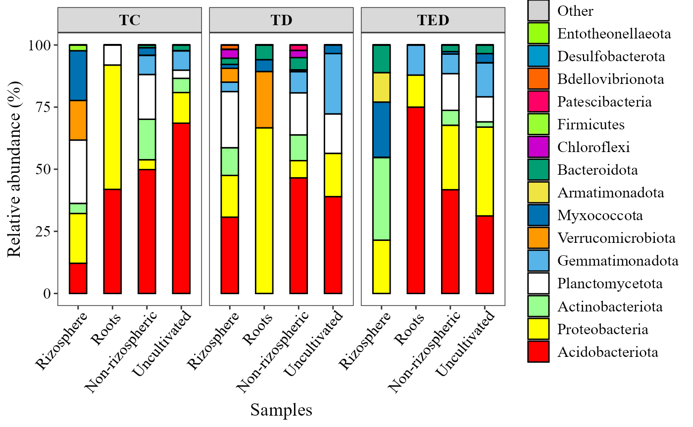
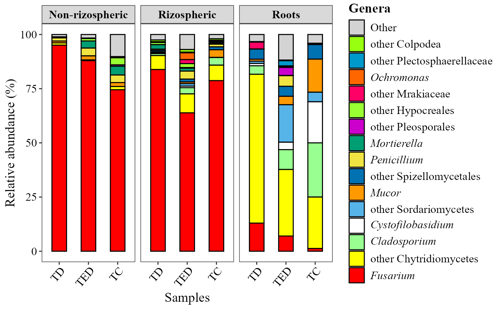
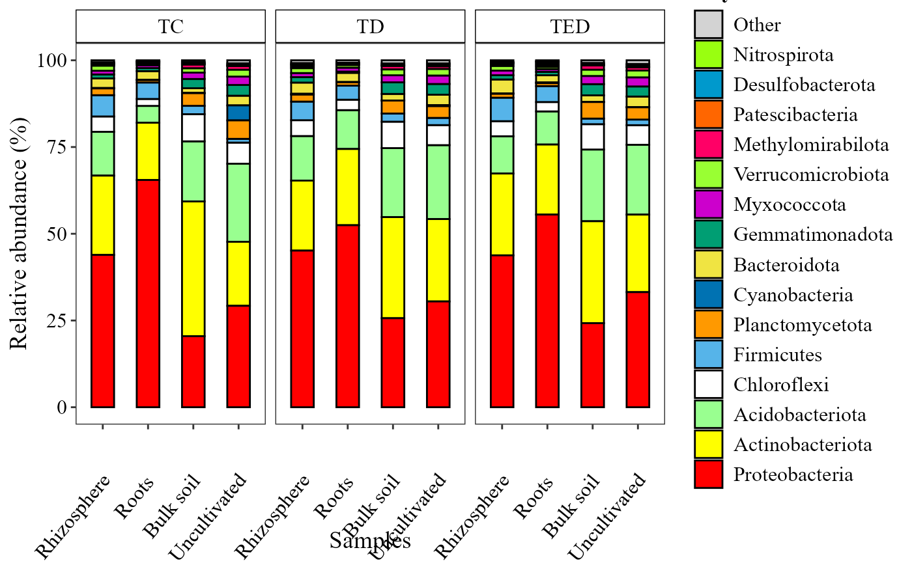
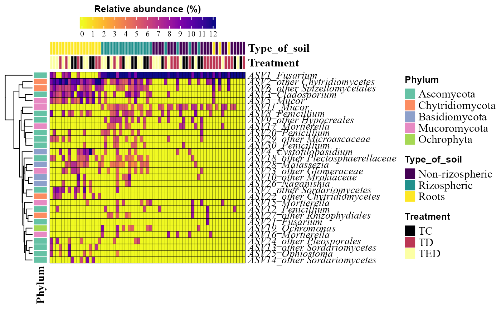
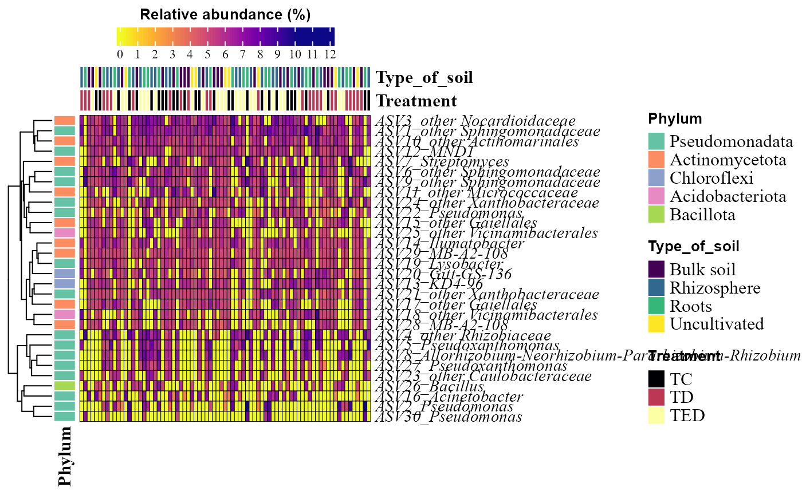
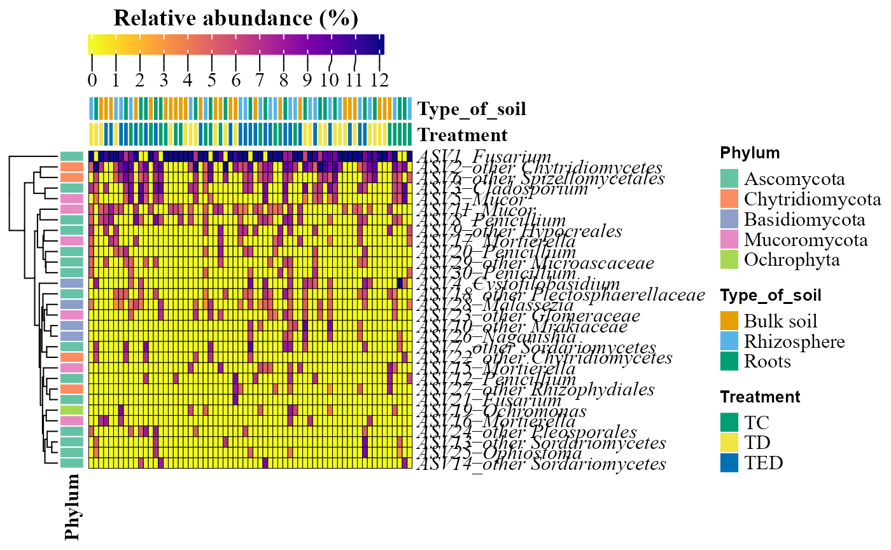
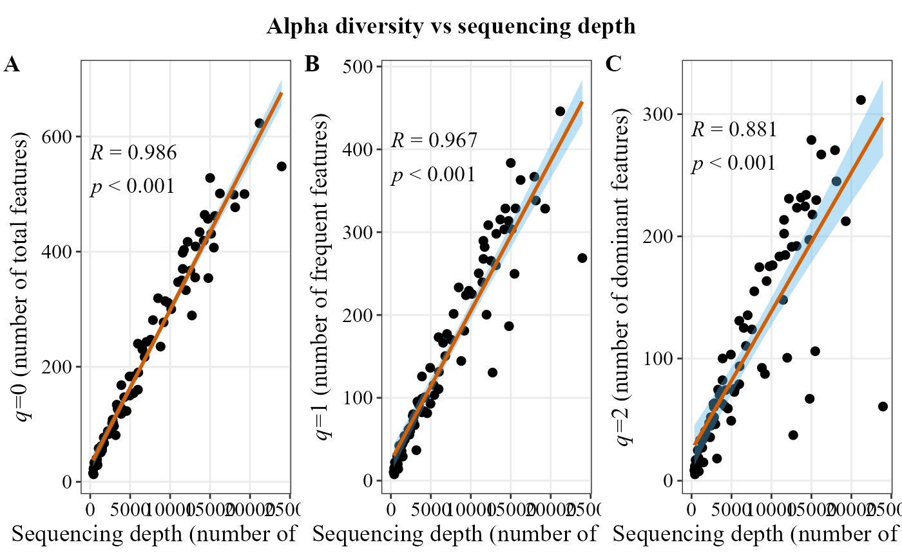
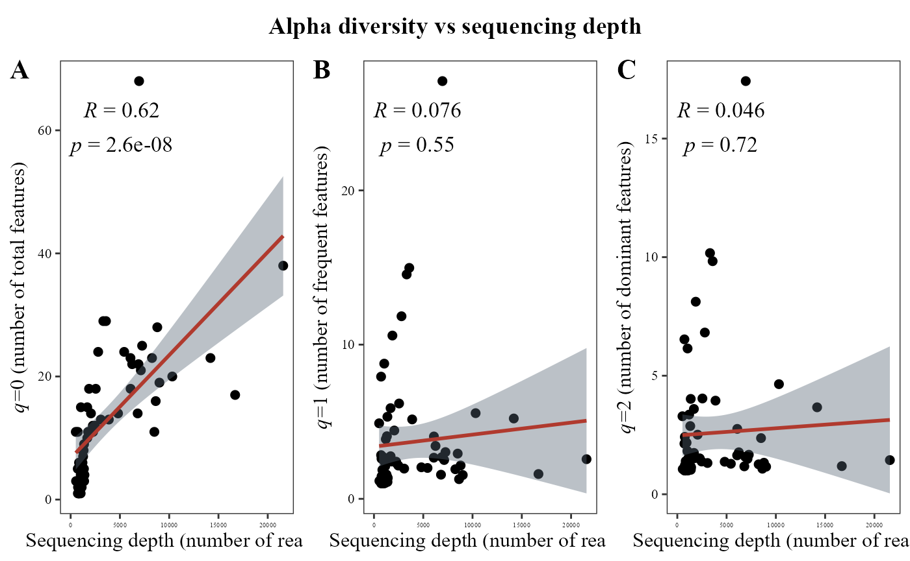
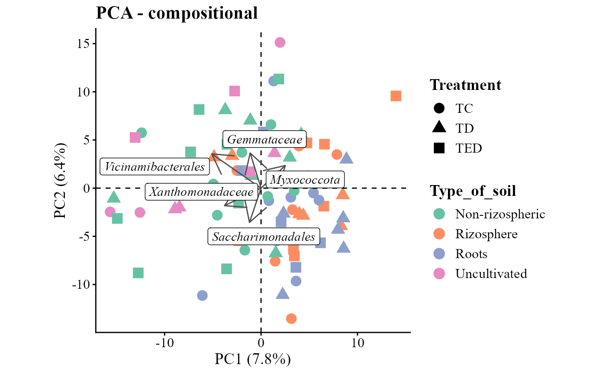
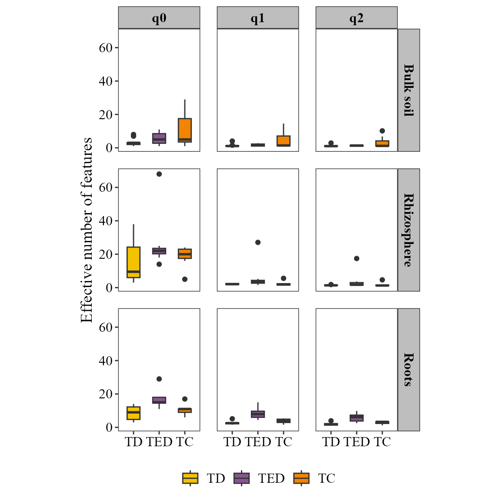

# metabarcoding

For this example, we are going to use metabarcoding data: 16S for
bacteria and 18S for fungi.

The data is taken from:
[16S](https://www.nature.com/articles/s41598-021-81551-7)
[18S](https://www.sciencedirect.com/science/article/abs/pii/S1754504823000028)

First, Let’s call the `MicroBioMeta` package:

``` r
library("MicroBioMeta")
```

Let’s call other packages needed:

``` r
library(tidyverse)
library(qiime2R)
```

tidyverse is used for all the data wrangling and visualizations

Then, Load the data and reformat:

``` r
bacteria_table <- qiime2R::read_qza("../man/Data/dada2.200.trimmed.single.filtered.cleaned.qza")$data %>% as.data.frame()

fungi_table <- qiime2R::read_qza("../man/Data/merge_table_240_noplant_filtered_nous.qza")$data %>% 
  as.data.frame()

metadata <- read.delim("../man/Data/FINALMAP.txt", check.names = F) %>% rename(SAMPLEID =`#SampleID`) %>% 
  filter(Month == "2") %>%
  mutate(Treatment = factor(
    case_when(
      Treatment == 1 ~ "TC",
      Treatment == 2 ~ "TD",
      Treatment == 3 ~ "TED",
      TRUE ~ as.character(Treatment)
    ),
    levels = c("TC", "TD", "TED")
  ))

metadata2 <- read.delim("../man/Data/FINALMAP18S.txt", check.names = F)%>% rename(SAMPLEID=`#SampleID`)%>%
  mutate(
    Treatment = factor(
      case_when(
        Treatment == 1 ~ "TC",
        Treatment == 2 ~ "TD",
        Treatment == 3 ~ "TED",
        TRUE ~ as.character(Treatment)
      ),
      levels = c("TC", "TD", "TED")
    )
  )


bacteria_table_filter <- bacteria_table[match(metadata$SAMPLEID, colnames(bacteria_table)), ]


taxonomy_bacteria <- read_qza("../man/Data/taxonomy_dada2.200.trimmed.single.seqs.qza")$data %>%
  as.data.frame() %>% rename(taxonomy = Taxon) %>% 
  dplyr::select(-Confidence) %>% 
  column_to_rownames(var = "Feature.ID")

taxonomy_fungi <- read_qza("../man/Data/taxonomy_blast_240_0.97.qza")$data %>% as.data.frame() %>% 
  rename(taxonomy = Taxon) %>% 
  dplyr::select(-Consensus) %>% 
  column_to_rownames(var = "Feature.ID")
```

## Pre-processing data

In order to use the data as input for functions of `MicroBioMeta` should
contain a biom format with the column of *taxonomy* at the end.

``` r
table_bac <- merge_feature_taxonomy(table = bacteria_table_filter,
                                    taxonomy = taxonomy_bacteria)
```

    ## Warning in merge_feature_taxonomy(table = bacteria_table_filter, taxonomy =
    ## taxonomy_bacteria): 6049 taxonomy IDs are not present in the table and will be
    ## excluded from the result.

``` r
table_fung <- merge_feature_taxonomy(table = fungi_table, 
                                     taxonomy = taxonomy_fungi)
```

    ## Warning in merge_feature_taxonomy(table = fungi_table, taxonomy =
    ## taxonomy_fungi): 17 taxonomy IDs are not present in the table and will be
    ## excluded from the result.

## Composition exploration

### Abundance barplots

``` r
abundance_barplot(table = table_bac,
                  metadata = metadata,
                  taxonomy_db = "silva",
                  level = "phylum", 
                  x_col = "Type_of_soil", 
                  facet_col = "Treatment", 
                  add_remained = TRUE,
                  label =   "Phylum",
                  save_table = FALSE)+
  theme(axis.text.x = element_text(angle = 50, hjust = 0.95))
```



``` r
abundance_barplot(table = table_fung,
                  metadata = metadata2,
                  x_col = "Treatment", 
                  facet_col = "Type_of_soil", 
                  add_remained = TRUE,  
                  label =   "Genera",
                  save_table = FALSE)+
  theme(axis.text.x = element_text(angle = 50, hjust = 0.95))
```



### Abundance heatmaps

``` r
abundance_heatmap_plot(table = table_bac,
                  metadata = metadata,
                  top_n = 30,
                  show_column_names = FALSE,
                  condition1 = "Type_of_soil", 
                  condition2 = "Treatment")
```



``` r
abundance_heatmap_plot(table = table_fung,
                  metadata = metadata2,
                  top_n = 30,
                  show_column_names = FALSE,
                  condition1 = "Type_of_soil", 
                  condition2 = "Treatment")
```



## Alpha diversity

``` r
alpha_hill_corrplot(table = table_bac)
```



``` r
alpha_hill_corrplot(table = table_fung)
```



``` r
alpha_hill_plot(table = table_bac, 
                metadata = metadata%>% filter(SAMPLEID %in% colnames(table_bac)),
                x_col = "Treatment",
                fill_col = "Treatment",
                facet_by = "Type_of_soil",
                facet_orientation = "vertical",
                save_table = FALSE)
```



``` r
alpha_hill_plot(table = table_fung, 
                metadata = metadata%>% filter(SAMPLEID %in% colnames(table_fung)),
                x_col = "Treatment",
                fill_col = "Treatment",
                facet_by = "Type_of_soil",
                facet_orientation = "horizontal",
                save_table = FALSE)
```



## Beta diversity

``` r
beta_div_plot(table = table_bac, 
              metadata = metadata, 
              group_col = "Type_of_soil",
              shape_col = "Treatment")
```

    ## Loading required namespace: ggrepel

    ## Loading required namespace: ALDEx2

    ## no conditions provided: forcing denom = 'all'

    ## no conditions provided: forcing conds = 'NA'

    ## conditions vector supplied

    ## operating in serial mode

    ## computing center with all features

    ## Coordinate system already present.
    ## ℹ Adding new coordinate system, which will replace the existing one.



``` r
beta_div_plot(table = table_fung, 
              metadata = metadata2, 
              group_col = "Type_of_soil",
              shape_col = "Treatment",distance = "aitchison", ordination = "NMDS")
```

    ## Run 0 stress 0.1631777 
    ## Run 1 stress 0.1728602 
    ## Run 2 stress 0.1628665 
    ## ... New best solution
    ## ... Procrustes: rmse 0.03182413  max resid 0.2274498 
    ## Run 3 stress 0.1686813 
    ## Run 4 stress 0.1765663 
    ## Run 5 stress 0.1636684 
    ## Run 6 stress 0.1639759 
    ## Run 7 stress 0.1746675 
    ## Run 8 stress 0.1856753 
    ## Run 9 stress 0.4049748 
    ## Run 10 stress 0.1688712 
    ## Run 11 stress 0.1781419 
    ## Run 12 stress 0.173531 
    ## Run 13 stress 0.1718962 
    ## Run 14 stress 0.1728286 
    ## Run 15 stress 0.1723131 
    ## Run 16 stress 0.1706585 
    ## Run 17 stress 0.1675811 
    ## Run 18 stress 0.1729734 
    ## Run 19 stress 0.1708359 
    ## Run 20 stress 0.1721451 
    ## Run 21 stress 0.1700335 
    ## Run 22 stress 0.173577 
    ## Run 23 stress 0.1816426 
    ## Run 24 stress 0.1796804 
    ## Run 25 stress 0.164311 
    ## Run 26 stress 0.1684441 
    ## Run 27 stress 0.1763023 
    ## Run 28 stress 0.1632005 
    ## ... Procrustes: rmse 0.1056509  max resid 0.3157677 
    ## Run 29 stress 0.171395 
    ## Run 30 stress 0.1768256 
    ## Run 31 stress 0.1701486 
    ## Run 32 stress 0.1746599 
    ## Run 33 stress 0.1779963 
    ## Run 34 stress 0.1635891 
    ## Run 35 stress 0.1649816 
    ## Run 36 stress 0.1727578 
    ## Run 37 stress 0.1737838 
    ## Run 38 stress 0.1740852 
    ## Run 39 stress 0.1676496 
    ## Run 40 stress 0.1695613 
    ## Run 41 stress 0.172919 
    ## Run 42 stress 0.1767733 
    ## Run 43 stress 0.1767373 
    ## Run 44 stress 0.1711912 
    ## Run 45 stress 0.1657727 
    ## Run 46 stress 0.1771823 
    ## Run 47 stress 0.1674608 
    ## Run 48 stress 0.1720225 
    ## Run 49 stress 0.1774088 
    ## Run 50 stress 0.1730656 
    ## Run 51 stress 0.1663698 
    ## Run 52 stress 0.1695002 
    ## Run 53 stress 0.1716283 
    ## Run 54 stress 0.173787 
    ## Run 55 stress 0.1734042 
    ## Run 56 stress 0.1706982 
    ## Run 57 stress 0.1722677 
    ## Run 58 stress 0.1734106 
    ## Run 59 stress 0.177616 
    ## Run 60 stress 0.1631789 
    ## ... Procrustes: rmse 0.03185151  max resid 0.2283518 
    ## Run 61 stress 0.1732342 
    ## Run 62 stress 0.1748556 
    ## Run 63 stress 0.1673888 
    ## Run 64 stress 0.1654722 
    ## Run 65 stress 0.1744983 
    ## Run 66 stress 0.1631101 
    ## ... Procrustes: rmse 0.08616228  max resid 0.3197007 
    ## Run 67 stress 0.176383 
    ## Run 68 stress 0.173808 
    ## Run 69 stress 0.1670752 
    ## Run 70 stress 0.1690001 
    ## Run 71 stress 0.1659428 
    ## Run 72 stress 0.1730743 
    ## Run 73 stress 0.1737945 
    ## Run 74 stress 0.1714786 
    ## Run 75 stress 0.1721985 
    ## Run 76 stress 0.1625329 
    ## ... New best solution
    ## ... Procrustes: rmse 0.05087605  max resid 0.3060826 
    ## Run 77 stress 0.1679206 
    ## Run 78 stress 0.1638579 
    ## Run 79 stress 0.165161 
    ## Run 80 stress 0.1754281 
    ## Run 81 stress 0.1803768 
    ## Run 82 stress 0.1708012 
    ## Run 83 stress 0.4041509 
    ## Run 84 stress 0.1776208 
    ## Run 85 stress 0.1743457 
    ## Run 86 stress 0.1764971 
    ## Run 87 stress 0.1754817 
    ## Run 88 stress 0.1672278 
    ## Run 89 stress 0.1673222 
    ## Run 90 stress 0.1715581 
    ## Run 91 stress 0.1722379 
    ## Run 92 stress 0.1649475 
    ## Run 93 stress 0.1741702 
    ## Run 94 stress 0.1707411 
    ## Run 95 stress 0.1700221 
    ## Run 96 stress 0.1713041 
    ## Run 97 stress 0.1731016 
    ## Run 98 stress 0.1777061 
    ## Run 99 stress 0.1792984 
    ## Run 100 stress 0.1732426 
    ## *** Best solution was not repeated -- monoMDS stopping criteria:
    ##      7: no. of iterations >= maxit
    ##     93: stress ratio > sratmax

    ## Coordinate system already present.
    ## ℹ Adding new coordinate system, which will replace the existing one.


