# Metabarcoding

🧬 MicroBioMeta is an R designed to handle metabarcoding data. So, this
tutorial walks through an example of its use.

For this example, we will use data sequenced using the 16S barcode for
bacteria and 18S barcode for fungi.

The data is taken from:

For 16S 🦠: [Hereira-Pacheco, S.E., Navarro-Noya, Y.E. & Dendooven, L.
The root endophytic bacterial community of Ricinus communis L. resembles
the seeds community more than the rhizosphere bacteria independent of
soil water content. Sci Rep 11, 2173 (2021).
https://doi.org/10.1038/s41598-021-81551-7](https://doi.org/10.1038/s41598-021-81551-7)

For 18S 🍄: [Hereira-Pacheco, S. E., Estrada-Torres, A., Dendooven, L.,
& Navarro-Noya, Y. E. (2023). Shifts in root-associated fungal
communities under drought conditions in Ricinus communis. Fungal
Ecology, 63,
101225.](https://www.sciencedirect.com/science/article/abs/pii/S1754504823000028)

## Loading data

First, let’s load the `MicroBioMeta` package:

``` r

library("MicroBioMeta")
```

Let’s also load the other packages we’ll need:

``` r

library(tidyverse)
```

[`tidyverse`](https://tidyverse.org/) is used for all the data wrangling
and visualizations.

Next, we load the data and reformat it. This dataset was processed in
[`QIIME2`](https://qiime2.org/) ([Bolyen et al.
2019](#ref-bolyen2019qiime2)), so its `.qza` artifacts were originally
imported into R with the [`qiime2R`](https://github.com/jbisanz/qiime2R)
package ([Bisanz 2018](#ref-bisanz2018qiime2r)) (MIT License, © 2018
Jordan Bisanz), whose `read_qza()` `MicroBioMeta`’s own taxonomy parser
is adapted from. If you have your own `.qza` artifacts,
[`qiime2R::read_qza()`](https://rdrr.io/pkg/qiime2R/man/read_qza.html)
(`devtools::install_github("jbisanz/qiime2R")`) is the way to bring them
into R.

For this vignette, that same data is shipped with the package already
exported as plain `.txt` files (under `inst/extdata/`), so building it
doesn’t require `qiime2R` (a GitHub-only package) to be installed:

First, let’s load all the table and taxonomy data for each data set:

``` r

bacteria_table <- read.delim(
    system.file("extdata", "table_bacteria.txt", package = "MicroBioMeta"),
    row.names = 1, check.names = FALSE
)

fungi_table <- read.delim(
    system.file("extdata", "table_fungi.txt", package = "MicroBioMeta"),
    row.names = 1, check.names = FALSE
)

taxonomy_bacteria <- read.delim(
    system.file("extdata", "taxonomy_bacteria.txt", package = "MicroBioMeta"),
    check.names = FALSE
) %>%
    rename(taxonomy = Taxon) %>%
    dplyr::select(-Confidence) %>%
    column_to_rownames(var = "Feature.ID")

taxonomy_fungi <- read.delim(
    system.file("extdata", "taxonomy_fungi.txt", package = "MicroBioMeta"),
    check.names = FALSE
) %>%
    rename(taxonomy = Taxon) %>%
    dplyr::select(-Consensus) %>%
    column_to_rownames(var = "Feature.ID")
```

⚠️ Let’s notice that we renamed the column called Taxon for taxonomy
before join this two data:

``` r

colnames(taxonomy_bacteria)
```

    ## [1] "taxonomy"

Now, let’s call the metadata for data set:

``` r

bacteria_metadata <- read.delim(
    system.file("extdata", "metadata_bacterias.txt", package = "MicroBioMeta"),
    check.names = FALSE
) %>%
    filter(Month == "2")

fungi_metadata <- read.delim(
    system.file("extdata", "metadata_fungis.txt", package = "MicroBioMeta"),
    check.names = FALSE
)
```

Then, Let’s filter and manage data. It is a good practice to use table
and metadata that contains de same information and samples and in the
same order. So basically at this point, we are going to filter tables to
match with the metadata.

For bacteria:

``` r

samples_bac <- bacteria_metadata$SAMPLEID[
    bacteria_metadata$SAMPLEID %in% colnames(bacteria_table)
]

table_bacteria <- bacteria_table[, samples_bac]

metadata_bacteria <- bacteria_metadata[
    bacteria_metadata$SAMPLEID %in% samples_bac,
]
```

and for fungi:

``` r

samples_fun <- fungi_metadata$SAMPLEID[
    fungi_metadata$SAMPLEID %in% colnames(fungi_table)
]

table_fungi <- fungi_table[, samples_fun]

metadata_fungi <- fungi_metadata[
    fungi_metadata$SAMPLEID %in% samples_fun,
]
```

## Pre-processing data

`MicroBioMeta` function needs the data should be in `biom` format, with
a **taxonomy** column at the end.

If your data is not already in that form,
[`merge_feature_taxonomy()`](https://steph0522.github.io/MicroBioMeta/reference/merge_feature_taxonomy.md)
combines an abundance table and a taxonomy table into this format.
Keeping taxonomy as a column of the same table means most functions can
look up taxonomic identity without requiring a separate object.

``` r

table_bac <- merge_feature_taxonomy(
    table = table_bacteria,
    taxonomy = taxonomy_bacteria
)
```

    ## Warning in merge_feature_taxonomy(table = table_bacteria, taxonomy =
    ## taxonomy_bacteria): 83 taxonomy IDs are not present in the table and will be
    ## excluded from the result.

``` r

table_fung <- merge_feature_taxonomy(
    table = table_fungi,
    taxonomy = taxonomy_fungi
)
```

    ## Warning in merge_feature_taxonomy(table = table_fungi, taxonomy =
    ## taxonomy_fungi): 17 taxonomy IDs are not present in the table and will be
    ## excluded from the result.

⚠️ Notice that this warning reports how many taxonomy IDs did not match
the feature table and were excluded from the result.

## Composition exploration

`MicroBioMeta` has several functions to explore composition, taxonomic
identity, and abundance. Let’s explore each of them.

### Abundance barplots

Abundance barplots are useful to identify patterns in community
composition based on taxonomic identity.\
This function generates stacked barplots of relative abundances using an
abundance table and a metadata file as input.

The `taxonomy_db` parameter specifies the taxonomic reference database
used for taxonomic assignment (e.g., SILVA, GTDB, UNITE).\
The `x_col` parameter indicates the column in the metadata used for
grouping samples along the x-axis, while `facet_by` defines the metadata
column used to split the plot into facets.

The `level` parameters allow us to choose the taxonomic level to
collapse.

The `top_n_groups` controls the number of most abundant taxa displayed
in the barplot.

If `add_remain = TRUE`, the relative abundances are completed to 100% by
adding a gray category representing the remaining taxa not explicitly
displayed; if `FALSE`, only the selected taxa are shown.\
The `label` parameter defines the legend title displayed in the plot.

The x-axis tick labels can be rotated with `x_label_angle` (default `0`,
horizontal), useful when sample or group names are long enough to
overlap, as in the examples below. `strip_text_bold` controls whether
facet strip titles are bold (default `FALSE`), and `aspect_ratio` fixes
the height/width ratio of the panel when you need consistent proportions
across figures.

Finally, when `save_table = TRUE`, the function also returns a table
containing the relative abundances (percentages) used to generate the
plot.

``` r

abundance_bar_plot(
    table = table_bac,
    metadata = metadata_bacteria,
    taxonomy_db = "silva",
    level = "phylum",
    top_n = 15,
    x_col = "Type_of_soil",
    facet_by = "Treatment",
    add_remained = TRUE,
    label = "Phylum",
    x_label_angle = 45,
    save_table = FALSE
)
```


``` r

abundance_bar_plot(
    table = table_fung,
    metadata = metadata_fungi,
    x_col = "Treatment",
    facet_by = "Type_of_soil",
    add_remained = TRUE,
    label = "Genera",
    x_label_angle = 45,
    save_table = FALSE
)
```


### Abundance heatmaps

Notice that the input files are the same as the previous function and
this is consistent with all functions from now on.

The parameters `condition1`, `condition2`, and `condition3` define the
three metadata variables to be displayed as horizontal annotations above
the heatmap.\
Custom color palettes for each annotation can be specified using
`colors_condition1`, `colors_condition2`, and `colors_condition3`,
respectively.\
Legend titles for these annotations can be customized with
`name_legend_condition1`, `name_legend_condition2`, and
`name_legend_condition3`.

The `top_n` argument controls the number of most abundant features
included in the heatmap.\
If `cluster = TRUE`, rows are hierarchically clustered; if `FALSE`,
features are ordered by decreasing relative abundance.\
The `show_column_names` parameter determines whether sample names are
displayed in the heatmap.

Row labels default to just the feature’s rank number (`"1"`, `"2"`…);
`feature_prefix` prepends whatever fits the data - `"ASV"` here, since
this table’s features are QIIME2/DADA2 amplicon sequence variants.

SILVA composite names of three or more genera are shortened to the last
genus plus “group”
(e.g. *Allorhizobium-Neorhizobium-Pararhizobium-Rhizobium* is shown as
“Rhizobium group”; two-genus names such as *Escherichia-Shigella* stay
whole), here and in the barplots, Sankey diagrams and ALDEx2 figures.
Other labels longer than `max_label_length` (default `35`) characters
are cut with “…”. Set `composite_names = FALSE` to show the full names.

The soil types keep the package’s default colorblind-friendly Okabe-Ito
colors (Bulk soil orange, Rhizosphere blue, Roots green, Uncultivated
yellow). For the treatments we use colors from the colorblind-friendly
“Safe” palette, so the two variables don’t share colors:

``` r

treatment_colors <- c(TC = "#CC6677", TD = "#332288", TED = "#999933")
```

``` r

abundance_heatmap_plot(
    table = table_bac,
    metadata = metadata_bacteria,
    top_n = 20,
    show_column_names = FALSE,
    condition1 = "Type_of_soil",
    condition2 = "Treatment",
    colors_condition2 = treatment_colors,
    feature_prefix = "ASV"
)
```


``` r

abundance_heatmap_plot(
    table = table_fung,
    metadata = metadata_fungi,
    top_n = 20,
    show_column_names = FALSE,
    condition1 = "Type_of_soil",
    condition2 = "Treatment",
    colors_condition2 = treatment_colors,
    feature_prefix = "ASV"
)
```


### Sankey diagram of taxonomic flow

[`abundance_sankey_plot()`](https://steph0522.github.io/MicroBioMeta/reference/abundance_sankey_plot.md)
visualizes how relative abundance flows across taxonomic ranks: from
Kingdom to Species as an interactive Sankey diagram. It is useful for
getting a quick overview of which lineages dominate the community.

The `taxRanks` argument specifies which ranks to include as nodes,
`maxn` caps the number of taxa kept per rank and `taxonomy_db` tells the
function how the taxonomy strings are formatted (e.g. `"silva"`, `"gg"`,
`"kraken2"`). This function depends on
[`networkD3`](https://CRAN.R-project.org/package=networkD3), available
on CRAN:

``` r

install.packages("networkD3")
```

⚠️ Unlike the other functions, this one doesn’t return a `ggplot` object
but an interactive `sankeyNetwork` (htmlwidget) object. Nothing is
written to disk by default; set `output_file`
(e.g. `output_file = "sankey_bacteria.html"`) to **save the diagram as
an HTML file**.

``` r

sankey_bacteria <- abundance_sankey_plot(
    table       = table_bac,
    maxn        = 10,
    width       = 950,
    height      = 650,
    taxRanks    = c("P", "C", "O", "F", "G"),
    taxonomy_db = "silva"
)
sankey_bacteria
```

## Alpha diversity

Alpha diversity describes the diversity within individual samples. With
`MicroBioMeta`, alpha diversity can be explored using several different
metrics, like classic metrcis as Chao and Simpson. Also, the package
implements functions based on the **Hill numbers framework** ([Chao et
al. 2014](#ref-chao2014hill); [Li 2018](#ref-li2018hillr)), which
provides a unified way to represent different units. Hill numbers are
parameterized by the order *q*, which regulates the weight given to the
abundance. For example, *q*=0 corresponds to species richness (total
species), *q*=1 to the exponential of Shannon entropy (frequent
species), and *q*=2 to the inverse Simpson index (dominant species).

### Correlation among Hill numbers

The
[`alpha_hill_corr_plot()`](https://steph0522.github.io/MicroBioMeta/reference/alpha_hill_corr_plot.md)
function calculates Hill numbers for different orders (typically,
𝑞=0,1,2) and visualizes the correlations among them using a correlation
plot and evaluate how strongly diversity metrics of different orders are
related to the depth sequencing.

This is the first step before analyze alpha diversity metrics.

For the bacteria 🦠, we can observed that at all orders of *q* there is
a strong correlation with sequencing depth. When this happens,
differences in diversity between samples may partly reflect differences
in sequencing effort, so it is worth keeping in mind (or rarefying)
before comparing groups.

``` r

alpha_hill_corr_plot(table = table_bac)
```

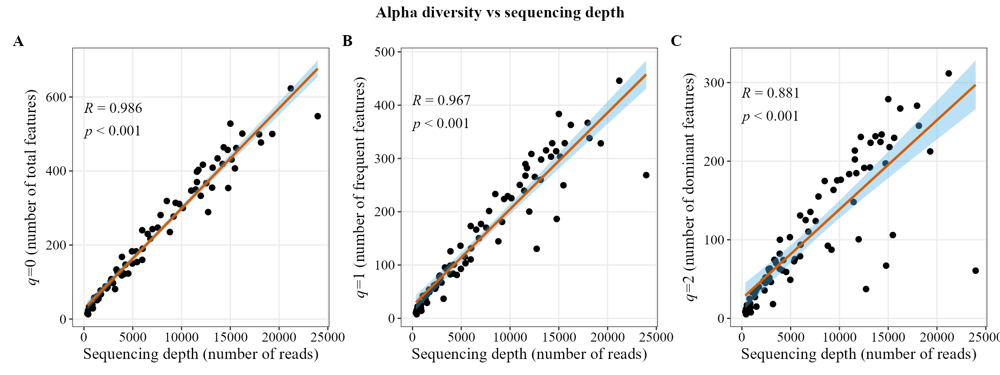

### Alpha diversity visualization

The
[`alpha_hill_plot()`](https://steph0522.github.io/MicroBioMeta/reference/alpha_hill_plot.md)
function calculates Hill numbers and visualizes alpha diversity patterns
across experimental conditions using boxplots.

The `x_col` parameter specifies the metadata column used on the x-axis,
while `fill_col` controls the grouping used to color the boxplots.

The `facet_by` argument allows splitting the plot according to a
metadata variable, and `facet_orientation` controls whether facets are
arranged horizontally or vertically.

If `save_table = TRUE`, the function also returns a table containing the
alpha diversity values calculated for each sample.

``` r

alpha_hill_plot(
    table = table_bac,
    metadata = metadata_bacteria,
    x_col = "Treatment",
    fill_col = "Treatment",
    group_colors = treatment_colors,
    facet_by = "Type_of_soil",
    facet_orientation = "horizontal",
    save_table = FALSE
)
```


The same function can swap the roles of the variables. For the fungi 🍄
we put the soil compartment on the x-axis and split the panels by
treatment, which highlights how diversity changes from bulk soil to
roots within each treatment:

``` r

alpha_hill_plot(
    table = table_fung,
    metadata = metadata_fungi,
    x_col = "Type_of_soil",
    fill_col = "Type_of_soil",
    facet_by = "Treatment",
    facet_orientation = "horizontal",
    show_legend = FALSE,
    save_table = FALSE
)
```

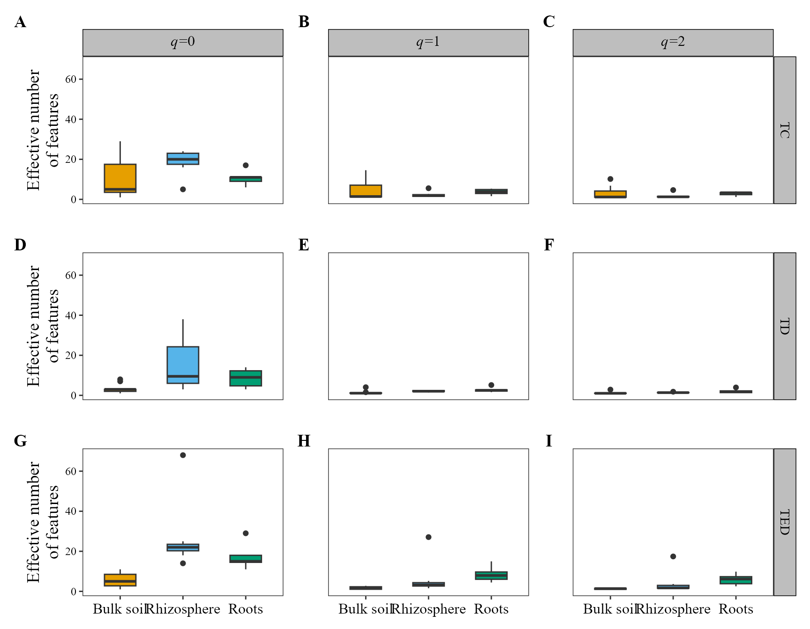

Also, we can visualize other metrics considering classic alpha diversity
indexes:

``` r

alpha_diversity_plot(
    table = table_fung,
    metadata = metadata_fungi,
    x_col = "Treatment",
    fill_col = "Treatment",
    group_colors = treatment_colors,
    facet_by = "Type_of_soil",
    facet_orientation = "horizontal",
    stat = "anova",
    free_y = TRUE,
    save_table = FALSE
)
```

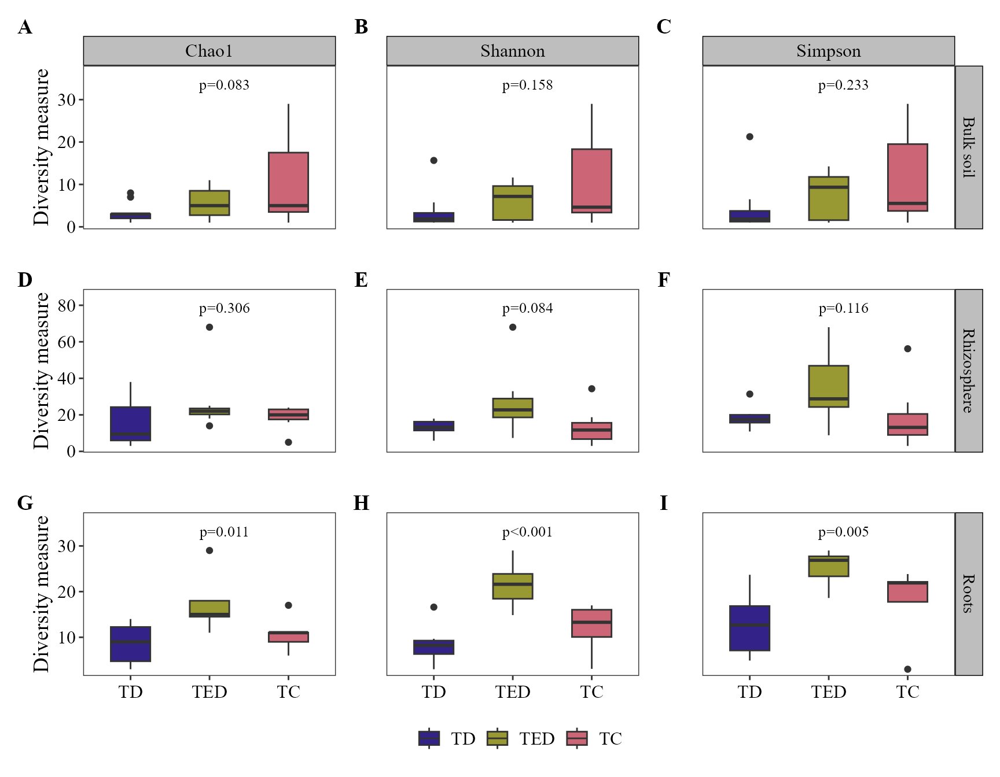

Each panel is automatically labeled (A, B, C, …) so it can be
referenced. When `stat` is set, p-values are added to each panel as
well. `"wilcox.test"` or `"t.test"` compare every pair of groups, each
with its own bracket, and correct the p-values for multiple comparisons
within the panel with `p_adjust_method` (default `"holm"`; `"none"`
shows the raw p-values). `"kruskal.test"` or `"anova"` give one global
p-value per panel. Only significant comparisons are drawn.
`panel_label_case` switches between upper and lowercase labels,
`panel_label_bold` for bold labels and `panel_labels` lets you supply
custom labels(e.g. `c("(a)", "(b)", "(c)")`) instead of the
auto-generated ones. `free_y` lets each panel use its own y-axis scale
instead of a shared one, as below:

``` r

alpha_diversity_plot(
    table = table_fung,
    metadata = metadata_fungi,
    x_col = "Treatment",
    fill_col = "Treatment",
    group_colors = treatment_colors,
    facet_by = "Type_of_soil",
    facet_orientation = "horizontal",
    stat = "anova",
    free_y = TRUE,
    x_label_angle = 45,
    panel_label_bold = FALSE,
    save_table = FALSE
)
```

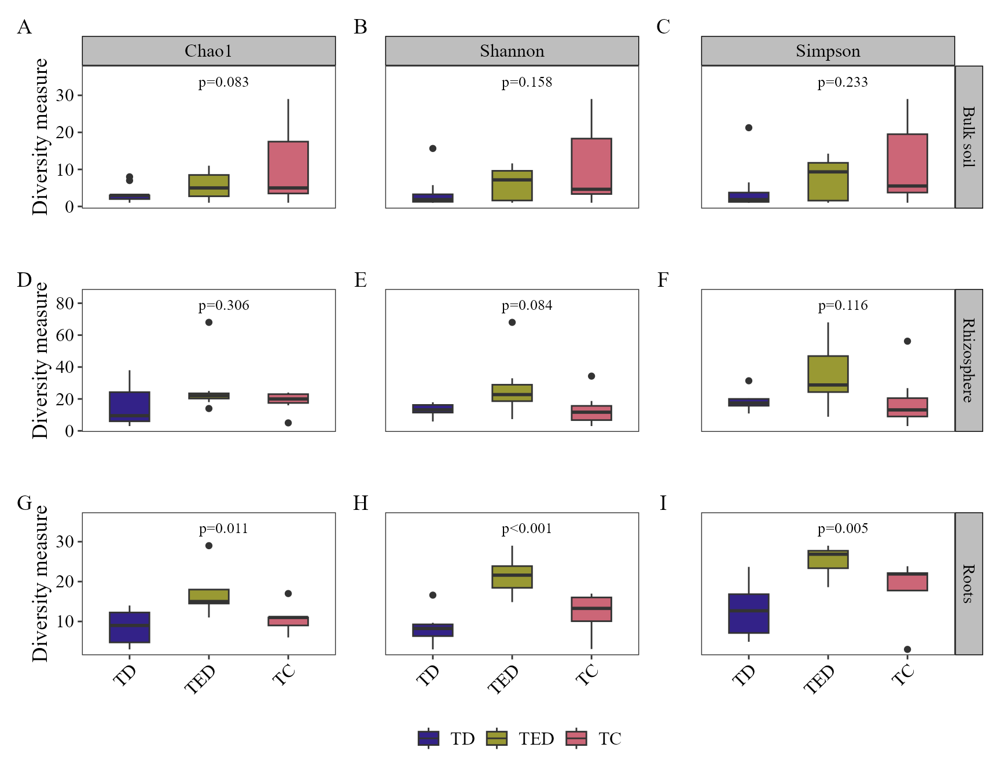

With `facet_orientation = "vertical"` the Hill orders (*q*) go in rows
and the `facet_by` groups in columns:

``` r

alpha_hill_plot(
    table = table_fung,
    metadata = metadata_fungi,
    x_col = "Type_of_soil",
    fill_col = "Type_of_soil",
    facet_by = "Treatment",
    facet_orientation = "vertical",
    show_legend = FALSE,
    save_table = FALSE
)
```

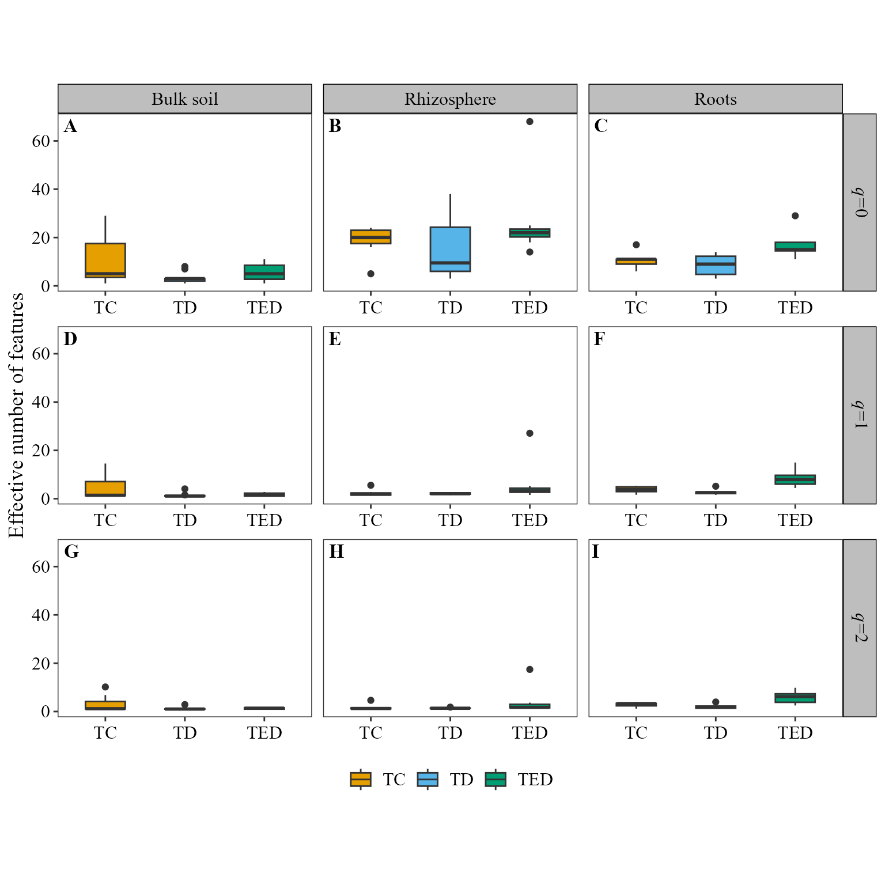

### Alpha diversity along a continuous gradient

[`alpha_decay_plot()`](https://steph0522.github.io/MicroBioMeta/reference/alpha_decay_plot.md)
makes a regression Hill numbers against a **continuous** metadata
variable (e.g. pH, elevation, distance). Each Hill order (*q*=0, 1, 2)
gets its own panel with a regression line and an annotation reporting
the correlation coefficient (Spearman’s rho by default), its p-value and
when `show_lm_stats = TRUE`, the linear model’s R² and slope.

The `cont_var` parameter names the continuous metadata column to place
on the x-axis, and the optional `group_col` fits a separate regression
line per group instead of a single global one.

Here we use soil `pH` as the gradient, restricted to `Bulk soil` and
`Rhizosphere` for a cleaner comparison:

``` r

metadata_bacteria_decay <- metadata_bacteria %>%
    filter(Type_of_soil %in% c("Bulk soil", "Rhizosphere"))

alpha_decay_plot(
    table = table_bac,
    metadata = metadata_bacteria_decay,
    cont_var = "pH",
    group_col = "Type_of_soil",
    x_axis_title = "Soil pH"
)
```


### Shared taxa between sample groups

Another way to explore alpha diversity patterns is by examining **which
taxa are shared or unique among groups of samples**. The function
[`venn_plot()`](https://steph0522.github.io/MicroBioMeta/reference/venn_plot.md)
generates Venn diagrams that summarize the overlap of taxa between
groups defined in the metadata.

We generate a Venn diagram grouping samples according to the treatment
(TC, TD and TED).

``` r

venn_plot(
    table = table_fung,
    metadata = metadata_fungi,
    merge_by = "Treatment",
    min_prevalence = 0
)
```


#### Collapsing the table by taxonomic level

Microbial community tables are often generated at the **ASV or OTU
level**, which can contain hundreds or thousands of features. For
interpretation and visualization, it is often useful to group these
features at a higher **taxonomic level**, such as genus.

The function
[`collapse_table()`](https://steph0522.github.io/MicroBioMeta/reference/collapse_table.md)
performs this aggregation by grouping features that are at the same
taxonomy level and summing their counts.

The function returns a **list with two elements**:

- **`collapsed_table`**: a wide-format abundance table where rows
  correspond to taxa collapsed at the selected level and columns
  correspond to samples.

- **`long_format`**: the same information in long format, which is
  useful for downstream plotting or statistical analyses.

- For example, the following code collapses the fungal abundance table
  to the **genus level** and we make a venn diagram to visualize genera
  shared.

``` r

table_genus <- collapse_table(
    table = table_fung,
    level = "genus"
)

venn_plot(
    table = table_genus$collapsed_table,
    metadata = metadata_fungi,
    merge_by = "Treatment"
)
```

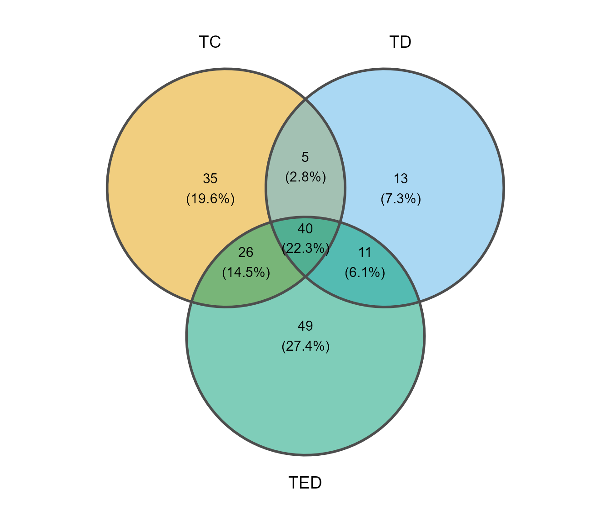

By default,
[`collapse_table()`](https://steph0522.github.io/MicroBioMeta/reference/collapse_table.md)
returns the **raw counts** summed at the selected taxonomic level.
However, microbial community data are needed to visualized or analyzed
as **relative abundance**. Setting `rel_abun = TRUE` converts the counts
of each sample into **percentages**, where the total abundance per
sample sums to 100%.

#### Filtering taxa by prevalence

Sometimes it is useful to visualize only taxa that occur frequently
within each group. This can be done using the `min_prevalence`
parameter.

For example, the following diagram includes only taxa present in **at
least 20% of the samples within each group**. The parameter is default
to 0, that means that nor filtering is applied.

``` r

venn_plot(
    table = table_fung,
    metadata = metadata_fungi,
    merge_by = "Treatment",
    min_prevalence = 0.2
)
```

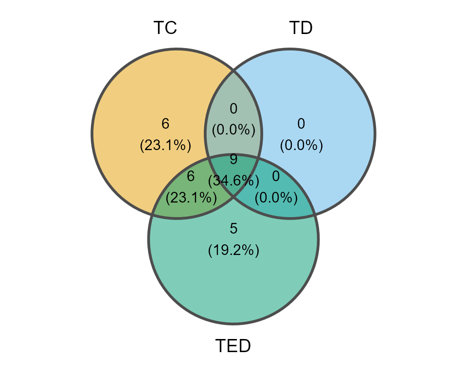

#### Customizing group colors

The function also allows custom colors for the groups.

``` r

venn_plot(
    table = table_fung,
    metadata = metadata_fungi,
    merge_by = "Treatment",
    min_prevalence = 0,
    group_colors = treatment_colors
)
```


#### Alternative plotting method

By default the function uses the package **ggvenn**, but it can also
generate the diagram using **ggVennDiagram**.

``` r

venn_plot(
    table = table_fung,
    metadata = metadata_fungi,
    merge_by = "Treatment",
    method = "ggvenndiagram"
)
```

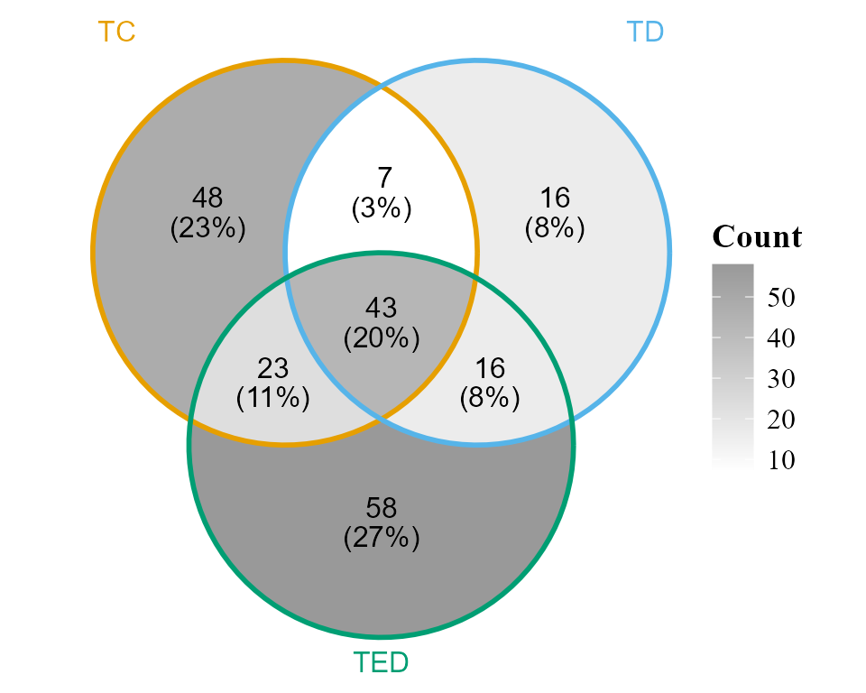

## Beta diversity

Beta diversity describes the differences in community composition and
structure among samples. These analyses help determine whether microbial
communities vary across environmental conditions, treatments, or
experimental groups and how this clustered or grouped for.

`MicroBioMeta` has several functions to explore beta diversity,
including ordination plots, statistical tests for community differences
and partitioning approaches that separate shared and unique components
of diversity. These functions allow both visual exploration and formal
hypothesis testing.

### Ordination of community composition

The
[`beta_ord_plot()`](https://steph0522.github.io/MicroBioMeta/reference/beta_ord_plot.md)
function calculates pairwise dissimilarities among samples and
visualizes the results using an ordination method. By default, the
function uses common ecological distance metrics (e.g., Bray–Curtis or
Euclidean) and dimensionality reduction techniques such as **PCoA**,
**PCA**, or **NMDS**. Accounting for compositional data in the examples
`aitchinson` and `compositional` distances are used. Compositional uses
the *clr* (log centered ratio) transformation made by `ALDEx2` package.

The `group_col` parameter specifies the metadata column used to color
the samples, while `shape_col` allows an additional metadata variable to
be displayed using different point shapes.

The `distance` argument defines the dissimilarity metric used to
calculate beta diversity (e.g, **bray, jaccard, aitchsion**, etc), and
`ordination` (options: **PCA, PCoA** or **NMDS**) specifies the
ordination method applied to visualize the distances among samples.

⚠️ **NOTE: `distance = "compositional"` uses one of the Monte Carlo
instances that `ALDEx2` draws at random, so the result changes slightly
from run to run. If you want to get the same result every time, we
suggest running [`set.seed()`](https://rdrr.io/r/base/Random.html)
before the function**, as in the examples below. The same applies to
`beta_test_table(distance = "compositional")`, to the ALDEx2 functions
and to the p-values of
[`cca_rda_biplot()`](https://steph0522.github.io/MicroBioMeta/reference/cca_rda_biplot.md).
By default (`mc_samples = 1`) a single instance is used, which is fast;
for final analyses we suggest `mc_samples = 128` (ALDEx2’s default),
which averages the clr values over 128 instances and gives almost the
same result in every run, at the cost of a longer computation.

``` r

set.seed(123)
beta_ord_plot(
    table = table_bac,
    metadata = metadata_bacteria,
    distance = "compositional",
    mc_samples = 128,
    ordination = "PCA",
    group_col = "Type_of_soil",
    shape_col = "Treatment"
)
```

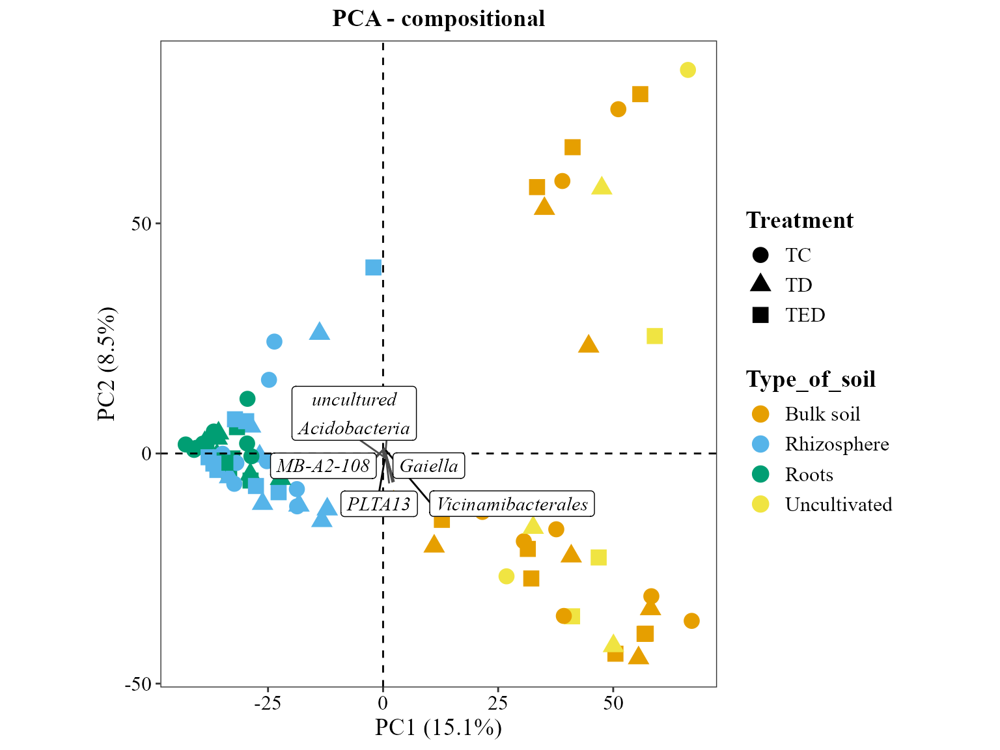

For the fungi 🍄 we use a different combination: **Bray-Curtis**
dissimilarity, which weights taxa by their abundance, with an **NMDS**
ordination. NMDS starts from random configurations, so
[`set.seed()`](https://rdrr.io/r/base/Random.html) is used here too:

``` r

set.seed(123)
beta_ord_plot(
    table = table_fung,
    metadata = metadata_fungi,
    group_col = "Type_of_soil",
    shape_col = "Treatment",
    distance = "bray",
    ordination = "NMDS"
)
```

    ## Run 0 stress 0.1282494 
    ## Run 1 stress 0.137064 
    ## Run 2 stress 0.1268558 
    ## ... New best solution
    ## ... Procrustes: rmse 0.01348788  max resid 0.06322113 
    ## Run 3 stress 0.131974 
    ## Run 4 stress 0.1284548 
    ## Run 5 stress 0.165162 
    ## Run 6 stress 0.1272512 
    ## ... Procrustes: rmse 0.007298609  max resid 0.05473952 
    ## Run 7 stress 0.1402745 
    ## Run 8 stress 0.1268558 
    ## ... Procrustes: rmse 3.561058e-06  max resid 1.719656e-05 
    ## ... Similar to previous best
    ## Run 9 stress 0.1272512 
    ## ... Procrustes: rmse 0.007300011  max resid 0.05475023 
    ## Run 10 stress 0.1274534 
    ## Run 11 stress 0.1315103 
    ## Run 12 stress 0.1309372 
    ## Run 13 stress 0.1301517 
    ## Run 14 stress 0.1268558 
    ## ... New best solution
    ## ... Procrustes: rmse 4.203426e-06  max resid 1.973148e-05 
    ## ... Similar to previous best
    ## Run 15 stress 0.1272512 
    ## ... Procrustes: rmse 0.007293077  max resid 0.05469673 
    ## Run 16 stress 0.1574605 
    ## Run 17 stress 0.1272512 
    ## ... Procrustes: rmse 0.00729887  max resid 0.05473141 
    ## Run 18 stress 0.1366118 
    ## Run 19 stress 0.1272606 
    ## ... Procrustes: rmse 0.02929663  max resid 0.1521837 
    ## Run 20 stress 0.1361393 
    ## *** Best solution repeated 1 times

    ## Coordinate system already present.
    ## ℹ Adding new coordinate system, which will replace the existing one.


### Statistical tests for beta diversity

The
[`beta_test_table()`](https://steph0522.github.io/MicroBioMeta/reference/beta_test_table.md)
function performs statistical tests to evaluate whether community
composition differs among experimental groups.

The `formula_str` argument specifies the experimental design using a
formula syntax similar to linear models in R or as it is used for the
`vegan` package ([Oksanen et al. 2024](#ref-oksanen2024vegan)). The
`distance` parameter defines the distance metric used to calculate
dissimilarities, and the `test` argument specifies the statistical test
(options: **PERMANOVA** ([Anderson 2001](#ref-anderson2001permanova)) or
**BETADISPER**).

The `permutations` parameter determines the number of permutations used
to estimate statistical significance. The `strata_var` is used as in
`vegan` package to block for a parameter. The first column of `metadata`
must hold the sample IDs. The functions never match samples by position:
metadata rows are matched to the table by ID (and reordered if needed,
with a message), samples missing from the metadata are left out with a
message, and the function stops if no ID matches. This applies to every
function that runs a statistical test (PERMANOVA, betadisper, ALDEx2,
CCA/RDA, random forest). `table` can also be a precomputed distance
(e.g. from
[`vegan::vegdist()`](https://vegandevs.github.io/vegan/reference/vegdist.html)),
which is used as-is.

⚠️ **NOTE: Each function has the option save\_\* that export a table or
an element obtain in each function**.

`distance` matches the ordination of each dataset above (`compositional`
for bacteria, `bray` for fungi), so the significance test evaluates the
same notion of dissimilarity shown in the plot.

The result is a table figure (a ggplot), so it can be combined with
other plots
(e.g. [`cowplot::plot_grid()`](https://wilkelab.org/cowplot/reference/plot_grid.html))
or saved with
[`ggplot2::ggsave()`](https://ggplot2.tidyverse.org/reference/ggsave.html).
Use `save_table = TRUE` to also get the results as a text file.

``` r

set.seed(123)
beta_test_table(
    table = table_bac,
    metadata = metadata_bacteria,
    formula_str = "Type_of_soil*Treatment",
    distance = "compositional",
    mc_samples = 128,
    test = "permanova",
    permutations = 999
)
```

    ## no conditions provided: forcing denom = 'all'

    ## no conditions provided: forcing conds = 'NA'

    ## conditions vector supplied

    ## operating in serial mode

    ## computing center with all features

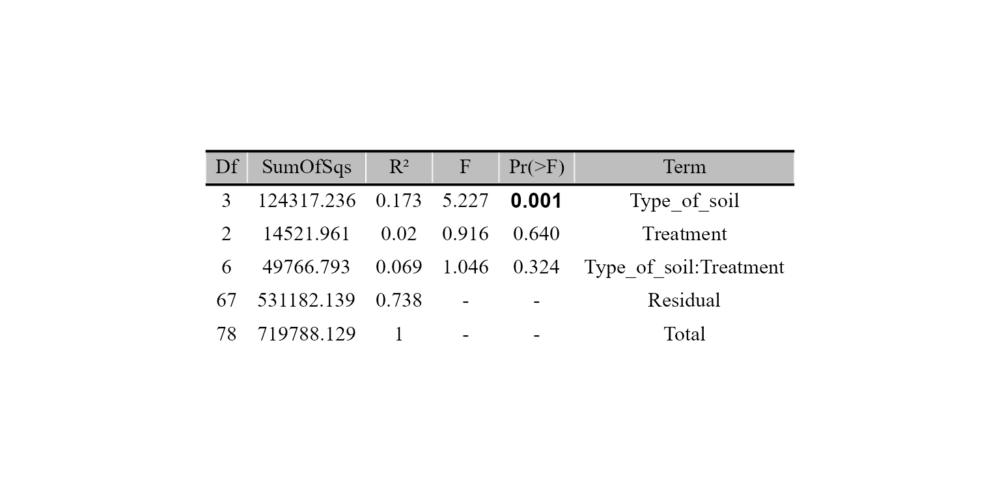

``` r

set.seed(123)
beta_test_table(
    table = table_fung,
    metadata = metadata_fungi,
    formula_str = "Type_of_soil*Treatment",
    distance = "bray",
    test = "permanova",
    permutations = 999
)
```


### Beta diversity partitioning

Beta diversity can also be decomposed into different components. The
[`beta_partition_ord_plot()`](https://steph0522.github.io/MicroBioMeta/reference/beta_partition_ord_plot.md)
function partitions beta diversity into the turnover and nestedness
components based on selected dissimilarity indices ([Baselga and Orme
2012](#ref-baselga2012betapart)).

The `family` argument specifies the dissimilarity family used for the
partition (e.g., Jaccard or Sørensen). The `group_col` and `shape_col`
parameters define how samples are visualized according to metadata
variables.

``` r

beta_partition_ord_plot(
    table = table_bac,
    metadata = metadata_bacteria,
    family = "jaccard",
    group_col = "Type_of_soil",
    shape_col = "Treatment",
    save_table = FALSE
)
```


``` r

beta_partition_ord_plot(
    table = table_fung,
    metadata = metadata_fungi,
    family = "jaccard",
    group_col = "Type_of_soil",
    shape_col = "Treatment",
    save_table = FALSE
)
```


### Pairwise beta diversity visualization

The
[`beta_dissimilarity_plot()`](https://steph0522.github.io/MicroBioMeta/reference/beta_dissimilarity_plot.md)
function summarizes pairwise beta diversity values using boxplots,
allowing comparison of diversity patterns among groups of samples. This
funciont uses betapart on incidence data using Sorensen or Jaccard
index: shared, turnover or nestedness.

The `condition1_col` and `condition2_col` parameters specify metadata
variables used to define the groups being compared. `condition2_col`
splits the comparisons into facets: each facet keeps only pairs of
samples from the same value (e.g. both samples from treatment TC), so
treatments are not mixed. The `partition` argument determines which
component of beta diversity is displayed (e.g., shared or unique), while
`family` defines the dissimilarity index used.

By default
[`beta_dissimilarity_plot()`](https://steph0522.github.io/MicroBioMeta/reference/beta_dissimilarity_plot.md)
keeps every pairwise combination possible of `condition1_col`, including
a group compared against itself (e.g. `"Roots_vs_Roots"`). The
`comparison_condition1` argument restricts the plot to specific
`"value1_vs_value2"` labels (the two values sorted alphabetically and
joined with `"*_vs_*"`). Here we build that list programmatically to
keep only the comparisons of every other compartment **against Roots**,
dropping self-comparisons:

``` r

groups_bac <- setdiff(unique(as.character(metadata_bacteria$Type_of_soil)), "Roots")
vs_roots_bac <- paste0(pmin(groups_bac, "Roots"), "_vs_", pmax(groups_bac, "Roots"))
# each comparison takes the color of the group compared with Roots
vs_roots_colors <- c(
    "Bulk soil_vs_Roots" = "#E69F00",
    "Rhizosphere_vs_Roots" = "#56B4E9",
    "Roots_vs_Uncultivated" = "#F0E442"
)
vs_roots_bac
```

    ## [1] "Rhizosphere_vs_Roots"  "Bulk soil_vs_Roots"    "Roots_vs_Uncultivated"

As with the alpha diversity plots, `x_label_angle` rotates the x-axis
tick labels (default `0`), `strip_text_bold` toggles bold facet strip
titles (default `FALSE`), and `aspect_ratio` fixes the panel’s
height/width ratio. As with the alpha plots, `stat`
(e.g. `"wilcox.test"`, `"kruskal.test"`, `"anova"`) adds a statistical
comparison across the boxplots of each facet, with the same pairwise or
global behavior and `p_adjust_method` as in the alpha plots.

If `save_table = TRUE`, the function also returns a table containing the
beta diversity values used to generate the plot.

``` r

beta_dissimilarity_plot(
    table = table_bac,
    metadata = metadata_bacteria,
    comparison_condition1 = vs_roots_bac,
    group_colors = vs_roots_colors,
    condition1_col = "Type_of_soil",
    condition2_col = "Treatment",
    x_axis_title = "Samples",
    show_x_labels = FALSE,
    stat = "kruskal.test",
    partition = "shared",
    family = "jaccard",
    save_table = FALSE
)
```

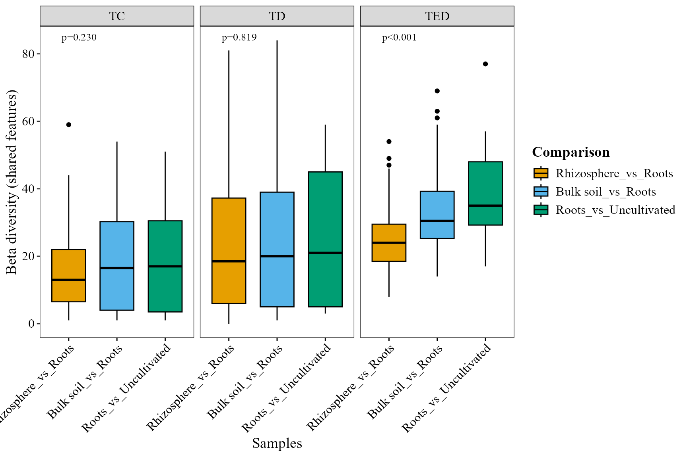

For the fungi 🍄 we look at a different component:
`partition = "turnover"` keeps only the replacement of taxa between
samples (not the differences due to one sample holding a subset of the
other), here with the Sørensen family:

``` r

groups_fung <- setdiff(unique(as.character(metadata_fungi$Type_of_soil)), "Roots")
vs_roots_fung <- paste0(pmin(groups_fung, "Roots"), "_vs_", pmax(groups_fung, "Roots"))
```

``` r

beta_dissimilarity_plot(
    table = table_fung,
    metadata = metadata_fungi,
    comparison_condition1 = vs_roots_fung,
    group_colors = vs_roots_colors,
    condition1_col = "Type_of_soil",
    condition2_col = "Treatment",
    x_axis_title = "Samples",
    show_x_labels = FALSE,
    stat = "kruskal.test",
    partition = "turnover",
    family = "sorensen",
    save_table = FALSE
)
```

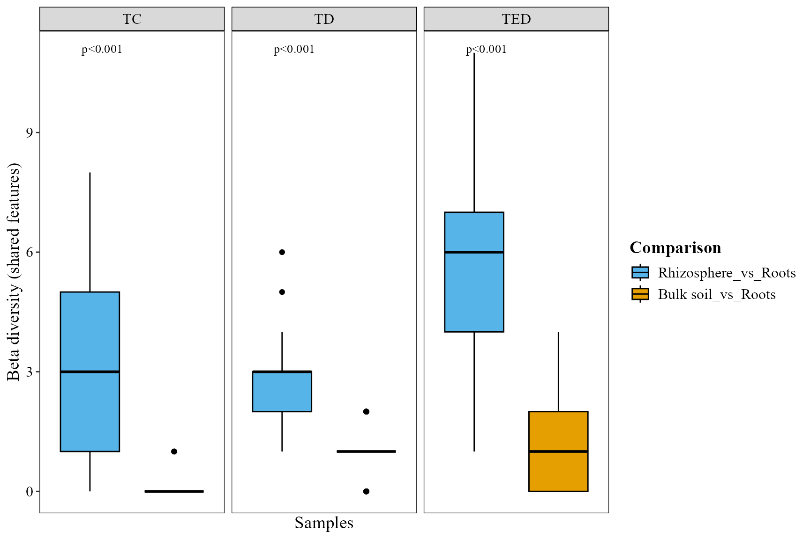

### Pairwise turnover: between-group vs. within-group

[`beta_turnover_plot()`](https://steph0522.github.io/MicroBioMeta/reference/beta_turnover_plot.md)
reports the ASV turnover component of Hill-number-based beta diversity
(*q*=0, 1, 2), one facet row per Hill order.

[`beta_turnover_plot()`](https://steph0522.github.io/MicroBioMeta/reference/beta_turnover_plot.md)
answers a different question than
[`beta_dissimilarity_plot()`](https://steph0522.github.io/MicroBioMeta/reference/beta_dissimilarity_plot.md):
for **one reference group** (e.g. Rhizosphere), is its turnover
**against another group** (e.g. Roots, a between-group comparison)
greater than its turnover **against itself** (Rhizosphere-vs-Rhizosphere
pairs, a within-group baseline)? If between-group turnover is
significantly higher, that’s evidence the two compartments really do
host distinct communities, beyond the variability already present among
replicates of the same compartment.

So the plot below has one purple (this color can be set) strip on top
per treatment (**TC**, **TD**, **TED**: only `condition2_col` is given,
so each facet keeps the pairs of samples from that same treatment) and,
inside each, two boxes: **“Rhizosphere_vs_Roots”** (between-group) and
**“Rhizosphere_vs_Rhizosphere”** (the within-group baseline). The names
in `group_colors` must match these comparison labels exactly; otherwise
the boxes are drawn grey (the function warns about it).

`comparison_condition1` selects which `"value1_vs_value2"` combinations
to keep always with the reference group (`Rhizosphere`) first.
`comparison_condition2` keeps only the same treatment pairs, so turnover
isn’t confounded by comparing samples from different treatments. Giving
only `condition2_col` (without `comparison_condition2`) does the same
for every treatment: it keeps the same-treatment pairs and facets by
treatment.

`facet_colors` colors the top facet strips (one per
`comparison_condition2` pair) and `group_colors` colors the boxes (one
per `comparison_condition1` pair). Tick labels are hidden by default
since the groups are already identified in the legend. Set
`show_x_labels = TRUE` to bring them back. `stat` adds a statistical
comparison between the boxes of each facet, as in
[`beta_dissimilarity_plot()`](https://steph0522.github.io/MicroBioMeta/reference/beta_dissimilarity_plot.md).

``` r

beta_turnover_plot(
    table = table_fungi,
    metadata = metadata_fungi,
    comparison_condition1 = c("Rhizosphere_vs_Roots", "Rhizosphere_vs_Rhizosphere"),
    condition1_col = "Type_of_soil",
    condition2_col = "Treatment",
    facet_colors = "#5D478B",
    group_colors = c(
        "Rhizosphere_vs_Roots" = "#56B4E9",
        "Rhizosphere_vs_Rhizosphere" = "grey75"
    ),
    stat = "wilcox.test"
)
```

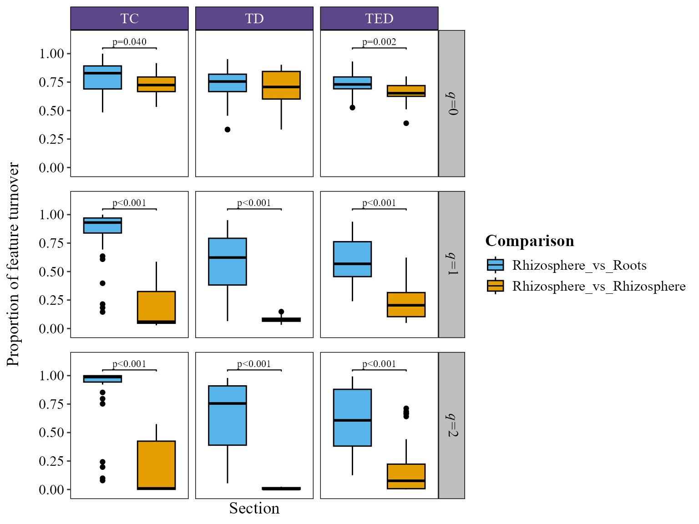

### Distance-decay of community similarity

The function
[`beta_decay_plot()`](https://steph0522.github.io/MicroBioMeta/reference/beta_decay_plot.md)
tests whether communities that are geographically closer are also more
similar in composition. It computes pairwise community dissimilarity
(`distance`, e.g. `"jaccard"`, `"bray"`, `"horn"`) and pairwise
geographic distances from sample coordinates, runs a Mantel test
([Mantel 1967](#ref-mantel1967test)) between them, and plots similarity
(1 − dissimilarity) against distance with a fitted regression line.

`lat_col`/`lon_col` name the latitude/longitude columns in `metadata`
(decimal degrees), and the optional `group_col` runs a separate Mantel
test and regression line per group instead of one global test.

We construct example data for this part:

``` r

loc_coords <- data.frame(
    Loc = 0:8,
    lat = 19.0 + seq(0, 0.8, length.out = 9),
    lon = -99.0 + seq(0, 0.8, length.out = 9)
)
metadata_bacteria$lat <- loc_coords$lat[match(metadata_bacteria$Loc, loc_coords$Loc)]
metadata_bacteria$lon <- loc_coords$lon[match(metadata_bacteria$Loc, loc_coords$Loc)]

# filtering uncultivated
metadata_bacteria_decay <- metadata_bacteria %>%
    filter(Type_of_soil != "Uncultivated")
```

``` r

beta_decay_plot(
    table     = table_bac,
    metadata  = metadata_bacteria_decay,
    lat_col   = "lat",
    lon_col   = "lon",
    distance  = "jaccard",
    group_col = "Type_of_soil"
)
```


## Differential abundant analysis

`MicroBioMeta` has several functions to explore **differentially
abundant taxa**. These analyses help identify microbial features that
vary significantly across experimental groups.

Two functions rely on a **compositional data analysis framework
implemented in the package**
[ALDEx2](https://www.bioconductor.org/packages/release/bioc/html/ALDEx2.html)
([Fernandes et al. 2014](#ref-fernandes2014aldex2)). This approach
accounts for the compositional nature of sequencing data ([Gloor et al.
2017](#ref-gloor2017compositional)) by using Monte Carlo Dirichlet
instances and centered log-ratio transformations and in the package
[ANCOMBC2](https://bioconductor.org/packages/ANCOMBC/) ([Lin and Peddada
2020](#ref-lin2020ancombc)) an alternative differential abundance method
that explicitly models compositional bias and structural zeros.

The functions:

- [`aldex_volcano_plot()`](https://steph0522.github.io/MicroBioMeta/reference/aldex_volcano_plot.md)
  visualizes differential abundance results using a **volcano plot**.

- [`aldex_heatmap_plot()`](https://steph0522.github.io/MicroBioMeta/reference/aldex_heatmap_plot.md)
  visualizes significant taxa in a **heatmap**.

- [`ancombc_plot()`](https://steph0522.github.io/MicroBioMeta/reference/ancombc_plot.md)
  returns a bar plot (when 2 groups) and a heatmap (when 3+ groups).

Additionally, two complementary approaches help identify **important
taxa that discriminate between groups**:

- [`ratios_bubble_plot()`](https://steph0522.github.io/MicroBioMeta/reference/ratios_bubble_plot.md)
  visualizes taxa based on **log-ratio differences between conditions**.

- [`random_forest_lollipop_plot()`](https://steph0522.github.io/MicroBioMeta/reference/random_forest_lollipop_plot.md)
  uses a **Random Forest model** ([Breiman
  2001](#ref-breiman2001randomforest)) to identify features that best
  predict a given variable or condition, visualized as a **lollipop plot
  of feature importance**.

### Example: Bacterial data

First, we keep only two soil compartments, **Bulk soil** and **Roots**,
since ALDEx2 compares two groups.

``` r

metadata_bacteria_compar <- metadata_bacteria %>%
    filter(Type_of_soil == "Roots" | Type_of_soil == "Bulk soil")

table_bacteria_compar <- table_bacteria[match(metadata_bacteria_compar$SAMPLEID, colnames(table_bacteria))]

table_bac_compar <- merge_feature_taxonomy(table_bacteria_compar, taxonomy_bacteria)
```

    ## Warning in merge_feature_taxonomy(table_bacteria_compar, taxonomy_bacteria): 83
    ## taxonomy IDs are not present in the table and will be excluded from the result.

We can visualize differential abundance using a **volcano plot**.
Significant taxa are labeled with their name; `label_size` controls the
font size of these labels, and `filter_uncultured = TRUE` drops
“uncultured”/“unculture” taxa from the labels (they are still plotted as
points, just not labeled). By default significance uses the
Benjamini-Hochberg adjusted p-value (`p_adjust_method = "BH"`), since
thousands of taxa are tested at once. Between bulk soil and roots many
taxa remain significant after the correction (colored points);
`p_adjust_method = "none"` would use the raw p-values instead.

``` r

set.seed(123)
aldex_volcano_plot(
    table = table_bac_compar,
    metadata = metadata_bacteria_compar,
    group_col = "Type_of_soil",
    type = "volcano",
    label_size = 3,
    filter_uncultured = TRUE
)
```


### ANCOMBC2 as an alternative method

[`ancombc_plot()`](https://steph0522.github.io/MicroBioMeta/reference/ancombc_plot.md)
provides an alternative to the ALDEx2-based functions above. This
function depends on the Bioconductor package `ANCOMBC`:

``` r

# install.packages("BiocManager")
BiocManager::install("ANCOMBC")
```

`level` groups the table to a taxonomic rank before testing (default
`"Genus"`), and `p_adjust_method`/`min_prevalence` control the
multiple-testing correction and prevalence filter.

With two groups the result is a **bar plot**: one bar per significant
taxon with its log fold change (LFC) between the two groups and its
standard error, colored by the group where the taxon is more abundant.
The reference group is the first level of `group_col` (here **Bulk
soil**), so positive values mean more abundant in **Roots**. Here
`min_prevalence = 0.5` keeps the phyla present in at least half of the
samples.

⚠️ With a low `min_prevalence`, rare/sparse taxa can trigger a
`"Zero variances have been detected..."` error from ANCOMBC2’s internal
bias-correction step on some runs (it doesn’t always happen, it depends
on which taxa the bootstrap iteration happens to keep). Raising
`min_prevalence` filters those sparse taxa out before testing and avoids
it.

``` r

ancombc_plot(
    table = table_bac_compar,
    metadata = metadata_bacteria_compar,
    group_col = "Type_of_soil",
    level = "Phylum",
    min_prevalence = 0.5,
    p_adjust_method = "BH"
)
```


With **3 or more groups**,
[`ancombc_plot()`](https://steph0522.github.io/MicroBioMeta/reference/ancombc_plot.md)
returns a **heatmap** instead: one column per group compared against the
reference level (the first factor level, here **Bulk soil**; it can be
changed with `ref_level`), and one row per taxon that is significant in
at least one comparison. Here we keep the three compartments (dropping
**Uncultivated**) and group to `"Phylum"` so the heatmap stays readable:

``` r

metadata_bacteria_3 <- metadata_bacteria %>%
    filter(Type_of_soil != "Uncultivated")

table_bac_3 <- table_bac[, c(match(metadata_bacteria_3$SAMPLEID, colnames(table_bac)), ncol(table_bac))]

ancombc_plot(
    table           = table_bac_3,
    metadata        = metadata_bacteria_3,
    group_col       = "Type_of_soil",
    level           = "Phylum",
    min_prevalence  = 0.3,
    p_adjust_method = "holm"
)
```

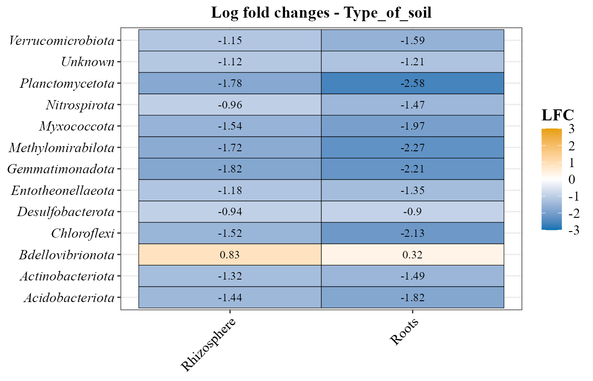

**How to read the heatmap:** each column is one group compared with the
reference (here **Rhizosphere** vs **Bulk soil** and **Roots** vs **Bulk
soil**), and each row is a taxon. The color and the number in each cell
are the log fold change (LFC, natural logarithm) estimated by ANCOMBC2:
positive values (orange) mean the taxon is more abundant in that group
than in bulk soil, negative values (blue) that it is less abundant, and
white means no change. For example, an LFC of 1 means about 2.7 times
more abundant (*e*¹), and -1 about 2.7 times less. A taxon is shown when
it is significant in at least one of the comparisons, so a cell can be
colored even if that particular comparison is not significant;
`save_table = TRUE` saves the adjusted p-value (`q_`) and the
significance (`diff_`) of every comparison.

### Example: Fungal data

We follow the same procedure, comparing **Bulk soil** and **Roots**, but
visualize the results with a **heatmap**. This funtcions uses
`ComplexHeatmap`.

``` r

metadata_fungi_compar <- metadata_fungi %>%
    filter(Type_of_soil == "Bulk soil" | Type_of_soil == "Roots")

table_fungi_compar <- table_fung[match(metadata_fungi_compar$SAMPLEID, colnames(table_fung))]

table_fung_compar <- merge_feature_taxonomy(table_fungi_compar, taxonomy_fungi)
```

    ## Warning in merge_feature_taxonomy(table_fungi_compar, taxonomy_fungi): 17
    ## taxonomy IDs are not present in the table and will be excluded from the result.

As in the volcano plot, by default the heatmap keeps the taxa with a
Benjamini-Hochberg adjusted p-value below 0.05 (`pval_threshold = 0.05`,
`p_adjust_method = "BH"`); `effect_threshold` can additionally filter by
effect size. Each row shows the median clr values per group, with side
annotations for the effect size, the p-value class and the difference
between groups:

``` r

set.seed(123)
aldex_heatmap_plot(
    table = table_fung_compar,
    metadata = metadata_fungi_compar,
    group_col = "Type_of_soil"
)
```


### Identifying important taxa

The functions
[`random_forest_lollipop_plot()`](https://steph0522.github.io/MicroBioMeta/reference/random_forest_lollipop_plot.md)
and
[`ratios_bubble_plot()`](https://steph0522.github.io/MicroBioMeta/reference/ratios_bubble_plot.md)
can also be used to highlight taxa that contribute most strongly to the
observed differences between conditions.

For example, a **Random Forest model** can be used to identify the taxa
that best predict the soil compartment:

``` r

random_forest_lollipop_plot(
    table = table_bac,
    metadata = metadata_bacteria,
    top_n = 10,
    variable_to_predict = "Type_of_soil"
)
```

    ## Warning in random_forest_lollipop_plot(table = table_bac, metadata = metadata_bacteria, : Note: Some bacterial phylum names have been updated to match NCBI's revised taxonomy:
    ##   - 'Proteobacteria' changed to 'Pseudomonadota'
    ##   - 'Actinobacteriota' changed to 'Actinomycetota'
    ## Reference: https://ncbiinsights.ncbi.nlm.nih.gov/2021/12/10/ncbi-taxonomy-prokaryote-phyla-added/


Alternatively, taxa with the strongest **log-ratio differences between
two conditions** can be visualized using:

``` r

ratios_bubble_plot(
    table = table_fung_compar,
    metadata = metadata_fungi_compar,
    group_col = "Type_of_soil",
    top_n = 20,
    condition_A = "Roots",
    condition_B = "Bulk soil"
)
```


## Environmental analyses

`MicroBioMeta` provides two functions to explore the relationship
between **environmental variables** and **microbial community
composition**:

- [`corr_env_abund_plot()`](https://steph0522.github.io/MicroBioMeta/reference/corr_env_abund_plot.md)
  — computes correlations between taxonomic abundance and environmental
  variables.

- [`cca_rda_biplot()`](https://steph0522.github.io/MicroBioMeta/reference/cca_rda_biplot.md)
  — performs constrained ordination using **Canonical Correspondence
  Analysis (CCA)** or **Redundancy Analysis (RDA)**.

#### Choosing the environmental variables

The environmental variables are read directly from the **metadata** (one
column per variable), so no separate table is needed: just pass the
names of the columns to use in `env_vars`. If your variables are in a
different table, give it in `env_data` (rows = samples, as row names).

``` r

env_vars_fung <- metadata_fungi %>%
    dplyr::select(pH:Arbus_per) %>%
    colnames()
```

#### Correlation between environmental variables and taxonomic abundance

The function
[`corr_env_abund_plot()`](https://steph0522.github.io/MicroBioMeta/reference/corr_env_abund_plot.md)
calculates correlations between **environmental variables** and
**taxonomic relative abundances** at a selected taxonomic level and
returns a **correlation heatmap** showing how environmental variables
relate to taxonomic abundances.

Example using **phylum-level abundances**:

``` r

corr_env_abund_plot(
    table = table_fung,
    metadata = metadata_fungi,
    env_vars = env_vars_fung,
    level = "phylum",
    save_table = FALSE
)
```


### Alternative visualization

Correlations can also be displayed using circle markers instead of
tiles:

``` r

corr_env_abund_plot(
    table = table_fung,
    metadata = metadata_fungi,
    env_vars = env_vars_fung,
    level = "phylum",
    save_table = FALSE,
    geom = "circle"
)
```

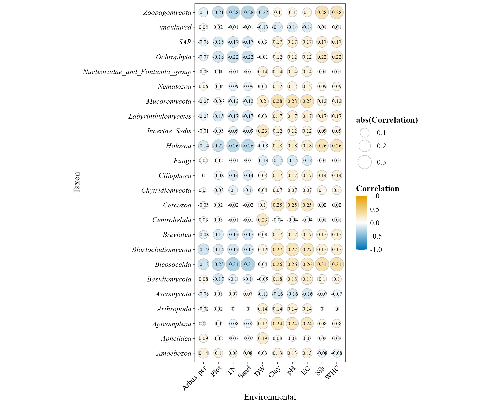

#### Constrained ordination (CCA / RDA)

The function
[`cca_rda_biplot()`](https://steph0522.github.io/MicroBioMeta/reference/cca_rda_biplot.md)
performs a constrained ordination analysis to evaluate how environmental
variables explain variation in microbial community composition.

`scale_arrows` is a parameter that helps you to visualize better the
environmental vectors:

``` r

cca_rda_biplot(
    table = table_fung,
    metadata = metadata_fungi,
    env_vars = c("pH", "TN", "WHC", "EC", "Clay"),
    analysis = "RDA",
    show_all_env_vectors = TRUE,
    group_col = "Type_of_soil",
    scale_arrows = 3
)
```

    ## 
    ## Some constraints or conditions were aliased because they were redundant. This
    ## can happen if terms are constant or linearly dependent (collinear): 'WHC',
    ## 'EC', 'Clay'


This analysis produces a **biplot** where:

- **Points** represent samples

- **Colors** indicate sample groups defined in the metadata.

- **Arrows** represent environmental variables and their direction of
  influence on community structure.

- Environmental vectors pointing in similar directions indicate
  **positive associations**, while vectors pointing in opposite
  directions suggest **negative relationships**

## References

Anderson, Marti J. 2001. “A New Method for Non-Parametric Multivariate
Analysis of Variance.” *Austral Ecology* 26 (1): 32–46.
<https://doi.org/10.1111/j.1442-9993.2001.01070.pp.x>.

Baselga, Andrés, and C. David L. Orme. 2012. “betapart: An R Package for
the Study of Beta Diversity.” *Methods in Ecology and Evolution* 3 (5):
808–12. <https://doi.org/10.1111/j.2041-210X.2012.00224.x>.

Bisanz, Jordan E. 2018. *qiime2R: Importing QIIME2 Artifacts and
Associated Data into R Sessions*. <https://github.com/jbisanz/qiime2R>.

Bolyen, Evan, Jai Ram Rideout, Matthew R. Dillon, et al. 2019.
“Reproducible, Interactive, Scalable and Extensible Microbiome Data
Science Using QIIME 2.” *Nature Biotechnology* 37 (8): 852–57.
<https://doi.org/10.1038/s41587-019-0209-9>.

Breiman, Leo. 2001. “Random Forests.” *Machine Learning* 45 (1): 5–32.
<https://doi.org/10.1023/A:1010933404324>.

Chao, Anne, Nicholas J. Gotelli, T. C. Hsieh, et al. 2014. “Rarefaction
and Extrapolation with Hill Numbers: A Framework for Sampling and
Estimation in Species Diversity Studies.” *Ecological Monographs* 84
(1): 45–67. <https://doi.org/10.1890/13-0133.1>.

Fernandes, Andrew D., Jennifer N. S. Reid, Jean M. Macklaim, Thomas A.
McMurrough, David R. Edgell, and Gregory B. Gloor. 2014. “Unifying the
Analysis of High-Throughput Sequencing Datasets: Characterizing RNA-Seq,
16S rRNA Gene Sequencing and Selective Growth Experiments by
Compositional Data Analysis.” *Microbiome* 2: 15.
<https://doi.org/10.1186/2049-2618-2-15>.

Gloor, Gregory B., Jean M. Macklaim, Vera Pawlowsky-Glahn, and Juan J.
Egozcue. 2017. “Microbiome Datasets Are Compositional: And This Is Not
Optional.” *Frontiers in Microbiology* 8: 2224.
<https://doi.org/10.3389/fmicb.2017.02224>.

Li, Daijiang. 2018. “hillR: Taxonomic, Functional, and Phylogenetic
Diversity and Similarity Through Hill Numbers.” *Journal of Open Source
Software* 3 (31): 1041. <https://doi.org/10.21105/joss.01041>.

Lin, Huang, and Shyamal Das Peddada. 2020. “Analysis of Compositions of
Microbiomes with Bias Correction.” *Nature Communications* 11: 3514.
<https://doi.org/10.1038/s41467-020-17041-7>.

Mantel, Nathan. 1967. “The Detection of Disease Clustering and a
Generalized Regression Approach.” *Cancer Research* 27 (2): 209–20.

Oksanen, Jari, Gavin L. Simpson, F. Guillaume Blanchet, et al. 2024.
*Vegan: Community Ecology Package*.
<https://CRAN.R-project.org/package=vegan>.

## Session info

``` r

sessionInfo()
```

    ## R version 4.6.1 (2026-06-24 ucrt)
    ## Platform: x86_64-w64-mingw32/x64
    ## Running under: Windows 10 x64 (build 19045)
    ## 
    ## Matrix products: default
    ##   LAPACK version 3.12.1
    ## 
    ## locale:
    ## [1] LC_COLLATE=Spanish_Latin America.utf8 
    ## [2] LC_CTYPE=Spanish_Latin America.utf8   
    ## [3] LC_MONETARY=Spanish_Latin America.utf8
    ## [4] LC_NUMERIC=C                          
    ## [5] LC_TIME=Spanish_Latin America.utf8    
    ## 
    ## time zone: America/Mexico_City
    ## tzcode source: internal
    ## 
    ## attached base packages:
    ## [1] stats     graphics  grDevices utils     datasets  methods   base     
    ## 
    ## other attached packages:
    ##  [1] doRNG_1.8.6.3       rngtools_1.5.2      foreach_1.5.2      
    ##  [4] lubridate_1.9.5     forcats_1.0.1       stringr_1.6.0      
    ##  [7] dplyr_1.2.1         purrr_1.2.2         readr_2.2.0        
    ## [10] tidyr_1.3.2         tibble_3.3.1        ggplot2_4.0.3      
    ## [13] tidyverse_2.0.0     MicroBioMeta_0.99.0
    ## 
    ## loaded via a namespace (and not attached):
    ##   [1] fs_2.1.0                    matrixStats_1.5.0          
    ##   [3] httr_1.4.9                  betapart_1.6.1             
    ##   [5] RColorBrewer_1.1-3          doParallel_1.0.17          
    ##   [7] numDeriv_2016.8-1.1         tools_4.6.1                
    ##   [9] backports_1.5.1             R6_2.6.1                   
    ##  [11] vegan_2.7-6                 mgcv_1.9-4                 
    ##  [13] GetoptLong_1.1.1            permute_0.9-10             
    ##  [15] withr_3.0.3                 gridExtra_2.3.1            
    ##  [17] cli_3.6.6                   Biobase_2.72.0             
    ##  [19] textshaping_1.0.5           Cairo_1.7-0                
    ##  [21] sandwich_3.1-3              labeling_0.4.3             
    ##  [23] sass_0.4.10                 mvtnorm_1.4-2              
    ##  [25] S7_0.2.2                    randomForest_4.7-1.2       
    ##  [27] proxy_0.4-29                pkgdown_2.2.1              
    ##  [29] systemfonts_1.3.2           foreign_0.8-91             
    ##  [31] dichromat_2.0-1             itertools_0.1-3            
    ##  [33] readxl_1.5.0.1              rstudioapi_0.19.0          
    ##  [35] generics_0.1.4              ggVennDiagram_1.5.7        
    ##  [37] shape_1.4.6.1               gtools_3.9.5               
    ##  [39] car_3.1-5                   Matrix_1.7-5               
    ##  [41] interp_1.1-6                DescTools_0.99.60          
    ##  [43] S4Vectors_0.50.3            abind_1.4-8                
    ##  [45] lifecycle_1.0.5             multcomp_1.4-32            
    ##  [47] yaml_2.3.12                 carData_3.0-6              
    ##  [49] SummarizedExperiment_1.42.0 SparseArray_1.12.2         
    ##  [51] grid_4.6.1                  crayon_1.5.3               
    ##  [53] lattice_0.22-9              haven_2.5.5                
    ##  [55] cowplot_1.2.0               magick_2.9.1               
    ##  [57] pillar_1.11.1               knitr_1.52                 
    ##  [59] ComplexHeatmap_2.28.0       rcdd_1.6-1                 
    ##  [61] GenomicRanges_1.64.0        rjson_0.2.23               
    ##  [63] boot_1.3-32                 gld_2.6.8                  
    ##  [65] codetools_0.2-20            fastmatch_1.1-8            
    ##  [67] picante_1.8.4               glue_1.8.1                 
    ##  [69] ggvenn_0.1.19               data.table_1.18.6.1        
    ##  [71] vctrs_0.7.3                 png_0.1-9                  
    ##  [73] Rdpack_2.6.6                cellranger_1.1.0           
    ##  [75] gtable_0.3.6                cachem_1.1.0               
    ##  [77] zigg_0.0.2                  xfun_0.61                  
    ##  [79] rbibutils_2.4.1             S4Arrays_1.12.0            
    ##  [81] Rfast_2.1.5.2               Seqinfo_1.2.0              
    ##  [83] reformulas_0.4.4            survival_3.8-6             
    ##  [85] hillR_0.5.2                 geometry_0.5.2             
    ##  [87] iterators_1.0.14            TH.data_1.1-5              
    ##  [89] directlabels_2026.8.27      nlme_3.1-169               
    ##  [91] ANCOMBC_2.14.0              data.tree_1.2.0            
    ##  [93] bslib_0.12.0                otel_0.2.0                 
    ##  [95] rpart_4.1.27                colorspace_2.1-3           
    ##  [97] BiocGenerics_0.58.1         Hmisc_5.3-0                
    ##  [99] nnet_7.3-20                 NADA_1.6-1.2               
    ## [101] Exact_3.3                   tidyselect_1.2.1           
    ## [103] compiler_4.6.1              htmlTable_2.5.0            
    ## [105] expm_1.0-1                  desc_1.4.3                 
    ## [107] DelayedArray_0.38.2         checkmate_2.3.4            
    ## [109] scales_1.4.0                quadprog_1.5-8             
    ## [111] digest_0.6.39               minqa_1.2.8                
    ## [113] rmarkdown_2.32              XVector_0.52.0             
    ## [115] htmltools_0.5.9             pkgconfig_2.0.3            
    ## [117] jpeg_0.1-11                 base64enc_0.1-6            
    ## [119] lme4_2.0-6                  MatrixGenerics_1.24.0      
    ## [121] fastmap_1.2.0               rlang_1.3.0                
    ## [123] GlobalOptions_0.1.4         htmlwidgets_1.6.4          
    ## [125] zCompositions_1.6.2         ggh4x_0.3.1                
    ## [127] farver_2.1.2                jquerylib_0.1.4            
    ## [129] zoo_1.9-1                   jsonlite_2.0.0             
    ## [131] energy_1.7-12               BiocParallel_1.46.0        
    ## [133] magrittr_2.0.5              Formula_1.2-6              
    ## [135] patchwork_1.3.2             geosphere_1.6-8            
    ## [137] Rcpp_1.1.2                  ape_5.8-1                  
    ## [139] stringi_1.8.9               rootSolve_1.8.2.4          
    ## [141] MASS_7.3-65                 parallel_4.6.1             
    ## [143] ggrepel_0.9.8               doSNOW_1.0.20              
    ## [145] lmom_3.3                    deldir_2.0-4               
    ## [147] splines_4.6.1               multtest_2.68.0            
    ## [149] hms_1.1.4                   circlize_0.4.18            
    ## [151] ALDEx2_1.44.0               igraph_2.3.3               
    ## [153] ggpubr_1.0.0                ggsignif_0.6.4             
    ## [155] stats4_4.6.1                magic_1.6-1                
    ## [157] evaluate_1.0.5              latticeExtra_0.6-31        
    ## [159] RcppParallel_6.2.1          nloptr_2.2.1               
    ## [161] tzdb_0.5.0                  networkD3_0.4.1            
    ## [163] clue_0.3-68                 broom_1.0.13               
    ## [165] e1071_1.7-17                rstatix_1.1.0              
    ## [167] viridisLite_0.4.3           class_7.3-23               
    ## [169] ragg_1.5.2                  gsl_2.1-9                  
    ## [171] truncnorm_1.0-9             snow_0.4-4                 
    ## [173] minpack.lm_1.2-4            lmerTest_3.2-1             
    ## [175] IRanges_2.46.0              cluster_2.1.8.2            
    ## [177] timechange_0.4.0
