# Amplicón

🧬 MicroBioMeta es un paquete de R diseñado para trabajar con datos de
metabarcoding. Este tutorial recorre un ejemplo de su uso.

Para este ejemplo usaremos datos secuenciados con el barcode 16S para
bacterias y 18S para hongos.

Los datos provienen de:

Para 16S 🦠: [Hereira-Pacheco, S.E., Navarro-Noya, Y.E. & Dendooven, L.
The root endophytic bacterial community of Ricinus communis L. resembles
the seeds community more than the rhizosphere bacteria independent of
soil water content. Sci Rep 11, 2173 (2021).
https://doi.org/10.1038/s41598-021-81551-7](https://doi.org/10.1038/s41598-021-81551-7)

Para 18S 🍄: [Hereira-Pacheco, S. E., Estrada-Torres, A., Dendooven, L.,
& Navarro-Noya, Y. E. (2023). Shifts in root-associated fungal
communities under drought conditions in Ricinus communis. Fungal
Ecology, 63,
101225.](https://www.sciencedirect.com/science/article/abs/pii/S1754504823000028)

## Cargar los datos

Primero, carguemos el paquete `MicroBioMeta`:

``` r

library("MicroBioMeta")
```

Carguemos también los demás paquetes que vamos a necesitar:

``` r

library(tidyverse)
```

[`tidyverse`](https://tidyverse.org/) se usa para todo el manejo de
datos y las visualizaciones.

Ahora cargamos los datos y los reformateamos. Este conjunto de datos fue
procesado en [`QIIME2`](https://qiime2.org/) ([Bolyen et al.
2019](#ref-bolyen2019qiime2)), así que sus artefactos `.qza` se
importaron originalmente a R con el paquete
[`qiime2R`](https://github.com/jbisanz/qiime2R) ([Bisanz
2018](#ref-bisanz2018qiime2r)) (Licencia MIT, © 2018 Jordan Bisanz), del
cual `read_qza()` el parser de taxonomía propio de `MicroBioMeta` está
adaptado. Si tienes tus propios artefactos `.qza`,
[`qiime2R::read_qza()`](https://rdrr.io/pkg/qiime2R/man/read_qza.html)
(`devtools::install_github("jbisanz/qiime2R")`) es la forma de
importarlos a R.

Para esta viñeta, esos mismos datos vienen incluidos en el paquete ya
exportados como archivos `.txt` planos (en `inst/extdata/`), así que
construirla no requiere tener instalado `qiime2R` (un paquete que solo
está en GitHub):

Primero, carguemos las tablas y la taxonomía de cada conjunto de datos:

``` r

bacteria_table <- read.delim(
    system.file("extdata", "table_bacteria.txt", package = "MicroBioMeta"),
    row.names = 1, check.names = FALSE
)

fungi_table <- read.delim(
    system.file("extdata", "table_fungi.txt", package = "MicroBioMeta"),
    row.names = 1, check.names = FALSE
)

taxonomy_bacteria <- read.delim(
    system.file("extdata", "taxonomy_bacteria.txt", package = "MicroBioMeta"),
    check.names = FALSE
) %>%
    rename(taxonomy = Taxon) %>%
    dplyr::select(-Confidence) %>%
    column_to_rownames(var = "Feature.ID")

taxonomy_fungi <- read.delim(
    system.file("extdata", "taxonomy_fungi.txt", package = "MicroBioMeta"),
    check.names = FALSE
) %>%
    rename(taxonomy = Taxon) %>%
    dplyr::select(-Consensus) %>%
    column_to_rownames(var = "Feature.ID")
```

⚠️ Nota que renombramos la columna Taxon a taxonomy antes de unir estos
dos objetos:

``` r

colnames(taxonomy_bacteria)
```

    ## [1] "taxonomy"

Ahora, carguemos los metadatos de cada conjunto de datos:

``` r

bacteria_metadata <- read.delim(
    system.file("extdata", "metadata_bacterias.txt", package = "MicroBioMeta"),
    check.names = FALSE
) %>%
    filter(Month == "2")

fungi_metadata <- read.delim(
    system.file("extdata", "metadata_fungis.txt", package = "MicroBioMeta"),
    check.names = FALSE
)
```

Ahora filtremos y ordenemos los datos. Es una buena práctica usar tabla
y metadatos que contengan la misma información y muestras, y en el mismo
orden. Así que en este punto vamos a filtrar las tablas para que
coincidan con los metadatos.

Para bacterias:

``` r

samples_bac <- bacteria_metadata$SAMPLEID[
    bacteria_metadata$SAMPLEID %in% colnames(bacteria_table)
]

table_bacteria <- bacteria_table[, samples_bac]

metadata_bacteria <- bacteria_metadata[
    bacteria_metadata$SAMPLEID %in% samples_bac,
]
```

y para hongos:

``` r

samples_fun <- fungi_metadata$SAMPLEID[
    fungi_metadata$SAMPLEID %in% colnames(fungi_table)
]

table_fungi <- fungi_table[, samples_fun]

metadata_fungi <- fungi_metadata[
    fungi_metadata$SAMPLEID %in% samples_fun,
]
```

## Preprocesamiento de los datos

Las funciones de `MicroBioMeta` necesitan que los datos estén en formato
`biom`, con una columna de **taxonomía** al final.

Si tus datos no vienen ya en ese formato,
[`merge_feature_taxonomy()`](https://steph0522.github.io/MicroBioMeta/reference/merge_feature_taxonomy.md)
combina una tabla de abundancia y una tabla de taxonomía en este
formato. Mantener la taxonomía como una columna de la misma tabla
permite que la mayoría de las funciones consulten la identidad
taxonómica sin necesitar un objeto aparte.

``` r

table_bac <- merge_feature_taxonomy(
    table = table_bacteria,
    taxonomy = taxonomy_bacteria
)
```

    ## Warning in merge_feature_taxonomy(table = table_bacteria, taxonomy =
    ## taxonomy_bacteria): 83 taxonomy IDs are not present in the table and will be
    ## excluded from the result.

``` r

table_fung <- merge_feature_taxonomy(
    table = table_fungi,
    taxonomy = taxonomy_fungi
)
```

    ## Warning in merge_feature_taxonomy(table = table_fungi, taxonomy =
    ## taxonomy_fungi): 17 taxonomy IDs are not present in the table and will be
    ## excluded from the result.

⚠️ Nota que esta advertencia reporta cuántos IDs de taxonomía no
coincidieron con la tabla de features y fueron excluidos del resultado.

## Exploración de la composición

`MicroBioMeta` tiene varias funciones para explorar la composición,
identidad taxonómica y abundancia. Exploremos cada una.

### Barplots de abundancia

Los barplots de abundancia son útiles para identificar patrones en la
composición de la comunidad según la identidad taxonómica.\
Esta función genera barplots apilados de abundancias relativas usando
una tabla de abundancia y un archivo de metadatos como entrada.

El parámetro `taxonomy_db` especifica la base de datos taxonómica de
referencia usada para la asignación taxonómica (por ejemplo, SILVA,
GTDB, UNITE).\
El parámetro `x_col` indica la columna de los metadatos usada para
agrupar muestras en el eje x, mientras que `facet_by` define la columna
de metadatos usada para dividir el gráfico en facetas.

El parámetro `level` permite elegir el nivel taxonómico al que se
colapsan los datos.

`top_n_groups` controla el número de taxones más abundantes que se
muestran en el barplot.

Si `add_remain = TRUE`, las abundancias relativas se completan hasta el
100% agregando una categoría gris que representa los taxones restantes
no mostrados explícitamente; si es `FALSE`, solo se muestran los taxones
seleccionados.\
El parámetro `label` define el título de la leyenda mostrada en el
gráfico.

Las etiquetas del eje x pueden rotarse con `x_label_angle` (por defecto
`0`, horizontal), útil cuando los nombres de muestras o grupos son lo
suficientemente largos como para superponerse, como en los ejemplos de
abajo. `strip_text_bold` controla si los títulos de las facetas van en
negritas (por defecto `FALSE`), y `aspect_ratio` fija la relación
alto/ancho del panel cuando necesitas proporciones consistentes entre
figuras.

Finalmente, cuando `save_table = TRUE`, la función también retorna una
tabla con las abundancias relativas (porcentajes) usadas para generar el
gráfico.

``` r

abundance_bar_plot(
    table = table_bac,
    metadata = metadata_bacteria,
    taxonomy_db = "silva",
    level = "phylum",
    top_n = 15,
    x_col = "Type_of_soil",
    facet_by = "Treatment",
    add_remained = TRUE,
    label = "Phylum",
    x_label_angle = 45,
    save_table = FALSE
)
```

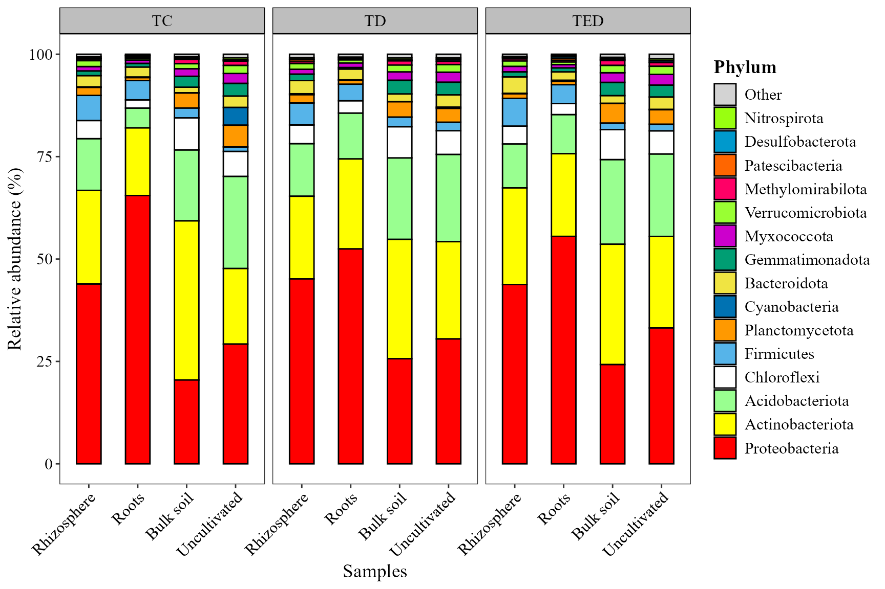

``` r

abundance_bar_plot(
    table = table_fung,
    metadata = metadata_fungi,
    x_col = "Treatment",
    facet_by = "Type_of_soil",
    add_remained = TRUE,
    label = "Genera",
    x_label_angle = 45,
    save_table = FALSE
)
```

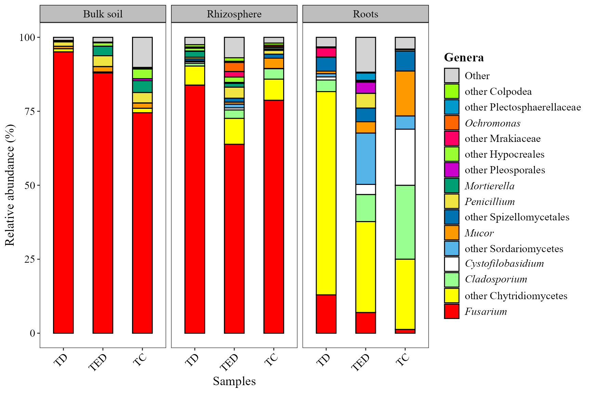

### Heatmaps de abundancia

Nota que los archivos de entrada son los mismos que en la función
anterior, y esto es consistente en todas las funciones de aquí en
adelante.

Los parámetros `condition1`, `condition2` y `condition3` definen las
tres variables de metadatos que se muestran como anotaciones
horizontales encima del heatmap.\
Se pueden especificar paletas de color personalizadas para cada
anotación con `colors_condition1`, `colors_condition2` y
`colors_condition3`, respectivamente.\
Los títulos de leyenda de estas anotaciones se pueden personalizar con
`name_legend_condition1`, `name_legend_condition2` y
`name_legend_condition3`.

El argumento `top_n` controla el número de features más abundantes
incluidos en el heatmap.\
Si `cluster = TRUE`, las filas se agrupan jerárquicamente; si es
`FALSE`, los features se ordenan por abundancia relativa decreciente.\
El parámetro `show_column_names` determina si se muestran los nombres de
las muestras en el heatmap.

Las etiquetas de fila por defecto son solo el número de rango del
feature (`"1"`, `"2"`…); `feature_prefix` antepone lo que corresponda a
los datos — aquí `"ASV"`, ya que los features de esta tabla son
variantes de secuencia de amplicón (ASV) de QIIME2/DADA2.

Los nombres compuestos de SILVA de tres o más géneros se acortan al
último género más “group” (por ejemplo,
*Allorhizobium-Neorhizobium-Pararhizobium-Rhizobium* se muestra como
“Rhizobium group”; los de dos géneros, como *Escherichia-Shigella*, se
dejan completos), aquí y en los barplots, diagramas de Sankey y figuras
de ALDEx2. Las demás etiquetas de más de `max_label_length` caracteres
(por defecto `35`) se cortan con “…”. Usa `composite_names = FALSE` para
ver los nombres completos.

Los tipos de suelo conservan los colores Okabe-Ito que el paquete usa
por defecto (aptos para daltonismo: Bulk soil naranja, Rhizosphere azul,
Roots verde, Uncultivated amarillo). Para los tratamientos usamos
colores de la paleta “Safe” (también apta para daltonismo), así las dos
variables no comparten colores:

``` r

treatment_colors <- c(TC = "#CC6677", TD = "#332288", TED = "#999933")
```

``` r

abundance_heatmap_plot(
    table = table_bac,
    metadata = metadata_bacteria,
    top_n = 20,
    show_column_names = FALSE,
    condition1 = "Type_of_soil",
    condition2 = "Treatment",
    colors_condition2 = treatment_colors,
    feature_prefix = "ASV"
)
```

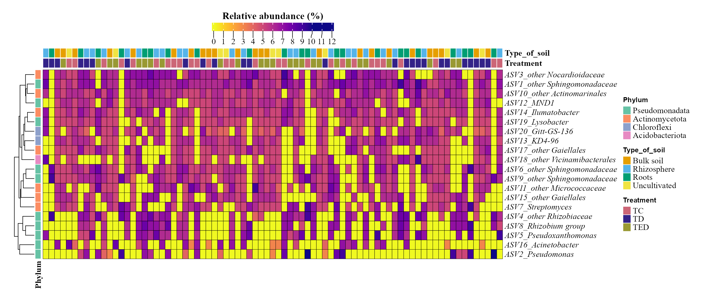

``` r

abundance_heatmap_plot(
    table = table_fung,
    metadata = metadata_fungi,
    top_n = 20,
    show_column_names = FALSE,
    condition1 = "Type_of_soil",
    condition2 = "Treatment",
    colors_condition2 = treatment_colors,
    feature_prefix = "ASV"
)
```

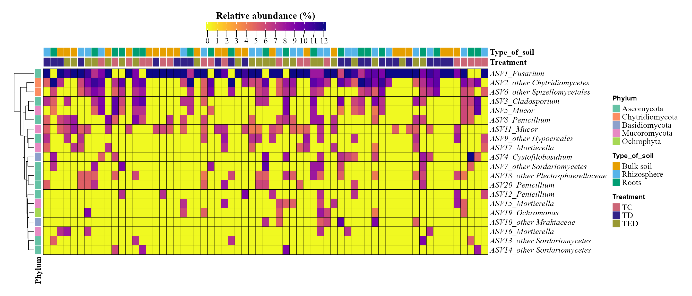

### Diagrama de Sankey del flujo taxonómico

[`abundance_sankey_plot()`](https://steph0522.github.io/MicroBioMeta/reference/abundance_sankey_plot.md)
visualiza cómo fluye la abundancia relativa a través de los rangos
taxonómicos: de Reino a Especie, como un diagrama de Sankey interactivo.
Es útil para tener una visión rápida de qué linajes dominan la
comunidad.

El argumento `taxRanks` especifica qué rangos incluir como nodos, `maxn`
limita el número de taxones conservados por rango, y `taxonomy_db` le
indica a la función cómo están formateadas las cadenas de taxonomía (por
ejemplo, `"silva"`, `"gg"`, `"kraken2"`). Esta función depende de
[`networkD3`](https://CRAN.R-project.org/package=networkD3), disponible
en CRAN:

``` r

install.packages("networkD3")
```

⚠️ A diferencia de las demás funciones, esta no retorna un objeto
`ggplot` sino un objeto interactivo `sankeyNetwork` (htmlwidget). Por
defecto no escribe nada en disco; usa `output_file` (por ejemplo,
`output_file = "sankey_bacteria.html"`) para **guardar el diagrama como
archivo HTML**.

``` r

sankey_bacteria <- abundance_sankey_plot(
    table       = table_bac,
    maxn        = 10,
    width       = 950,
    height      = 650,
    taxRanks    = c("P", "C", "O", "F", "G"),
    taxonomy_db = "silva"
)
sankey_bacteria
```

## Diversidad alfa

La diversidad alfa describe la diversidad dentro de cada muestra
individual. Con `MicroBioMeta`, la diversidad alfa se puede explorar con
varias métricas distintas, como métricas clásicas tipo Chao y Simpson.
Además, el paquete implementa funciones basadas en el **marco de números
de Hill** ([Chao et al. 2014](#ref-chao2014hill); [Li
2018](#ref-li2018hillr)), que ofrece una forma unificada de representar
distintas unidades. Los números de Hill se parametrizan mediante el
orden *q*, que regula el peso que se le da a la abundancia. Por ejemplo,
*q*=0 corresponde a la riqueza de especies (número total de especies),
*q*=1 al exponencial de la entropía de Shannon (especies frecuentes), y
*q*=2 al inverso del índice de Simpson (especies dominantes).

### Correlación entre números de Hill

La función
[`alpha_hill_corr_plot()`](https://steph0522.github.io/MicroBioMeta/reference/alpha_hill_corr_plot.md)
calcula los números de Hill para distintos órdenes (típicamente,
𝑞=0,1,2) y visualiza las correlaciones entre ellos mediante un gráfico
de correlación, evaluando qué tan fuertemente se relacionan las métricas
de diversidad de distintos órdenes con la profundidad de secuenciación.

Este es el primer paso antes de analizar las métricas de diversidad
alfa.

Para las bacterias 🦠, podemos observar que en todos los órdenes de *q*
hay una correlación fuerte con la profundidad de secuenciación. Cuando
esto pasa, las diferencias de diversidad entre muestras pueden reflejar
en parte diferencias en el esfuerzo de secuenciación, así que conviene
tenerlo en cuenta (o rarefaccionar) antes de comparar grupos.

``` r

alpha_hill_corr_plot(table = table_bac)
```


### Visualización de diversidad alfa

La función
[`alpha_hill_plot()`](https://steph0522.github.io/MicroBioMeta/reference/alpha_hill_plot.md)
calcula los números de Hill y visualiza los patrones de diversidad alfa
entre condiciones experimentales usando boxplots.

El parámetro `x_col` especifica la columna de metadatos usada en el eje
x, mientras que `fill_col` controla el agrupamiento usado para colorear
los boxplots.

El argumento `facet_by` permite dividir el gráfico según una variable de
metadatos, y `facet_orientation` controla si las facetas se organizan
horizontal o verticalmente.

Si `save_table = TRUE`, la función también retorna una tabla con los
valores de diversidad alfa calculados para cada muestra.

``` r

alpha_hill_plot(
    table = table_bac,
    metadata = metadata_bacteria,
    x_col = "Treatment",
    fill_col = "Treatment",
    group_colors = treatment_colors,
    facet_by = "Type_of_soil",
    facet_orientation = "horizontal",
    save_table = FALSE
)
```

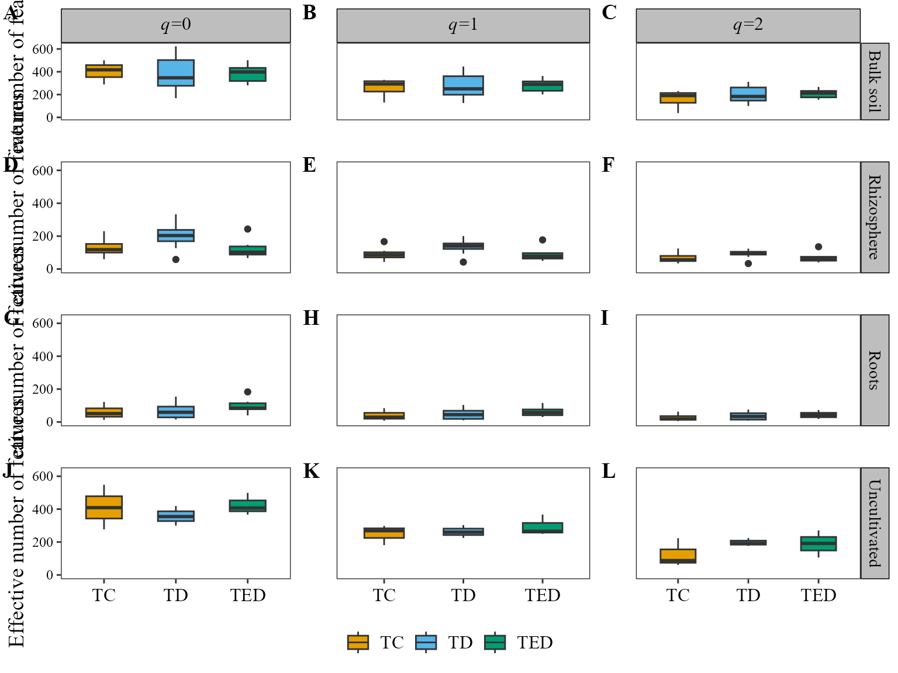

La misma función permite intercambiar el papel de las variables. Para
los hongos 🍄 ponemos el compartimento de suelo en el eje x y separamos
los paneles por tratamiento, lo que resalta cómo cambia la diversidad
del suelo desnudo a las raíces dentro de cada tratamiento:

``` r

alpha_hill_plot(
    table = table_fung,
    metadata = metadata_fungi,
    x_col = "Type_of_soil",
    fill_col = "Type_of_soil",
    facet_by = "Treatment",
    facet_orientation = "horizontal",
    show_legend = FALSE,
    save_table = FALSE
)
```


También podemos visualizar otras métricas considerando índices clásicos
de diversidad alfa:

``` r

alpha_diversity_plot(
    table = table_fung,
    metadata = metadata_fungi,
    x_col = "Treatment",
    fill_col = "Treatment",
    group_colors = treatment_colors,
    facet_by = "Type_of_soil",
    facet_orientation = "horizontal",
    stat = "anova",
    free_y = TRUE,
    save_table = FALSE
)
```


Cada panel se etiqueta automáticamente (A, B, C, …) para poder
referenciarlo. Cuando se establece `stat`, también se agregan valores p
a cada panel. `"wilcox.test"` o `"t.test"` comparan cada par de grupos,
cada uno con su corchete, y corrigen los valores p por comparaciones
múltiples dentro del panel con `p_adjust_method` (por defecto `"holm"`;
`"none"` muestra los valores p sin corregir). `"kruskal.test"` o
`"anova"` dan un solo valor p global por panel. Solo se dibujan las
comparaciones significativas. `panel_label_case` alterna entre etiquetas
en mayúsculas y minúsculas, `panel_label_bold` para etiquetas en
negritas, y `panel_labels` te permite dar etiquetas personalizadas (por
ejemplo `c("(a)", "(b)", "(c)")`) en vez de las generadas
automáticamente. `free_y` permite que cada panel use su propia escala
del eje y en vez de una compartida, como abajo:

``` r

alpha_diversity_plot(
    table = table_fung,
    metadata = metadata_fungi,
    x_col = "Treatment",
    fill_col = "Treatment",
    group_colors = treatment_colors,
    facet_by = "Type_of_soil",
    facet_orientation = "horizontal",
    stat = "anova",
    free_y = TRUE,
    x_label_angle = 45,
    panel_label_bold = FALSE,
    save_table = FALSE
)
```


Con `facet_orientation = "vertical"` los órdenes de Hill (*q*) van en
filas y los grupos de `facet_by` en columnas:

``` r

alpha_hill_plot(
    table = table_fung,
    metadata = metadata_fungi,
    x_col = "Type_of_soil",
    fill_col = "Type_of_soil",
    facet_by = "Treatment",
    facet_orientation = "vertical",
    show_legend = FALSE,
    save_table = FALSE
)
```


### Diversidad alfa a lo largo de un gradiente continuo

[`alpha_decay_plot()`](https://steph0522.github.io/MicroBioMeta/reference/alpha_decay_plot.md)
hace una regresión de los números de Hill contra una variable
**continua** de los metadatos (por ejemplo, pH, elevación, distancia).
Cada orden de Hill (*q*=0, 1, 2) tiene su propio panel con una línea de
regresión y una anotación con el coeficiente de correlación (rho de
Spearman por defecto), su valor p, y cuando `show_lm_stats = TRUE`, la
R² y la pendiente del modelo lineal.

El parámetro `cont_var` nombra la columna continua de metadatos a ubicar
en el eje x, y el argumento opcional `group_col` ajusta una línea de
regresión separada por grupo en vez de una sola línea global.

Aquí usamos el `pH` del suelo como gradiente, restringido a `Bulk soil`
y `Rhizosphere` para una comparación más limpia:

``` r

metadata_bacteria_decay <- metadata_bacteria %>%
    filter(Type_of_soil %in% c("Bulk soil", "Rhizosphere"))

alpha_decay_plot(
    table = table_bac,
    metadata = metadata_bacteria_decay,
    cont_var = "pH",
    group_col = "Type_of_soil",
    x_axis_title = "Soil pH"
)
```

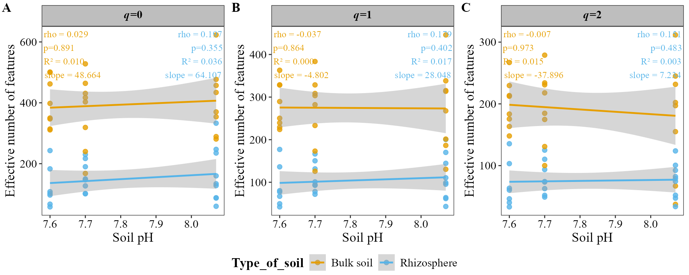

### Taxones compartidos entre grupos de muestras

Otra forma de explorar los patrones de diversidad alfa es examinando
**qué taxones son compartidos o exclusivos entre grupos de muestras**.
La función
[`venn_plot()`](https://steph0522.github.io/MicroBioMeta/reference/venn_plot.md)
genera diagramas de Venn que resumen el traslape de taxones entre los
grupos definidos en los metadatos.

Generamos un diagrama de Venn agrupando muestras según el tratamiento
(TC, TD y TED).

``` r

venn_plot(
    table = table_fung,
    metadata = metadata_fungi,
    merge_by = "Treatment",
    min_prevalence = 0
)
```

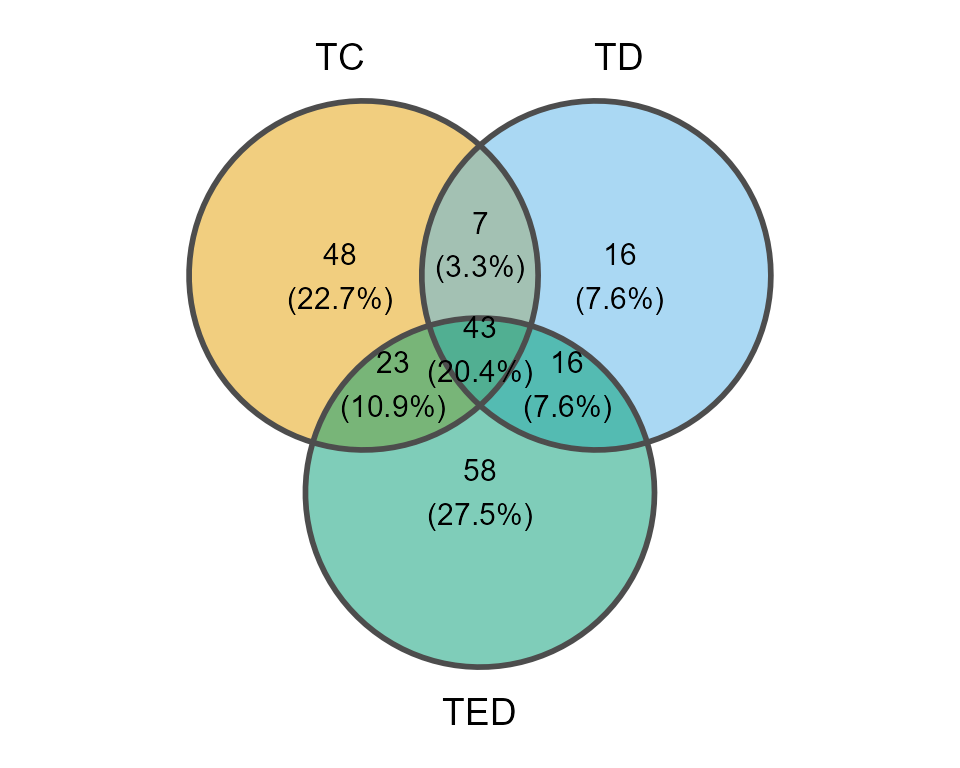

#### Colapsar la tabla por nivel taxonómico

Las tablas de comunidades microbianas suelen generarse a nivel de **ASV
u OTU**, lo que puede resultar en cientos o miles de features. Para la
interpretación y visualización, suele ser útil agrupar estos features en
un nivel **taxonómico** superior, como género.

La función
[`collapse_table()`](https://steph0522.github.io/MicroBioMeta/reference/collapse_table.md)
realiza esta agregación agrupando los features que están en el mismo
nivel de taxonomía y sumando sus conteos.

La función retorna una **lista con dos elementos**:

- **`collapsed_table`**: una tabla de abundancia en formato ancho, donde
  las filas corresponden a los taxones colapsados en el nivel
  seleccionado y las columnas corresponden a las muestras.

- **`long_format`**: la misma información en formato largo, útil para
  graficación o análisis estadísticos posteriores.

- Por ejemplo, el siguiente código colapsa la tabla de abundancia de
  hongos al **nivel de género** y hacemos un diagrama de Venn para
  visualizar los géneros compartidos.

``` r

table_genus <- collapse_table(
    table = table_fung,
    level = "genus"
)

venn_plot(
    table = table_genus$collapsed_table,
    metadata = metadata_fungi,
    merge_by = "Treatment"
)
```


Por defecto,
[`collapse_table()`](https://steph0522.github.io/MicroBioMeta/reference/collapse_table.md)
retorna los **conteos crudos** sumados en el nivel taxonómico
seleccionado. Sin embargo, los datos de comunidades microbianas suelen
necesitar visualizarse o analizarse como **abundancia relativa**. Al
establecer `rel_abun = TRUE`, los conteos de cada muestra se convierten
en **porcentajes**, donde la abundancia total por muestra suma 100%.

#### Filtrar taxones por prevalencia

A veces es útil visualizar solo los taxones que ocurren frecuentemente
dentro de cada grupo. Esto se puede hacer usando el parámetro
`min_prevalence`.

Por ejemplo, el siguiente diagrama incluye solo los taxones presentes en
**al menos el 20% de las muestras dentro de cada grupo**. El parámetro
es 0 por defecto, lo que significa que no se aplica ningún filtro.

``` r

venn_plot(
    table = table_fung,
    metadata = metadata_fungi,
    merge_by = "Treatment",
    min_prevalence = 0.2
)
```


#### Personalizar los colores de los grupos

La función también permite colores personalizados para los grupos.

``` r

venn_plot(
    table = table_fung,
    metadata = metadata_fungi,
    merge_by = "Treatment",
    min_prevalence = 0,
    group_colors = treatment_colors
)
```

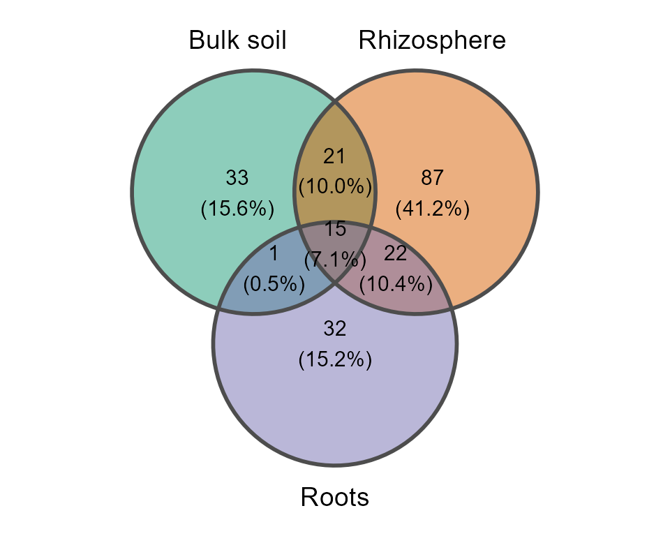

#### Método de graficación alternativo

Por defecto la función usa el paquete **ggvenn**, pero también puede
generar el diagrama usando **ggVennDiagram**.

``` r

venn_plot(
    table = table_fung,
    metadata = metadata_fungi,
    merge_by = "Treatment",
    method = "ggvenndiagram"
)
```


## Diversidad beta

La diversidad beta describe las diferencias en la composición y
estructura de la comunidad entre muestras. Estos análisis ayudan a
determinar si las comunidades microbianas varían según las condiciones
ambientales, los tratamientos o los grupos experimentales, y cómo se
agrupan o se separan.

`MicroBioMeta` tiene varias funciones para explorar la diversidad beta,
incluyendo gráficos de ordenación, pruebas estadísticas de diferencias
entre comunidades, y enfoques de partición que separan los componentes
compartidos y exclusivos de la diversidad. Estas funciones permiten
tanto la exploración visual como pruebas de hipótesis formales.

### Ordenación de la composición de la comunidad

La función
[`beta_ord_plot()`](https://steph0522.github.io/MicroBioMeta/reference/beta_ord_plot.md)
calcula las disimilitudes pareadas entre muestras y visualiza los
resultados usando un método de ordenación. Por defecto, la función usa
métricas de distancia ecológicas comunes (por ejemplo, Bray–Curtis o
Euclidiana) y técnicas de reducción de dimensionalidad como **PCoA**,
**PCA** o **NMDS**. Para tener en cuenta la naturaleza composicional de
los datos, en los ejemplos se usan las distancias `aitchinson` y
`compositional`. Compositional usa la transformación *clr* (log del
cociente centrado) implementada por el paquete `ALDEx2`.

El parámetro `group_col` especifica la columna de metadatos usada para
colorear las muestras, mientras que `shape_col` permite mostrar una
variable adicional de metadatos usando distintas formas de punto.

El argumento `distance` define la métrica de disimilitud usada para
calcular la diversidad beta (por ejemplo, **bray, jaccard, aitchsion**,
etc.), y `ordination` (opciones: **PCA, PCoA** o **NMDS**) especifica el
método de ordenación aplicado para visualizar las distancias entre
muestras.

⚠️ **NOTA: `distance = "compositional"` usa una de las instancias Monte
Carlo que `ALDEx2` genera al azar, así que el resultado cambia un poco
en cada corrida. Si quieres obtener siempre el mismo resultado, se
sugiere correr [`set.seed()`](https://rdrr.io/r/base/Random.html) antes
de la función**, como en los ejemplos de abajo. Lo mismo aplica a
`beta_test_table(distance = "compositional")`, a las funciones de ALDEx2
y a los p-valores de
[`cca_rda_biplot()`](https://steph0522.github.io/MicroBioMeta/reference/cca_rda_biplot.md).
Por defecto (`mc_samples = 1`) se usa una sola instancia, lo que es
rápido; para los análisis finales se sugiere `mc_samples = 128` (el
valor por defecto de ALDEx2), que promedia los valores clr de 128
instancias y da casi el mismo resultado en cada corrida, aunque tarda
más.

``` r

set.seed(123)
beta_ord_plot(
    table = table_bac,
    metadata = metadata_bacteria,
    distance = "compositional",
    mc_samples = 128,
    ordination = "PCA",
    group_col = "Type_of_soil",
    shape_col = "Treatment"
)
```


Para los hongos 🍄 usamos otra combinación: la disimilitud de
**Bray-Curtis**, que pondera los taxones por su abundancia, con una
ordenación **NMDS**. NMDS parte de configuraciones al azar, así que aquí
también se usa [`set.seed()`](https://rdrr.io/r/base/Random.html):

``` r

set.seed(123)
beta_ord_plot(
    table = table_fung,
    metadata = metadata_fungi,
    group_col = "Type_of_soil",
    shape_col = "Treatment",
    distance = "bray",
    ordination = "NMDS"
)
```

    ## Run 0 stress 0.1282494 
    ## Run 1 stress 0.137064 
    ## Run 2 stress 0.1268558 
    ## ... New best solution
    ## ... Procrustes: rmse 0.01348788  max resid 0.06322113 
    ## Run 3 stress 0.131974 
    ## Run 4 stress 0.1284548 
    ## Run 5 stress 0.165162 
    ## Run 6 stress 0.1272512 
    ## ... Procrustes: rmse 0.007298609  max resid 0.05473952 
    ## Run 7 stress 0.1402745 
    ## Run 8 stress 0.1268558 
    ## ... Procrustes: rmse 3.561058e-06  max resid 1.719656e-05 
    ## ... Similar to previous best
    ## Run 9 stress 0.1272512 
    ## ... Procrustes: rmse 0.007300011  max resid 0.05475023 
    ## Run 10 stress 0.1274534 
    ## Run 11 stress 0.1315103 
    ## Run 12 stress 0.1309372 
    ## Run 13 stress 0.1301517 
    ## Run 14 stress 0.1268558 
    ## ... New best solution
    ## ... Procrustes: rmse 4.203426e-06  max resid 1.973148e-05 
    ## ... Similar to previous best
    ## Run 15 stress 0.1272512 
    ## ... Procrustes: rmse 0.007293077  max resid 0.05469673 
    ## Run 16 stress 0.1574605 
    ## Run 17 stress 0.1272512 
    ## ... Procrustes: rmse 0.00729887  max resid 0.05473141 
    ## Run 18 stress 0.1366118 
    ## Run 19 stress 0.1272606 
    ## ... Procrustes: rmse 0.02929663  max resid 0.1521837 
    ## Run 20 stress 0.1361393 
    ## *** Best solution repeated 1 times

    ## Coordinate system already present.
    ## ℹ Adding new coordinate system, which will replace the existing one.

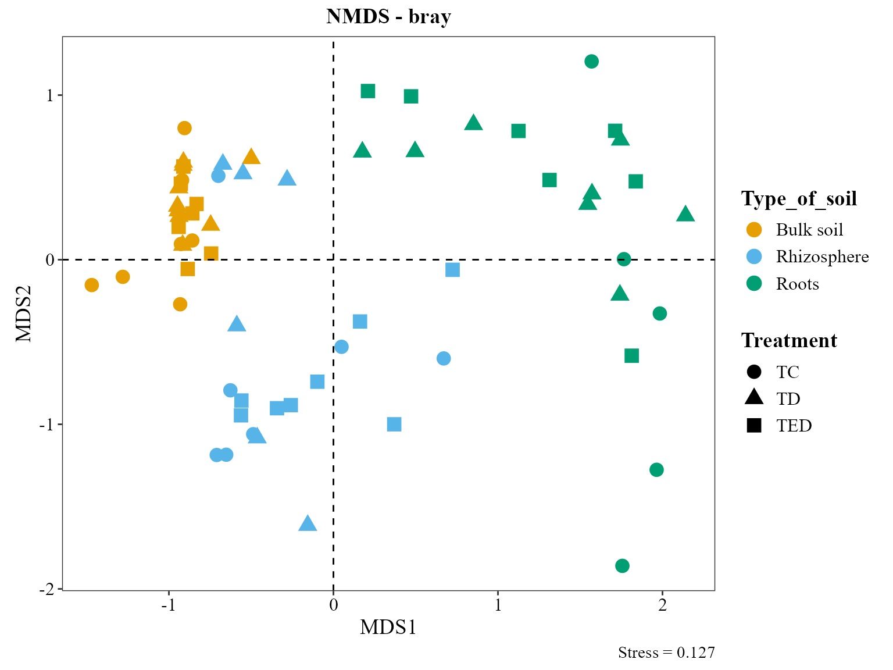

### Pruebas estadísticas para diversidad beta

La función
[`beta_test_table()`](https://steph0522.github.io/MicroBioMeta/reference/beta_test_table.md)
realiza pruebas estadísticas para evaluar si la composición de la
comunidad difiere entre grupos experimentales.

El argumento `formula_str` especifica el diseño experimental usando una
sintaxis de fórmula similar a la de los modelos lineales en R, o como se
usa en el paquete `vegan` ([Oksanen et al.
2024](#ref-oksanen2024vegan)). El parámetro `distance` define la métrica
de distancia usada para calcular las disimilitudes, y el argumento
`test` especifica la prueba estadística (opciones: **PERMANOVA**
([Anderson 2001](#ref-anderson2001permanova)) o **BETADISPER**).

El parámetro `permutations` determina el número de permutaciones usadas
para estimar la significancia estadística. `strata_var` se usa, como en
el paquete `vegan`, para bloquear un parámetro. La primera columna de
`metadata` debe tener los IDs de las muestras. Las funciones nunca
emparejan las muestras por posición: las filas de la metadata se
emparejan con la tabla por ID (y se reordenan si hace falta, con un
mensaje), las muestras que no están en la metadata se dejan fuera con un
mensaje, y la función se detiene si ningún ID coincide. Esto aplica a
todas las funciones que hacen una prueba estadística (PERMANOVA,
betadisper, ALDEx2, CCA/RDA, random forest). `table` también puede ser
una distancia ya calculada (por ejemplo, de
[`vegan::vegdist()`](https://vegandevs.github.io/vegan/reference/vegdist.html)),
que se usa tal cual.

⚠️ **NOTA: Cada función tiene la opción save\_\* que exporta una tabla o
un elemento obtenido en cada función**.

`distance` coincide con la ordenación de cada conjunto de datos de
arriba (`compositional` para bacterias, `bray` para hongos), de modo que
la prueba de significancia evalúa la misma noción de disimilitud que se
muestra en el gráfico.

El resultado es una figura de la tabla (un ggplot), así que se puede
combinar con otros gráficos (p. ej.
[`cowplot::plot_grid()`](https://wilkelab.org/cowplot/reference/plot_grid.html))
o guardar con
[`ggplot2::ggsave()`](https://ggplot2.tidyverse.org/reference/ggsave.html).
Usa `save_table = TRUE` para obtener también los resultados en un
archivo de texto.

``` r

set.seed(123)
beta_test_table(
    table = table_bac,
    metadata = metadata_bacteria,
    formula_str = "Type_of_soil*Treatment",
    distance = "compositional",
    mc_samples = 128,
    test = "permanova",
    permutations = 999
)
```

    ## no conditions provided: forcing denom = 'all'

    ## no conditions provided: forcing conds = 'NA'

    ## conditions vector supplied

    ## operating in serial mode

    ## computing center with all features


``` r

set.seed(123)
beta_test_table(
    table = table_fung,
    metadata = metadata_fungi,
    formula_str = "Type_of_soil*Treatment",
    distance = "bray",
    test = "permanova",
    permutations = 999
)
```

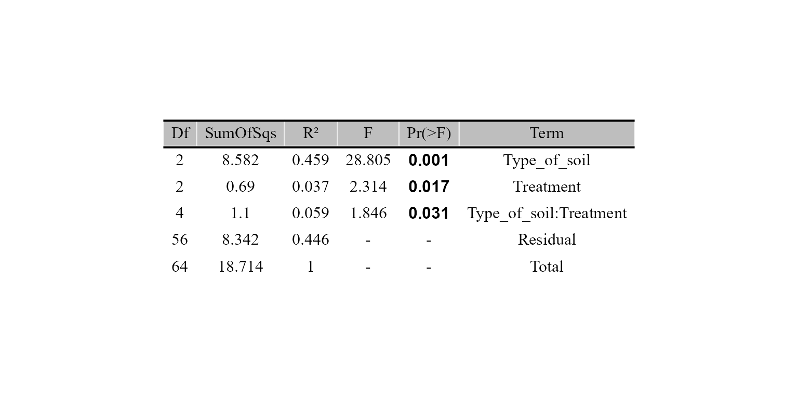

### Partición de la diversidad beta

La diversidad beta también puede descomponerse en distintos componentes.
La función
[`beta_partition_ord_plot()`](https://steph0522.github.io/MicroBioMeta/reference/beta_partition_ord_plot.md)
divide la diversidad beta en los componentes de recambio (*turnover*) y
anidamiento (*nestedness*) según índices de disimilitud seleccionados
([Baselga and Orme 2012](#ref-baselga2012betapart)).

El argumento `family` especifica la familia de índices de disimilitud
usada para la partición (por ejemplo, Jaccard o Sørensen). Los
parámetros `group_col` y `shape_col` definen cómo se visualizan las
muestras según variables de metadatos.

``` r

beta_partition_ord_plot(
    table = table_bac,
    metadata = metadata_bacteria,
    family = "jaccard",
    group_col = "Type_of_soil",
    shape_col = "Treatment",
    save_table = FALSE
)
```

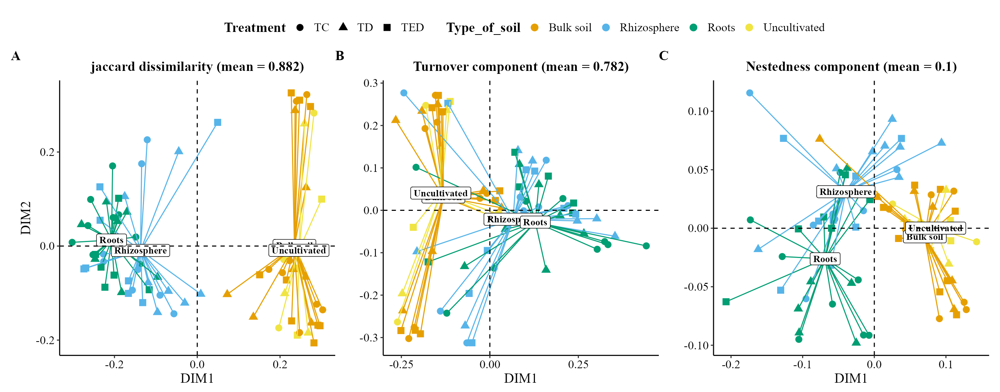

``` r

beta_partition_ord_plot(
    table = table_fung,
    metadata = metadata_fungi,
    family = "jaccard",
    group_col = "Type_of_soil",
    shape_col = "Treatment",
    save_table = FALSE
)
```

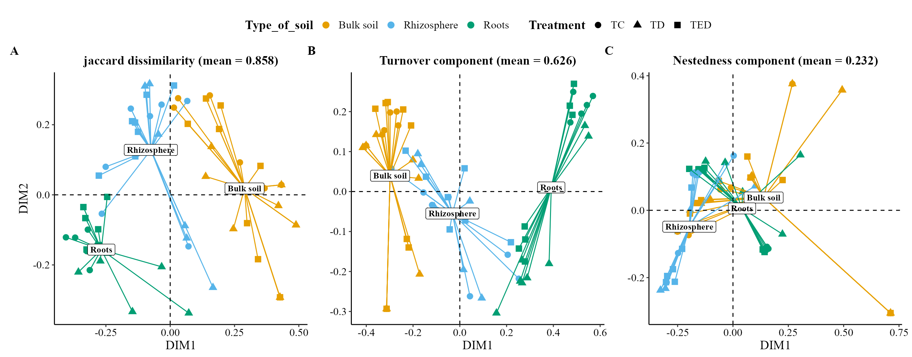

### Visualización pareada de diversidad beta

La función
[`beta_dissimilarity_plot()`](https://steph0522.github.io/MicroBioMeta/reference/beta_dissimilarity_plot.md)
resume los valores pareados de diversidad beta usando boxplots,
permitiendo comparar los patrones de diversidad entre grupos de
muestras. Esta función usa `betapart` sobre datos de incidencia
(presencia/ausencia), con el índice de Sørensen o Jaccard: shared,
turnover o nestedness.

Los parámetros `condition1_col` y `condition2_col` especifican las
variables de metadatos usadas para definir los grupos que se comparan.
`condition2_col` separa las comparaciones en facetas: cada faceta
conserva solo pares de muestras con el mismo valor (por ejemplo, las dos
muestras del tratamiento TC), así que no se mezclan tratamientos. El
argumento `partition` determina qué componente de la diversidad beta se
muestra (por ejemplo, compartido o exclusivo), mientras que `family`
define el índice de disimilitud usado.

Por defecto,
[`beta_dissimilarity_plot()`](https://steph0522.github.io/MicroBioMeta/reference/beta_dissimilarity_plot.md)
conserva todas las combinaciones pareadas posibles de `condition1_col`,
incluyendo un grupo comparado consigo mismo (por ejemplo
`"Roots_vs_Roots"`). El argumento `comparison_condition1` restringe el
gráfico a etiquetas específicas `"value1_vs_value2"` (los dos valores
ordenados alfabéticamente y unidos con `"*_vs_*"`). Aquí construimos esa
lista programáticamente para conservar solo las comparaciones de cada
otro compartimento **contra Roots**, descartando las autocomparaciones:

``` r

groups_bac <- setdiff(unique(as.character(metadata_bacteria$Type_of_soil)), "Roots")
vs_roots_bac <- paste0(pmin(groups_bac, "Roots"), "_vs_", pmax(groups_bac, "Roots"))
# each comparison takes the color of the group compared with Roots
vs_roots_colors <- c(
    "Bulk soil_vs_Roots" = "#E69F00",
    "Rhizosphere_vs_Roots" = "#56B4E9",
    "Roots_vs_Uncultivated" = "#F0E442"
)
vs_roots_bac
```

    ## [1] "Rhizosphere_vs_Roots"  "Bulk soil_vs_Roots"    "Roots_vs_Uncultivated"

Igual que en los gráficos de diversidad alfa, `x_label_angle` rota las
etiquetas del eje x (por defecto `0`), `strip_text_bold`
activa/desactiva las negritas de los títulos de faceta (por defecto
`FALSE`), y `aspect_ratio` fija la relación alto/ancho del panel. Igual
que en los gráficos alfa, `stat` (por ejemplo `"wilcox.test"`,
`"kruskal.test"`, `"anova"`) agrega una comparación estadística entre
los boxplots de cada faceta, por pares o global y con `p_adjust_method`,
igual que en los gráficos alfa.

Si `save_table = TRUE`, la función también retorna una tabla con los
valores de diversidad beta usados para generar el gráfico.

``` r

beta_dissimilarity_plot(
    table = table_bac,
    metadata = metadata_bacteria,
    comparison_condition1 = vs_roots_bac,
    group_colors = vs_roots_colors,
    condition1_col = "Type_of_soil",
    condition2_col = "Treatment",
    x_axis_title = "Samples",
    show_x_labels = FALSE,
    stat = "kruskal.test",
    partition = "shared",
    family = "jaccard",
    save_table = FALSE
)
```


Para los hongos 🍄 vemos otro componente: `partition = "turnover"`
conserva solo el reemplazo de taxones entre muestras (no las diferencias
debidas a que una muestra tenga un subconjunto de los taxones de la
otra), aquí con la familia Sørensen:

``` r

groups_fung <- setdiff(unique(as.character(metadata_fungi$Type_of_soil)), "Roots")
vs_roots_fung <- paste0(pmin(groups_fung, "Roots"), "_vs_", pmax(groups_fung, "Roots"))
```

``` r

beta_dissimilarity_plot(
    table = table_fung,
    metadata = metadata_fungi,
    comparison_condition1 = vs_roots_fung,
    group_colors = vs_roots_colors,
    condition1_col = "Type_of_soil",
    condition2_col = "Treatment",
    x_axis_title = "Samples",
    show_x_labels = FALSE,
    stat = "kruskal.test",
    partition = "turnover",
    family = "sorensen",
    save_table = FALSE
)
```


### Recambio pareado (turnover): entre grupos vs. dentro del grupo

[`beta_turnover_plot()`](https://steph0522.github.io/MicroBioMeta/reference/beta_turnover_plot.md)
reporta el componente de recambio (ASV turnover) de la diversidad beta
basada en números de Hill (*q*=0, 1, 2), con una fila de faceta por
orden de Hill.

[`beta_turnover_plot()`](https://steph0522.github.io/MicroBioMeta/reference/beta_turnover_plot.md)
responde una pregunta distinta a la de
[`beta_dissimilarity_plot()`](https://steph0522.github.io/MicroBioMeta/reference/beta_dissimilarity_plot.md):
para **un grupo de referencia** (por ejemplo, Rhizosphere), ¿es su
recambio **contra otro grupo** (por ejemplo, Roots, una comparación
entre grupos) mayor que su recambio **contra sí mismo** (pares
Rhizosphere-vs-Rhizosphere, una línea base dentro del grupo)? Si el
recambio entre grupos es significativamente mayor, eso es evidencia de
que los dos compartimentos realmente albergan comunidades distintas, más
allá de la variabilidad ya presente entre réplicas del mismo
compartimento.

Así que el gráfico de abajo tiene una franja morada arriba (este color
se puede configurar) por cada tratamiento (**TC**, **TD**, **TED**: solo
se da `condition2_col`, así que cada faceta conserva los pares de
muestras de ese mismo tratamiento) y, dentro de cada una, dos cajas:
**“Rhizosphere_vs_Roots”** (entre grupos) y
**“Rhizosphere_vs_Rhizosphere”** (la línea base dentro del grupo). Los
nombres en `group_colors` deben coincidir exactamente con estas
etiquetas de comparación; si no, las cajas salen grises (la función
avisa).

`comparison_condition1` selecciona qué combinaciones
`"valor1_vs_valor2"` conservar, siempre con el grupo de referencia
(`Rhizosphere`) primero. `comparison_condition2` conserva solo los pares
del mismo tratamiento, para que el recambio no se confunda al comparar
muestras de tratamientos distintos. Si solo se da `condition2_col` (sin
`comparison_condition2`), se hace lo mismo para todos los tratamientos:
se conservan los pares del mismo tratamiento y se faceta por
tratamiento.

`facet_colors` colorea las franjas de faceta superiores (una por par de
`comparison_condition2`) y `group_colors` colorea las cajas (una por par
de `comparison_condition1`). Las etiquetas del eje están ocultas por
defecto ya que los grupos ya están identificados en la leyenda.
Establece `show_x_labels = TRUE` para mostrarlas de nuevo. `stat` agrega
una comparación estadística entre las cajas de cada faceta, como en
[`beta_dissimilarity_plot()`](https://steph0522.github.io/MicroBioMeta/reference/beta_dissimilarity_plot.md).

``` r

beta_turnover_plot(
    table = table_fungi,
    metadata = metadata_fungi,
    comparison_condition1 = c("Rhizosphere_vs_Roots", "Rhizosphere_vs_Rhizosphere"),
    condition1_col = "Type_of_soil",
    condition2_col = "Treatment",
    facet_colors = "#5D478B",
    group_colors = c(
        "Rhizosphere_vs_Roots" = "#56B4E9",
        "Rhizosphere_vs_Rhizosphere" = "grey75"
    ),
    stat = "wilcox.test"
)
```


### Decaimiento de la similitud comunitaria con la distancia

La función
[`beta_decay_plot()`](https://steph0522.github.io/MicroBioMeta/reference/beta_decay_plot.md)
evalúa si las comunidades geográficamente más cercanas también son más
similares en composición. Calcula la disimilitud comunitaria pareada
(`distance`, por ejemplo `"jaccard"`, `"bray"`, `"horn"`) y las
distancias geográficas pareadas a partir de las coordenadas de las
muestras, corre una prueba de Mantel ([Mantel
1967](#ref-mantel1967test)) entre ambas, y grafica la similitud (1 −
disimilitud) contra la distancia con una línea de regresión ajustada.

`lat_col`/`lon_col` nombran las columnas de latitud/longitud en
`metadata` (en grados digits), y el argumento opcional `group_col` corre
una prueba de Mantel y una línea de regresión separadas por grupo, en
vez de una sola prueba global.

Construimos datos de ejemplo para esta parte:

``` r

loc_coords <- data.frame(
    Loc = 0:8,
    lat = 19.0 + seq(0, 0.8, length.out = 9),
    lon = -99.0 + seq(0, 0.8, length.out = 9)
)
metadata_bacteria$lat <- loc_coords$lat[match(metadata_bacteria$Loc, loc_coords$Loc)]
metadata_bacteria$lon <- loc_coords$lon[match(metadata_bacteria$Loc, loc_coords$Loc)]

# filtrando uncultivated
metadata_bacteria_decay <- metadata_bacteria %>%
    filter(Type_of_soil != "Uncultivated")
```

``` r

beta_decay_plot(
    table     = table_bac,
    metadata  = metadata_bacteria_decay,
    lat_col   = "lat",
    lon_col   = "lon",
    distance  = "jaccard",
    group_col = "Type_of_soil"
)
```

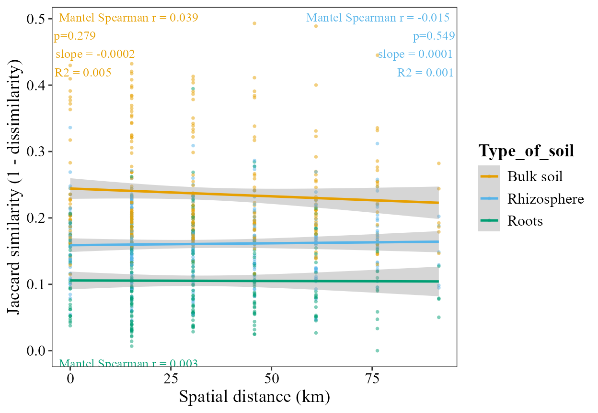

## Análisis de abundancia diferencial

`MicroBioMeta` tiene varias funciones para explorar **taxones
diferencialmente abundantes**. Estos análisis ayudan a identificar
features microbianos que varían significativamente entre grupos
experimentales.

Dos funciones se apoyan en un **marco de análisis de datos
composicionales implementado en el paquete**
[ALDEx2](https://www.bioconductor.org/packages/release/bioc/html/ALDEx2.html)
([Fernandes et al. 2014](#ref-fernandes2014aldex2)). Este enfoque tiene
en cuenta la naturaleza composicional de los datos de secuenciación
([Gloor et al. 2017](#ref-gloor2017compositional)) usando instancias de
Monte Carlo Dirichlet y transformaciones log-razón centradas, y en el
paquete [ANCOMBC2](https://bioconductor.org/packages/ANCOMBC/) ([Lin and
Peddada 2020](#ref-lin2020ancombc)), un método alternativo de abundancia
diferencial que modela explícitamente el sesgo composicional y los ceros
estructurales.

Las funciones:

- [`aldex_volcano_plot()`](https://steph0522.github.io/MicroBioMeta/reference/aldex_volcano_plot.md)
  visualiza los resultados de abundancia diferencial usando un **volcano
  plot**.

- [`aldex_heatmap_plot()`](https://steph0522.github.io/MicroBioMeta/reference/aldex_heatmap_plot.md)
  visualiza los taxones significativos en un **heatmap**.

- [`ancombc_plot()`](https://steph0522.github.io/MicroBioMeta/reference/ancombc_plot.md)
  retorna un gráfico de barras (cuando hay 2 grupos) y un heatmap
  (cuando hay 3 o más grupos).

Adicionalmente, dos enfoques complementarios ayudan a identificar
**taxones importantes que discriminan entre grupos**:

- [`ratios_bubble_plot()`](https://steph0522.github.io/MicroBioMeta/reference/ratios_bubble_plot.md)
  visualiza taxones basándose en **diferencias log-razón entre
  condiciones**.

- [`random_forest_lollipop_plot()`](https://steph0522.github.io/MicroBioMeta/reference/random_forest_lollipop_plot.md)
  usa un **modelo Random Forest** ([Breiman
  2001](#ref-breiman2001randomforest)) para identificar los features que
  mejor predicen una variable o condición dada, visualizado como un
  **gráfico de lollipop de importancia de features**.

### Ejemplo: datos de bacterias

Primero, conservamos solo dos compartimentos de suelo, **Bulk soil** y
**Roots**, ya que ALDEx2 compara dos grupos.

``` r

metadata_bacteria_compar <- metadata_bacteria %>%
    filter(Type_of_soil == "Roots" | Type_of_soil == "Bulk soil")

table_bacteria_compar <- table_bacteria[match(metadata_bacteria_compar$SAMPLEID, colnames(table_bacteria))]

table_bac_compar <- merge_feature_taxonomy(table_bacteria_compar, taxonomy_bacteria)
```

    ## Warning in merge_feature_taxonomy(table_bacteria_compar, taxonomy_bacteria): 83
    ## taxonomy IDs are not present in the table and will be excluded from the result.

Podemos visualizar la abundancia diferencial usando un **volcano plot**.
Los taxones significativos se etiquetan con su nombre; `label_size`
controla el tamaño de fuente de estas etiquetas, y
`filter_uncultured = TRUE` descarta los taxones “uncultured”/“unculture”
de las etiquetas (aunque igual se grafican como puntos, solo no se
etiquetan). Por defecto la significancia usa el valor p ajustado por
Benjamini-Hochberg (`p_adjust_method = "BH"`), porque se prueban miles
de taxones a la vez. Entre el suelo y las raíces muchos taxones siguen
siendo significativos después de la corrección (puntos de color); con
`p_adjust_method = "none"` se usaría el valor p sin corregir.

``` r

set.seed(123)
aldex_volcano_plot(
    table = table_bac_compar,
    metadata = metadata_bacteria_compar,
    group_col = "Type_of_soil",
    type = "volcano",
    label_size = 3,
    filter_uncultured = TRUE
)
```

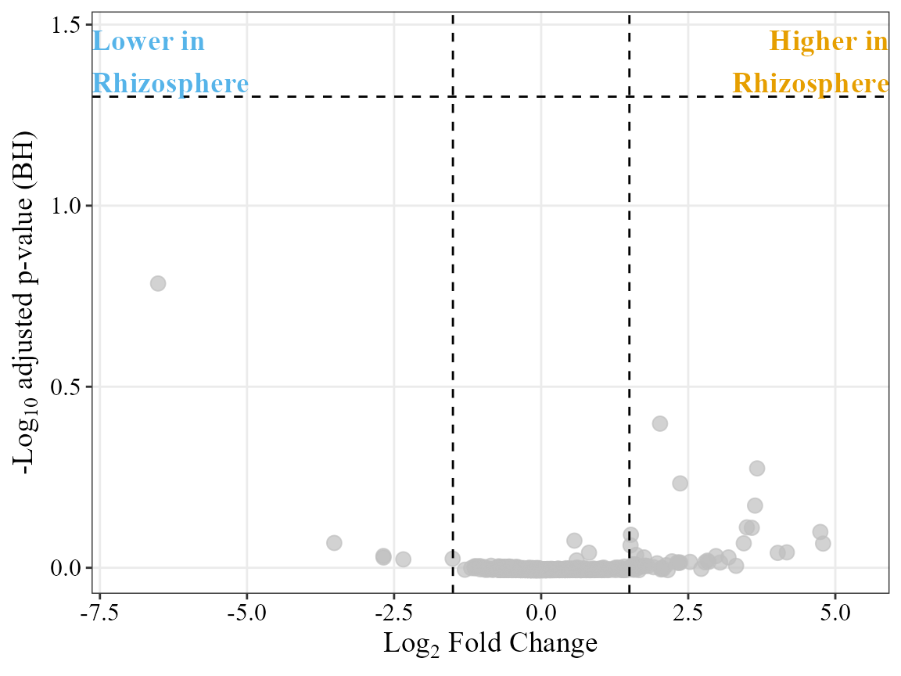

### ANCOMBC2 como método alternativo

[`ancombc_plot()`](https://steph0522.github.io/MicroBioMeta/reference/ancombc_plot.md)
ofrece una alternativa a las funciones basadas en ALDEx2 de arriba. Esta
función depende del paquete de Bioconductor `ANCOMBC`:

``` r

# install.packages("BiocManager")
BiocManager::install("ANCOMBC")
```

`level` agrupa la tabla a un rango taxonómico antes de la prueba (por
defecto `"Genus"`), y `p_adjust_method`/`min_prevalence` controlan la
corrección por pruebas múltiples y el filtro de prevalencia.

Con dos grupos el resultado es un **gráfico de barras**: una barra por
taxón significativo con su log fold change (LFC) entre los dos grupos y
su error estándar, coloreada según el grupo donde el taxón es más
abundante. El grupo de referencia es el primer nivel de `group_col`
(aquí **Bulk soil**), así que los valores positivos indican mayor
abundancia en **Roots**. Aquí `min_prevalence = 0.5` conserva los phyla
presentes en al menos la mitad de las muestras.

⚠️ Con un `min_prevalence` bajo, los taxones raros o dispersos pueden
disparar un error `"Zero variances have been detected..."` en el paso
interno de corrección de sesgo de ANCOMBC2 en algunas corridas (no
siempre ocurre, depende de qué taxones conserve la iteración de
bootstrap en turno). Subir `min_prevalence` filtra esos taxones
dispersos antes de la prueba y evita el error.

``` r

ancombc_plot(
    table = table_bac_compar,
    metadata = metadata_bacteria_compar,
    group_col = "Type_of_soil",
    level = "Phylum",
    min_prevalence = 0.5,
    p_adjust_method = "BH"
)
```

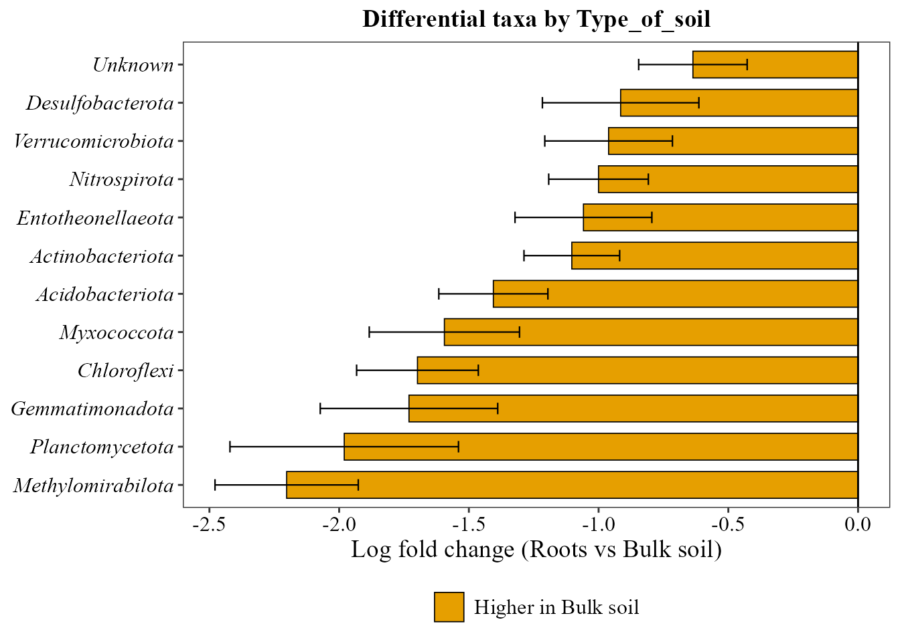

Con **3 o más grupos**,
[`ancombc_plot()`](https://steph0522.github.io/MicroBioMeta/reference/ancombc_plot.md)
retorna en cambio un **heatmap**: una columna por grupo comparado contra
el nivel de referencia (el primer nivel del factor, aquí **Bulk soil**;
se puede cambiar con `ref_level`), y una fila por cada taxón
significativo en al menos una comparación. Aquí mantenemos los tres
compartimentos (quitando **Uncultivated**) y agrupamos a `"Phylum"` para
que el heatmap sea legible:

``` r

metadata_bacteria_3 <- metadata_bacteria %>%
    filter(Type_of_soil != "Uncultivated")

table_bac_3 <- table_bac[, c(match(metadata_bacteria_3$SAMPLEID, colnames(table_bac)), ncol(table_bac))]

ancombc_plot(
    table           = table_bac_3,
    metadata        = metadata_bacteria_3,
    group_col       = "Type_of_soil",
    level           = "Phylum",
    min_prevalence  = 0.3,
    p_adjust_method = "holm"
)
```


**Cómo leer el heatmap:** cada columna es un grupo comparado con el de
referencia (aquí **Rhizosphere** vs **Bulk soil** y **Roots** vs **Bulk
soil**), y cada fila es un taxón. El color y el número de cada celda son
el log fold change (LFC, logaritmo natural) estimado por ANCOMBC2: los
valores positivos (naranja) indican que el taxón es más abundante en ese
grupo que en el suelo (Bulk soil), los negativos (azul) que es menos
abundante, y el blanco que no cambia. Por ejemplo, un LFC de 1 equivale
a unas 2.7 veces más abundante (*e*¹), y uno de -1 a unas 2.7 veces
menos. Un taxón aparece si es significativo en al menos una de las
comparaciones, así que una celda puede tener color aunque esa
comparación en particular no sea significativa; con `save_table = TRUE`
se guardan el valor p ajustado (`q_`) y la significancia (`diff_`) de
cada comparación.

### Ejemplo: datos de hongos

Seguimos el mismo procedimiento, comparando **Bulk soil** y **Roots**,
pero visualizamos los resultados con un **heatmap**. Esta función usa
`ComplexHeatmap`.

``` r

metadata_fungi_compar <- metadata_fungi %>%
    filter(Type_of_soil == "Bulk soil" | Type_of_soil == "Roots")

table_fungi_compar <- table_fung[match(metadata_fungi_compar$SAMPLEID, colnames(table_fung))]

table_fung_compar <- merge_feature_taxonomy(table_fungi_compar, taxonomy_fungi)
```

    ## Warning in merge_feature_taxonomy(table_fungi_compar, taxonomy_fungi): 17
    ## taxonomy IDs are not present in the table and will be excluded from the result.

Como en el volcano plot, por defecto el heatmap conserva los taxones con
un valor p ajustado por Benjamini-Hochberg menor a 0.05
(`pval_threshold = 0.05`, `p_adjust_method = "BH"`); `effect_threshold`
permite además filtrar por tamaño del efecto. Cada fila muestra los
valores clr medianos por grupo, con anotaciones laterales para el tamaño
del efecto, la clase de valor p y la diferencia entre grupos:

``` r

set.seed(123)
aldex_heatmap_plot(
    table = table_fung_compar,
    metadata = metadata_fungi_compar,
    group_col = "Type_of_soil"
)
```

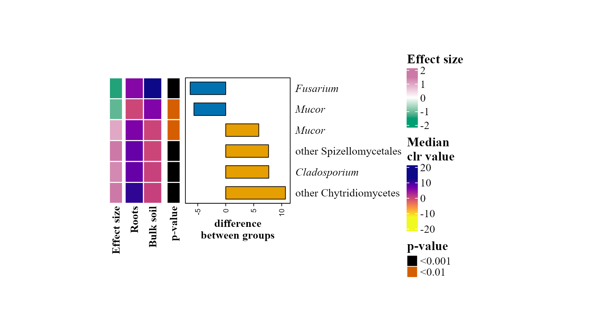

### Identificando taxones importantes

Las funciones
[`random_forest_lollipop_plot()`](https://steph0522.github.io/MicroBioMeta/reference/random_forest_lollipop_plot.md)
y
[`ratios_bubble_plot()`](https://steph0522.github.io/MicroBioMeta/reference/ratios_bubble_plot.md)
también se pueden usar para resaltar los taxones que más contribuyen a
las diferencias observadas entre condiciones.

Por ejemplo, un **modelo Random Forest** puede usarse para identificar
los taxones que mejor predicen el compartimento de suelo:

``` r

random_forest_lollipop_plot(
    table = table_bac,
    metadata = metadata_bacteria,
    top_n = 10,
    variable_to_predict = "Type_of_soil"
)
```

    ## Warning in random_forest_lollipop_plot(table = table_bac, metadata = metadata_bacteria, : Note: Some bacterial phylum names have been updated to match NCBI's revised taxonomy:
    ##   - 'Proteobacteria' changed to 'Pseudomonadota'
    ##   - 'Actinobacteriota' changed to 'Actinomycetota'
    ## Reference: https://ncbiinsights.ncbi.nlm.nih.gov/2021/12/10/ncbi-taxonomy-prokaryote-phyla-added/

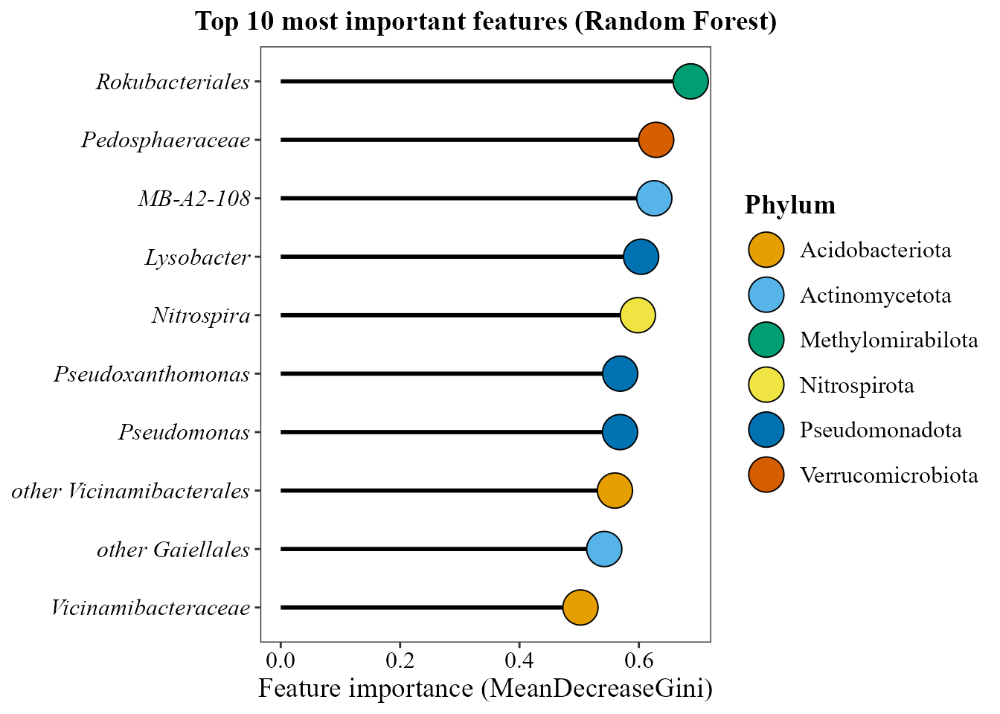

Alternativamente, los taxones con las diferencias log-razón más fuertes
entre dos condiciones pueden visualizarse con:

``` r

ratios_bubble_plot(
    table = table_fung_compar,
    metadata = metadata_fungi_compar,
    group_col = "Type_of_soil",
    top_n = 20,
    condition_A = "Roots",
    condition_B = "Bulk soil"
)
```

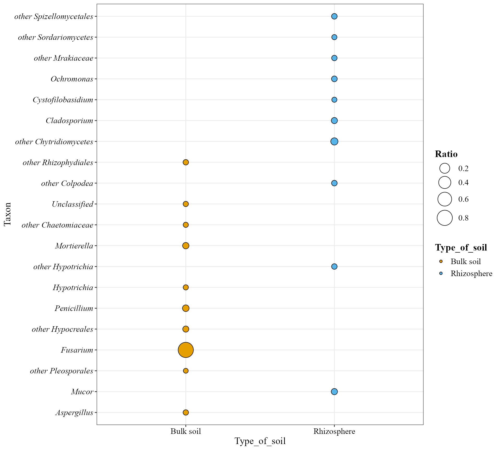

## Análisis ambientales

`MicroBioMeta` ofrece dos funciones para explorar la relación entre
**variables ambientales** y la **composición de la comunidad
microbiana**:

- [`corr_env_abund_plot()`](https://steph0522.github.io/MicroBioMeta/reference/corr_env_abund_plot.md)
  — calcula correlaciones entre la abundancia taxonómica y variables
  ambientales.

- [`cca_rda_biplot()`](https://steph0522.github.io/MicroBioMeta/reference/cca_rda_biplot.md)
  — realiza una ordenación restringida usando **Análisis de
  Correspondencia Canónica (CCA)** o **Análisis de Redundancia (RDA)**.

#### Eligiendo las variables ambientales

Las variables ambientales se leen directamente de los **metadatos** (una
columna por variable), así que no hace falta una tabla aparte: basta con
pasar en `env_vars` los nombres de las columnas a usar. Si tus variables
están en otra tabla, pásala en `env_data` (filas = muestras, como
nombres de fila).

``` r

env_vars_fung <- metadata_fungi %>%
    dplyr::select(pH:Arbus_per) %>%
    colnames()
```

#### Correlación entre variables ambientales y abundancia taxonómica

La función
[`corr_env_abund_plot()`](https://steph0522.github.io/MicroBioMeta/reference/corr_env_abund_plot.md)
calcula correlaciones entre **variables ambientales** y **abundancias
relativas taxonómicas** en un nivel taxonómico seleccionado, y retorna
un **heatmap de correlación** que muestra cómo se relacionan las
variables ambientales con las abundancias taxonómicas.

Ejemplo usando **abundancias a nivel de phylum**:

``` r

corr_env_abund_plot(
    table = table_fung,
    metadata = metadata_fungi,
    env_vars = env_vars_fung,
    level = "phylum",
    save_table = FALSE
)
```

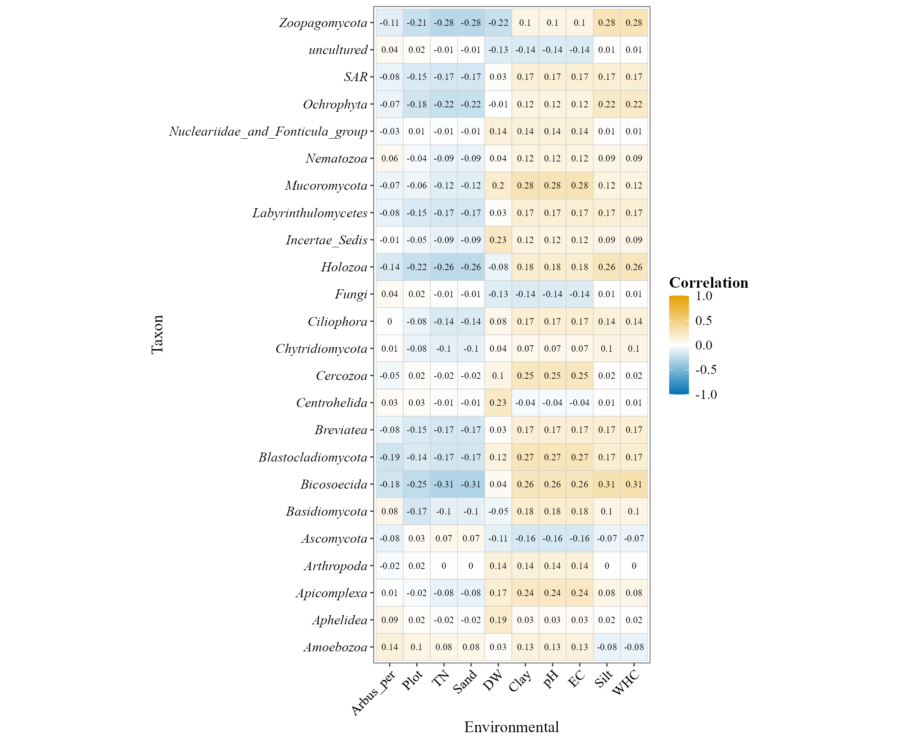

### Visualización alternativa

Las correlaciones también pueden mostrarse usando marcadores circulares
en vez de celdas:

``` r

corr_env_abund_plot(
    table = table_fung,
    metadata = metadata_fungi,
    env_vars = env_vars_fung,
    level = "phylum",
    save_table = FALSE,
    geom = "circle"
)
```


#### Ordenación restringida (CCA / RDA)

La función
[`cca_rda_biplot()`](https://steph0522.github.io/MicroBioMeta/reference/cca_rda_biplot.md)
realiza un análisis de ordenación restringida para evaluar cómo las
variables ambientales explican la variación en la composición de la
comunidad microbiana.

`scale_arrows` es un parámetro que te ayuda a visualizar mejor los
vectores ambientales:

``` r

cca_rda_biplot(
    table = table_fung,
    metadata = metadata_fungi,
    env_vars = c("pH", "TN", "WHC", "EC", "Clay"),
    analysis = "RDA",
    show_all_env_vectors = TRUE,
    group_col = "Type_of_soil",
    scale_arrows = 3
)
```

    ## 
    ## Some constraints or conditions were aliased because they were redundant. This
    ## can happen if terms are constant or linearly dependent (collinear): 'WHC',
    ## 'EC', 'Clay'

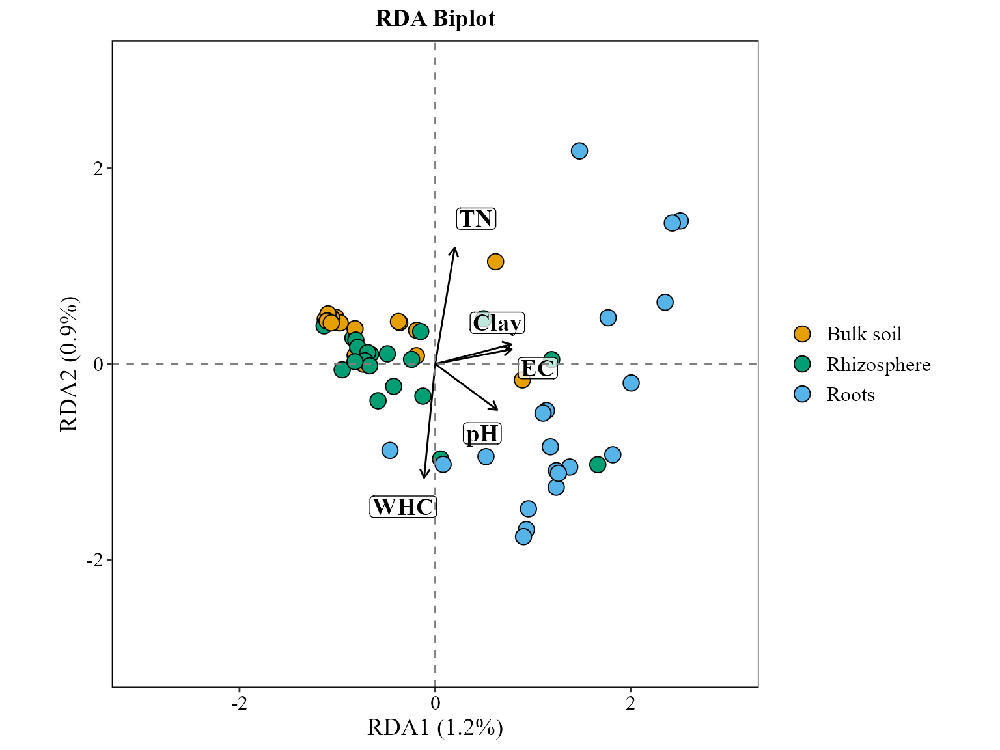

Este análisis produce un **biplot** donde:

- Los **puntos** representan muestras

- Los **colores** indican los grupos de muestras definidos en los
  metadatos.

- Las **flechas** representan las variables ambientales y su dirección
  de influencia sobre la estructura de la comunidad.

- Los vectores ambientales que apuntan en direcciones similares indican
  **asociaciones positivas**, mientras que los vectores que apuntan en
  direcciones opuestas sugieren **relaciones negativas**

## Referencias

Anderson, Marti J. 2001. “A New Method for Non-Parametric Multivariate
Analysis of Variance.” *Austral Ecology* 26 (1): 32–46.
<https://doi.org/10.1111/j.1442-9993.2001.01070.pp.x>.

Baselga, Andrés, and C. David L. Orme. 2012. “betapart: An R Package for
the Study of Beta Diversity.” *Methods in Ecology and Evolution* 3 (5):
808–12. <https://doi.org/10.1111/j.2041-210X.2012.00224.x>.

Bisanz, Jordan E. 2018. *qiime2R: Importing QIIME2 Artifacts and
Associated Data into R Sessions*. <https://github.com/jbisanz/qiime2R>.

Bolyen, Evan, Jai Ram Rideout, Matthew R. Dillon, et al. 2019.
“Reproducible, Interactive, Scalable and Extensible Microbiome Data
Science Using QIIME 2.” *Nature Biotechnology* 37 (8): 852–57.
<https://doi.org/10.1038/s41587-019-0209-9>.

Breiman, Leo. 2001. “Random Forests.” *Machine Learning* 45 (1): 5–32.
<https://doi.org/10.1023/A:1010933404324>.

Chao, Anne, Nicholas J. Gotelli, T. C. Hsieh, et al. 2014. “Rarefaction
and Extrapolation with Hill Numbers: A Framework for Sampling and
Estimation in Species Diversity Studies.” *Ecological Monographs* 84
(1): 45–67. <https://doi.org/10.1890/13-0133.1>.

Fernandes, Andrew D., Jennifer N. S. Reid, Jean M. Macklaim, Thomas A.
McMurrough, David R. Edgell, and Gregory B. Gloor. 2014. “Unifying the
Analysis of High-Throughput Sequencing Datasets: Characterizing RNA-Seq,
16S rRNA Gene Sequencing and Selective Growth Experiments by
Compositional Data Analysis.” *Microbiome* 2: 15.
<https://doi.org/10.1186/2049-2618-2-15>.

Gloor, Gregory B., Jean M. Macklaim, Vera Pawlowsky-Glahn, and Juan J.
Egozcue. 2017. “Microbiome Datasets Are Compositional: And This Is Not
Optional.” *Frontiers in Microbiology* 8: 2224.
<https://doi.org/10.3389/fmicb.2017.02224>.

Li, Daijiang. 2018. “hillR: Taxonomic, Functional, and Phylogenetic
Diversity and Similarity Through Hill Numbers.” *Journal of Open Source
Software* 3 (31): 1041. <https://doi.org/10.21105/joss.01041>.

Lin, Huang, and Shyamal Das Peddada. 2020. “Analysis of Compositions of
Microbiomes with Bias Correction.” *Nature Communications* 11: 3514.
<https://doi.org/10.1038/s41467-020-17041-7>.

Mantel, Nathan. 1967. “The Detection of Disease Clustering and a
Generalized Regression Approach.” *Cancer Research* 27 (2): 209–20.

Oksanen, Jari, Gavin L. Simpson, F. Guillaume Blanchet, et al. 2024.
*Vegan: Community Ecology Package*.
<https://CRAN.R-project.org/package=vegan>.

## Información de la sesión

``` r

sessionInfo()
```

    ## R version 4.6.1 (2026-06-24 ucrt)
    ## Platform: x86_64-w64-mingw32/x64
    ## Running under: Windows 10 x64 (build 19045)
    ## 
    ## Matrix products: default
    ##   LAPACK version 3.12.1
    ## 
    ## locale:
    ## [1] LC_COLLATE=Spanish_Latin America.utf8 
    ## [2] LC_CTYPE=Spanish_Latin America.utf8   
    ## [3] LC_MONETARY=Spanish_Latin America.utf8
    ## [4] LC_NUMERIC=C                          
    ## [5] LC_TIME=Spanish_Latin America.utf8    
    ## 
    ## time zone: America/Mexico_City
    ## tzcode source: internal
    ## 
    ## attached base packages:
    ## [1] stats     graphics  grDevices utils     datasets  methods   base     
    ## 
    ## other attached packages:
    ##  [1] doRNG_1.8.6.3       rngtools_1.5.2      foreach_1.5.2      
    ##  [4] lubridate_1.9.5     forcats_1.0.1       stringr_1.6.0      
    ##  [7] dplyr_1.2.1         purrr_1.2.2         readr_2.2.0        
    ## [10] tidyr_1.3.2         tibble_3.3.1        ggplot2_4.0.3      
    ## [13] tidyverse_2.0.0     MicroBioMeta_0.99.0
    ## 
    ## loaded via a namespace (and not attached):
    ##   [1] fs_2.1.0                    matrixStats_1.5.0          
    ##   [3] httr_1.4.9                  betapart_1.6.1             
    ##   [5] RColorBrewer_1.1-3          doParallel_1.0.17          
    ##   [7] numDeriv_2016.8-1.1         tools_4.6.1                
    ##   [9] backports_1.5.1             R6_2.6.1                   
    ##  [11] vegan_2.7-6                 mgcv_1.9-4                 
    ##  [13] GetoptLong_1.1.1            permute_0.9-10             
    ##  [15] withr_3.0.3                 gridExtra_2.3.1            
    ##  [17] cli_3.6.6                   Biobase_2.72.0             
    ##  [19] textshaping_1.0.5           Cairo_1.7-0                
    ##  [21] sandwich_3.1-3              labeling_0.4.3             
    ##  [23] sass_0.4.10                 mvtnorm_1.4-2              
    ##  [25] S7_0.2.2                    randomForest_4.7-1.2       
    ##  [27] proxy_0.4-29                pkgdown_2.2.1              
    ##  [29] systemfonts_1.3.2           foreign_0.8-91             
    ##  [31] dichromat_2.0-1             itertools_0.1-3            
    ##  [33] readxl_1.5.0.1              rstudioapi_0.19.0          
    ##  [35] generics_0.1.4              ggVennDiagram_1.5.7        
    ##  [37] shape_1.4.6.1               gtools_3.9.5               
    ##  [39] car_3.1-5                   Matrix_1.7-5               
    ##  [41] interp_1.1-6                DescTools_0.99.60          
    ##  [43] S4Vectors_0.50.3            abind_1.4-8                
    ##  [45] lifecycle_1.0.5             multcomp_1.4-32            
    ##  [47] yaml_2.3.12                 carData_3.0-6              
    ##  [49] SummarizedExperiment_1.42.0 SparseArray_1.12.2         
    ##  [51] grid_4.6.1                  crayon_1.5.3               
    ##  [53] lattice_0.22-9              haven_2.5.5                
    ##  [55] cowplot_1.2.0               magick_2.9.1               
    ##  [57] pillar_1.11.1               knitr_1.52                 
    ##  [59] ComplexHeatmap_2.28.0       rcdd_1.6-1                 
    ##  [61] GenomicRanges_1.64.0        rjson_0.2.23               
    ##  [63] boot_1.3-32                 gld_2.6.8                  
    ##  [65] codetools_0.2-20            fastmatch_1.1-8            
    ##  [67] picante_1.8.4               glue_1.8.1                 
    ##  [69] ggvenn_0.1.19               data.table_1.18.6.1        
    ##  [71] vctrs_0.7.3                 png_0.1-9                  
    ##  [73] Rdpack_2.6.6                cellranger_1.1.0           
    ##  [75] gtable_0.3.6                cachem_1.1.0               
    ##  [77] zigg_0.0.2                  xfun_0.61                  
    ##  [79] rbibutils_2.4.1             S4Arrays_1.12.0            
    ##  [81] Rfast_2.1.5.2               Seqinfo_1.2.0              
    ##  [83] reformulas_0.4.4            survival_3.8-6             
    ##  [85] hillR_0.5.2                 geometry_0.5.2             
    ##  [87] iterators_1.0.14            TH.data_1.1-5              
    ##  [89] directlabels_2026.8.27      nlme_3.1-169               
    ##  [91] ANCOMBC_2.14.0              data.tree_1.2.0            
    ##  [93] bslib_0.12.0                otel_0.2.0                 
    ##  [95] rpart_4.1.27                colorspace_2.1-3           
    ##  [97] BiocGenerics_0.58.1         Hmisc_5.3-0                
    ##  [99] nnet_7.3-20                 NADA_1.6-1.2               
    ## [101] Exact_3.3                   tidyselect_1.2.1           
    ## [103] compiler_4.6.1              htmlTable_2.5.0            
    ## [105] expm_1.0-1                  desc_1.4.3                 
    ## [107] DelayedArray_0.38.2         checkmate_2.3.4            
    ## [109] scales_1.4.0                quadprog_1.5-8             
    ## [111] digest_0.6.39               minqa_1.2.8                
    ## [113] rmarkdown_2.32              XVector_0.52.0             
    ## [115] htmltools_0.5.9             pkgconfig_2.0.3            
    ## [117] jpeg_0.1-11                 base64enc_0.1-6            
    ## [119] lme4_2.0-6                  MatrixGenerics_1.24.0      
    ## [121] fastmap_1.2.0               rlang_1.3.0                
    ## [123] GlobalOptions_0.1.4         htmlwidgets_1.6.4          
    ## [125] zCompositions_1.6.2         ggh4x_0.3.1                
    ## [127] farver_2.1.2                jquerylib_0.1.4            
    ## [129] zoo_1.9-1                   jsonlite_2.0.0             
    ## [131] energy_1.7-12               BiocParallel_1.46.0        
    ## [133] magrittr_2.0.5              Formula_1.2-6              
    ## [135] patchwork_1.3.2             geosphere_1.6-8            
    ## [137] Rcpp_1.1.2                  ape_5.8-1                  
    ## [139] stringi_1.8.9               rootSolve_1.8.2.4          
    ## [141] MASS_7.3-65                 parallel_4.6.1             
    ## [143] ggrepel_0.9.8               doSNOW_1.0.20              
    ## [145] lmom_3.3                    deldir_2.0-4               
    ## [147] splines_4.6.1               multtest_2.68.0            
    ## [149] hms_1.1.4                   circlize_0.4.18            
    ## [151] ALDEx2_1.44.0               igraph_2.3.3               
    ## [153] ggpubr_1.0.0                ggsignif_0.6.4             
    ## [155] stats4_4.6.1                magic_1.6-1                
    ## [157] evaluate_1.0.5              latticeExtra_0.6-31        
    ## [159] RcppParallel_6.2.1          nloptr_2.2.1               
    ## [161] tzdb_0.5.0                  networkD3_0.4.1            
    ## [163] clue_0.3-68                 broom_1.0.13               
    ## [165] e1071_1.7-17                rstatix_1.1.0              
    ## [167] viridisLite_0.4.3           class_7.3-23               
    ## [169] ragg_1.5.2                  gsl_2.1-9                  
    ## [171] truncnorm_1.0-9             snow_0.4-4                 
    ## [173] minpack.lm_1.2-4            lmerTest_3.2-1             
    ## [175] IRanges_2.46.0              cluster_2.1.8.2            
    ## [177] timechange_0.4.0
