# Metagenomic

🍄 This tutorial shows how to use `MicroBioMeta` on **shotgun
metagenomic** data, as an alternative to the amplicon (metabarcoding)
workflow covered in the [Metabarcoding
vignette](https://steph0522.github.io/MicroBioMeta/articles/metabarcoding.md).
The functions and most of their parameters are exactly the same across
both workflows, so they aren’t re-explained here only what’s specific to
metagenomic data is.

For this example, reads were taxonomically classified with
[`Kraken2`](https://ccb.jhu.edu/software/kraken2/) ([Wood et al.
2019](#ref-wood2019kraken2)) and abundance-corrected at the species
level with [`Bracken`](https://ccb.jhu.edu/software/bracken/) ([Lu et
al. 2017](#ref-lu2017bracken)).

The data comes from forest soils along the Iztaccíhuatl-Popocatépetl
(PNIP) and La Malinche (PNML) transects, Central Mexico:

[Hereira-Pacheco, S. E. et al. (2025). Metagenomic analysis of the
diversity and composition of the fungal communities of forest soils of
the transect Iztaccíhuatl-Popocatépetl and La Malinche. *PeerJ*, 13,
e18323.](https://peerj.com/articles/18323/)

Raw data, metadata and the original analysis scripts:
[github.com/Steph0522/Fungal_Metagenomes_PNIP_PNML](https://github.com/Steph0522/Fungal_Metagenomes_PNIP_PNML)

## 💻 Loading data

First, let’s load `MicroBioMeta` and `tidyverse` (used for data
wrangling):

``` r

library("MicroBioMeta")
library(tidyverse)
```

Each sample was processed separately, so `bracken_species` reports were
merged into a single table beforehand (one column per sample, named
`kraken_pluspfp_<id_metagenome>_report_bracken_species`) with a
**`taxonomy`** column already attached as the last column:

``` r

table_kraken <- read.delim(
  system.file("extdata", "table_kraken.txt", package = "MicroBioMeta"),
  row.names = 1, check.names = FALSE
)

table_kraken[1:3, c(1:2, ncol(table_kraken))]
```

    ##        kraken_pluspfp_100_report_bracken_species
    ## 101028                                      1302
    ## 36050                                        161
    ## 56646                                        108
    ##        kraken_pluspfp_105_report_bracken_species
    ## 101028                                      1066
    ## 36050                                        345
    ## 56646                                        203
    ##                                                                                                                  taxonomy
    ## 101028 k__Eukaryota; p__Ascomycota; c__Sordariomycetes; o__Hypocreales; f__Nectriaceae; g__Fusarium; s__pseudograminearum
    ## 36050               k__Eukaryota; p__Ascomycota; c__Sordariomycetes; o__Hypocreales; f__Nectriaceae; g__Fusarium; s__poae
    ## 56646          k__Eukaryota; p__Ascomycota; c__Sordariomycetes; o__Hypocreales; f__Nectriaceae; g__Fusarium; s__venenatum

Taxonomy is already in the table so, there is no need to use
[`merge_feature_taxonomy()`](https://steph0522.github.io/MicroBioMeta/reference/merge_feature_taxonomy.md)
function.

⚠️ Taxonomy strings from Kraken2 use a `k__`/`p__`/`c__`/… prefix like
SILVA/GTDB, but ranks are separated by `"; "` (semicolon **and space**)
instead of `";"`. `MicroBioMeta` already accounts for this wherever a
`taxonomy_db` argument exists, just pass `taxonomy_db = "Kraken2"`.

Now, let’s load the metadata:

``` r

metadata_meta <- read.delim(
  system.file("extdata", "metadata_metagenomic.txt", package = "MicroBioMeta"),
  check.names = FALSE
)

head(metadata_meta[, 1:10])
```

    ##   SAMPLEID id_sequence id_metagenome Poligono Sitio Transecto id_new id_fisicoq
    ## 1   P1S1T1         111           140        1     1         1     30         30
    ## 2   P1S1T2         112           152        1     1         2     13       <NA>
    ## 3   P1S1T3         113           164        1     1         3     21         21
    ## 4   P1S2T1         121           176        1     2         1     11         11
    ## 5   P1S2T2         122           188        1     2         2     33      13,33
    ## 6   P1S2T3         123           121        1     2         3     12         12
    ##   Sites         Names
    ## 1     1 Tetlanohcan 1
    ## 2     1 Tetlanohcan 1
    ## 3     1 Tetlanohcan 1
    ## 4     2 Tetlanohcan 2
    ## 5     2 Tetlanohcan 2
    ## 6     2 Tetlanohcan 2

Kraken column names encode a `id_metagenome` number
(e.g. `kraken_pluspfp_100_report_bracken_species`) rather than the
sample’s actual ID, so we recover it with a regular expression and use
`metadata_meta$id_metagenome` to rename each column to its `SampleID`:

``` r

sample_cols <- setdiff(colnames(table_kraken), "taxonomy")

id_metagenome <- as.integer(gsub("kraken_pluspfp_|_report_bracken_species", "", sample_cols))

colnames(table_kraken)[match(sample_cols, colnames(table_kraken))] <-
  metadata_meta$SAMPLEID[match(id_metagenome, metadata_meta$id_metagenome)]
```

Let’s rename and format the metadata:

``` r

metadata_meta$Polygon <- factor(paste0("Pol", metadata_meta$Poligono), levels = paste0("Pol", 1:6))
metadata_meta$Site <- as.character(metadata_meta$Sitio)
```

``` r

table_meta <- table_kraken[, c(metadata_meta$SAMPLEID, "taxonomy")]
```

Coordinates were taken and loaded:

``` r

coord_meta <- read.csv(
  system.file("extdata", "coord_metagenomic.csv", package = "MicroBioMeta")
) %>%
  dplyr::select(-Site) %>% # drop the CSV's own overall site index (1-12); we want `Sitio` (1-2) instead
  dplyr::rename(Polygon_num = pol, Site = Sitio) %>%
  dplyr::select(Polygon_num, Site, Transecto, Latitude, Longitude)

metadata_meta <- metadata_meta %>%
  dplyr::mutate(Polygon_num = as.integer(gsub("Pol", "", Polygon)), Site = as.integer(Site)) %>%
  dplyr::left_join(coord_meta, by = c("Polygon_num", "Site", "Transecto")) %>%
  dplyr::mutate(Site = as.character(Site))
```

## 📊 Composition exploration

### 📊 Abundance barplot

Same function as in the metabarcoding vignette; the only difference is
`taxonomy_db = "Kraken2"`, which tells the taxonomy-parsing logic to
expect Kraken2/Bracken-style strings.

``` r

abundance_bar_plot(table = table_meta,
                  metadata = metadata_meta,
                  taxonomy_db = "Kraken2",
                  level = "genus",
                  top_n = 20,
                  x_col = "Polygon",
                  x_axis_title = "Polygons",
                  add_remained = TRUE,
                  label = "Genus",
                  save_table = FALSE)
```

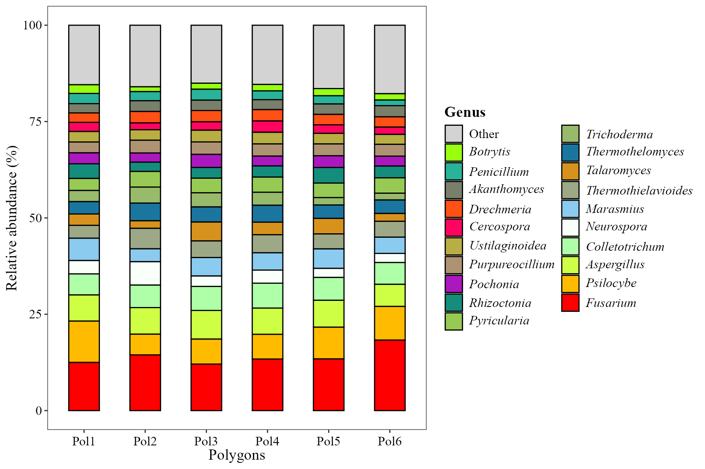

### 🖥️ Abundance heatmap

Kraken2/Bracken taxa aren’t ASVs, so `feature_prefix = "Taxon"` is used
here instead of the default `"ASV"` row-label prefix.

``` r

abundance_heatmap_plot(table = table_meta,
                  metadata = metadata_meta,
                  top_n = 20,
                  show_column_names = FALSE,
                  condition1 = "Polygon",
                  feature_prefix = "Taxon")
```

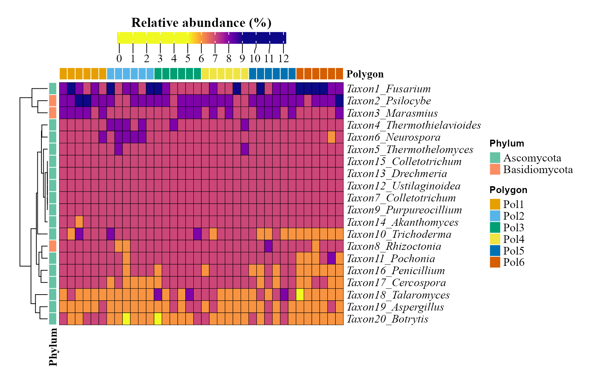

## 📊 Alpha diversity

### 📈 Correlation among Hill numbers

``` r

alpha_hill_corr_plot(table = table_meta)
```

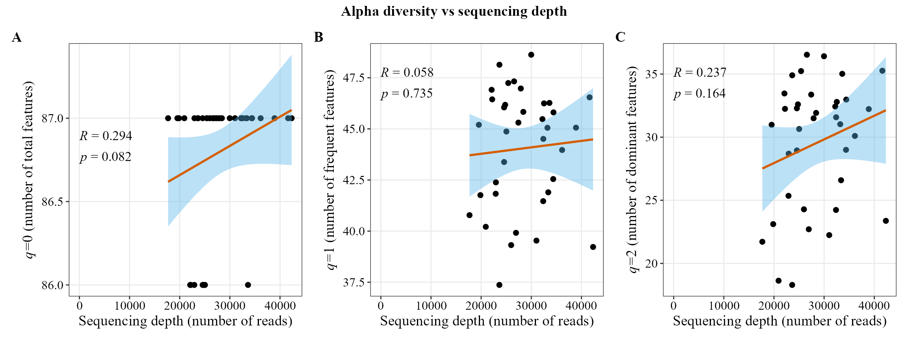

### 📊 Alpha diversity visualization

`fill_col` is the same as `x_col` here, so the legend would just repeat
the x-axis tick labels - `show_legend = FALSE` drops it.

``` r

alpha_hill_plot(table = table_meta,
                metadata = metadata_meta,
                x_col = "Polygon",
                fill_col = "Polygon",
                facet_by = "Site",
                facet_orientation = "horizontal",
                legend_title = "",
                stat = "kruskal.test",
                show_legend = FALSE,
                save_table = FALSE)
```

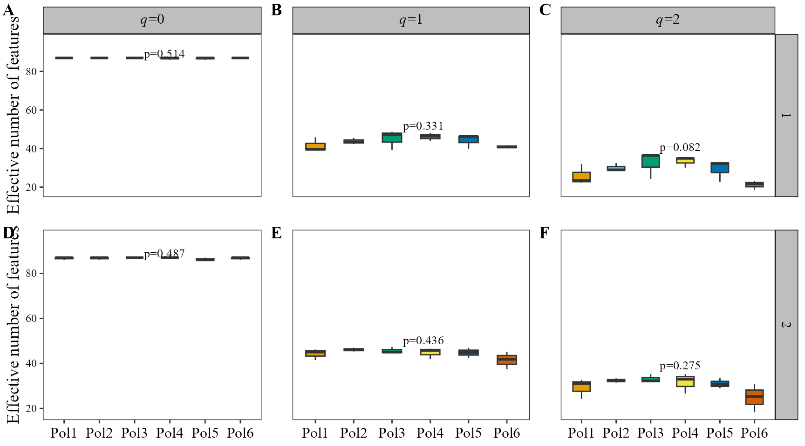

Richness (*q*=0) is nearly saturated and flat across blocks here — this
genus-level Bracken table simply doesn’t have much room left to vary at
*q*=0 — while *q*=1 and *q*=2 (which weight by relative abundance) do
pick up differences between blocks.

### Alpha diversity along a continuous gradient

``` r

alpha_decay_plot(table = table_meta,
                 metadata = metadata_meta,
                 cont_var = "pH",
                 x_axis_title = "Soil pH")
```

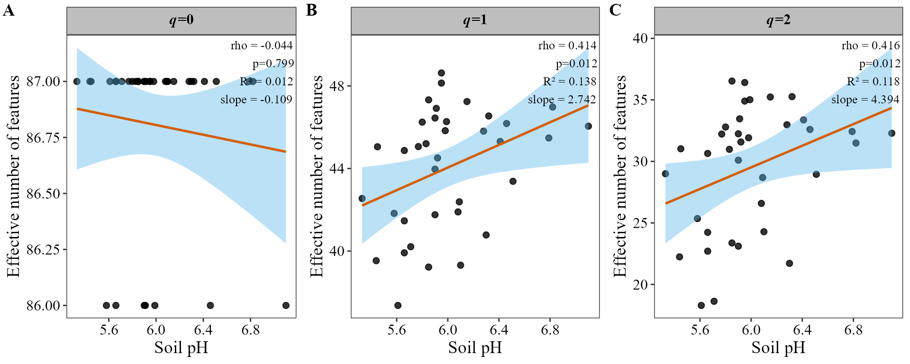

Diversity at *q*=1 and *q*=2 increases significantly with soil pH; *q*=0
doesn’t, for the same ceiling-effect reason as above.

## Beta diversity

### Ordination of community composition

We can use metrics that consider only presence/absence like **jaccard**:

``` r

beta_ord_plot(table = table_meta,
              metadata = metadata_meta,
              distance = "jaccard",
              ordination = "PCoA",
              group_col = "Polygon")
```

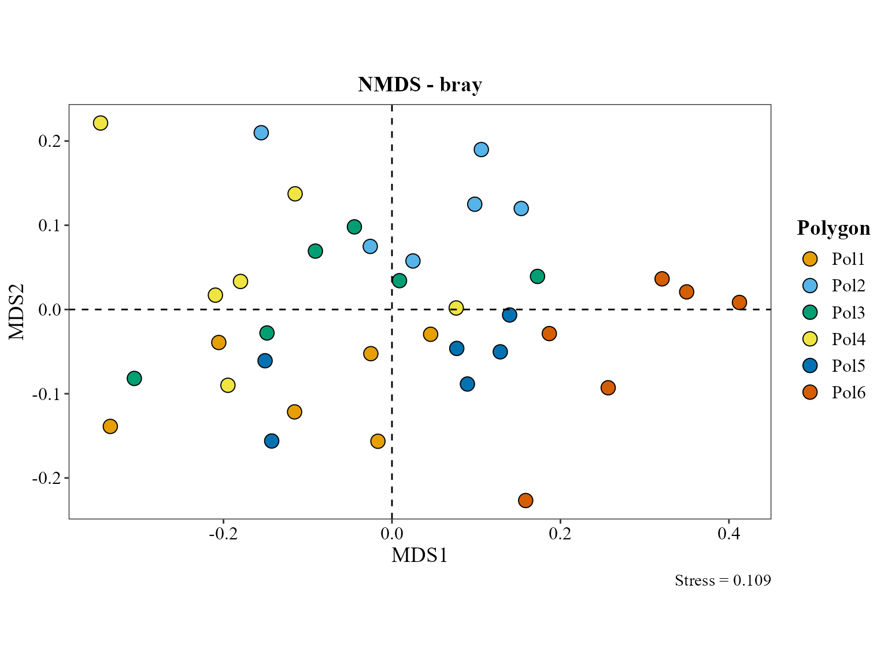

### Statistical tests for beta diversity

`distance = "jaccard"` matches with the one used for the ordinatrion
above, so the ordination (via the `vegan` package ([Oksanen et al.
2024](#ref-oksanen2024vegan))) and the PERMANOVA significance test
([Anderson 2001](#ref-anderson2001permanova)) are evaluating the same
notion of dissimilarity.

``` r

beta_test_table(table = table_meta,
                metadata = metadata_meta,
                formula_str = "Polygon*Site",
                distance = "jaccard",
                test = "permanova",
                permutations = 999)
```

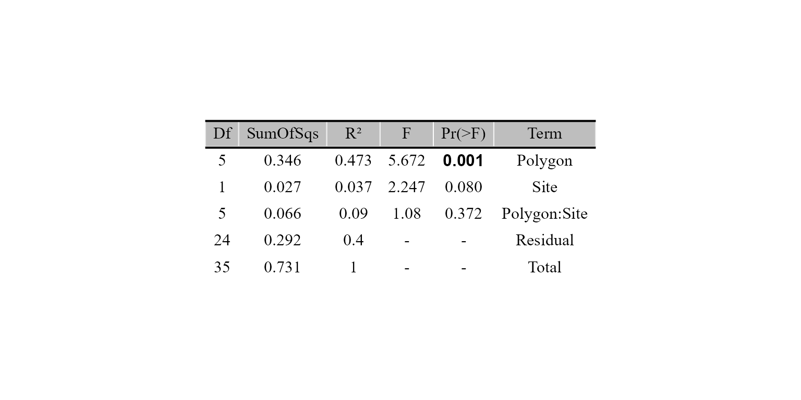

### Distance-decay of community similarity

[`beta_decay_plot()`](https://steph0522.github.io/MicroBioMeta/reference/beta_decay_plot.md)
tests whether communities that are geographically closer are also more
similar in composition, via a Mantel test ([Mantel
1967](#ref-mantel1967test)):

``` r

beta_decay_plot(
  table    = table_meta,
  metadata = metadata_meta,
  lat_col  = "Latitude",
  lon_col  = "Longitude",
  distance = "jaccard"
)
```

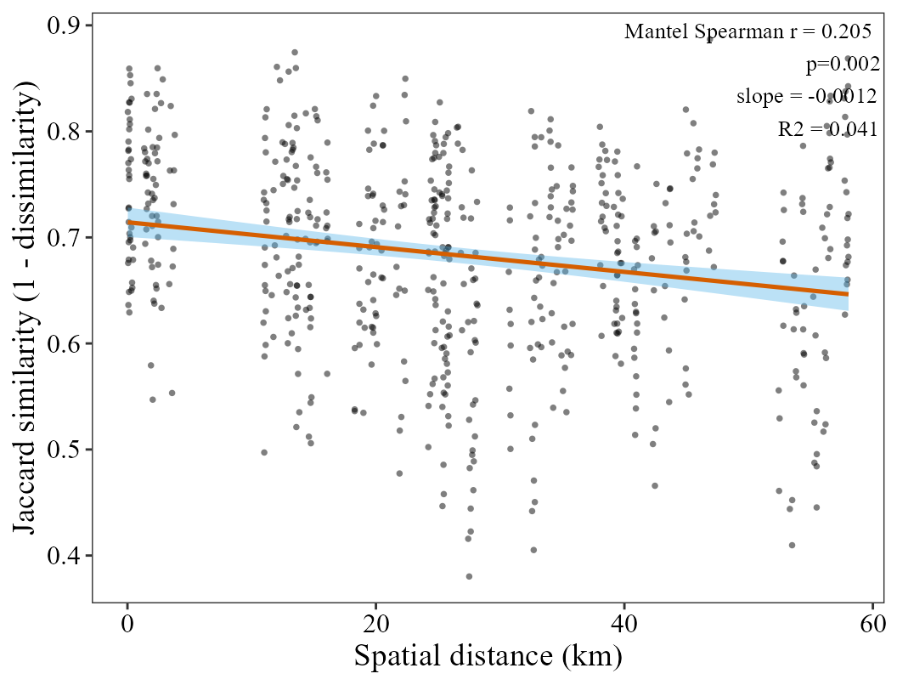

Communities that are geographically closer are significantly more
similar (Mantel *r* ≈ 0.2, *p* = 0.002. the exact value jitters slightly
between runs since the Mantel test is permutation-based), a real
distance-decay signal across these forest soils. `jaccard` is used to be
consistent with the ordination above.

## Differential abundant analysis

For the heatmap (ALDEx2 ([Fernandes et al.
2014](#ref-fernandes2014aldex2))) and ANCOMBC2 ([Lin and Peddada
2020](#ref-lin2020ancombc)) versions we need a 2-group subset of the
6-level `Polygon`, in this part we will compare Polygon 2 and 5:

``` r

metadata_meta_compar <- metadata_meta %>%
  filter(Polygon == "Pol2" | Polygon == "Pol5")

table_meta_compar <- table_meta[, c(match(metadata_meta_compar$SAMPLEID, colnames(table_meta)), ncol(table_meta))]
```

``` r

aldex_heatmap_plot(table = table_meta_compar,
                   metadata = metadata_meta_compar,
                   group_col = "Polygon")
```

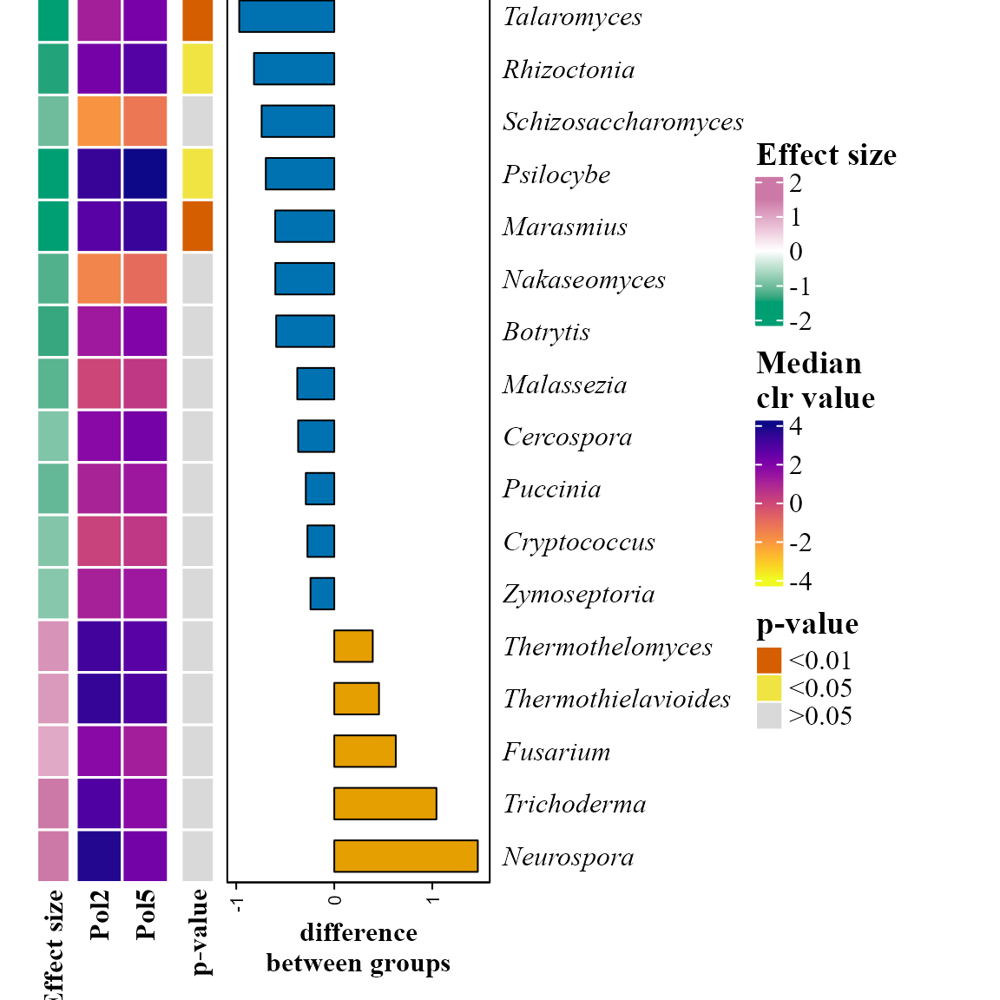

``` r

ancombc_plot(
  table        = table_meta_compar,
  metadata     = metadata_meta_compar,
  group_col     = "Polygon",
  level    = "Genus",
  min_prevalence      = 0.05,
  p_adjust_method = "BH"
)
```

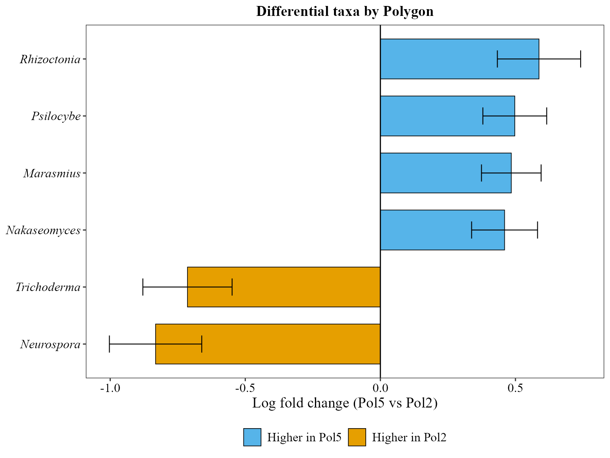

### Identifying important taxa

[`random_forest_lollipop_plot()`](https://steph0522.github.io/MicroBioMeta/reference/random_forest_lollipop_plot.md)
uses a Random Forest model ([Breiman
2001](#ref-breiman2001randomforest)) to find the taxa that best predict
the polygon:

``` r

random_forest_lollipop_plot(table = table_meta, metadata = metadata_meta, top_n = 10, variable_to_predict = "Polygon")
```

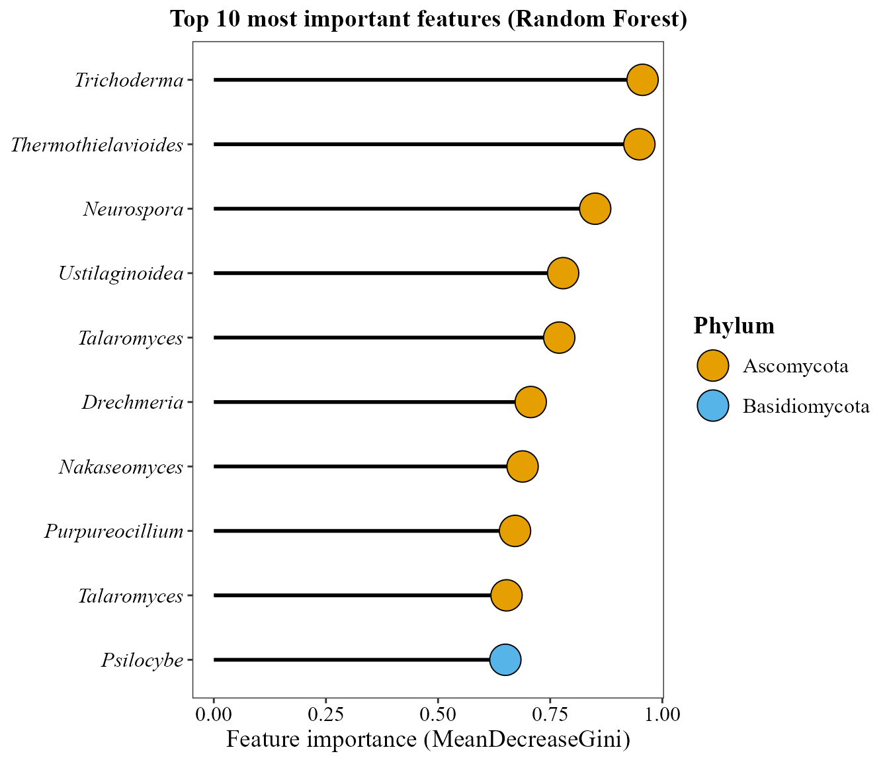

``` r

ratios_bubble_plot(table = table_meta_compar,
           metadata = metadata_meta_compar,
           group_col = "Polygon",
           top_n = 20,
           condition_A = "Pol2",
           condition_B = "Pol5")
```

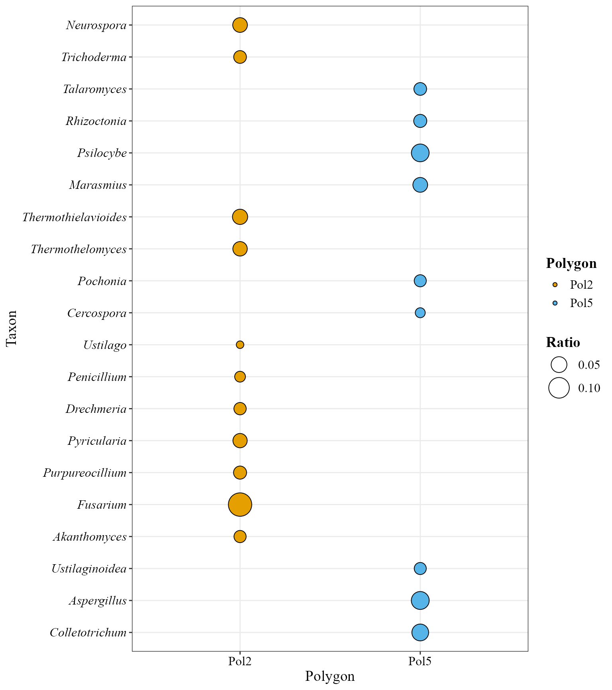

## Environmental analyses

The metadata already carries the soil physicochemical variables measured
for these samples, so the environmental table is built the same way as
in the metabarcoding vignette:

``` r

env_table_meta <- metadata_meta %>%
  dplyr::select(SAMPLEID, pH:ARENA) %>%
  remove_rownames() %>%
  column_to_rownames(var = "SAMPLEID")
```

### Correlation between environmental variables and taxonomic abundance

``` r

corr_env_abund_plot(table = table_meta,
                    env_data = env_table_meta,
                    metadata = metadata_meta,
                    taxonomy_db = "Kraken2",
                    level = "phylum",
                    save_table = FALSE)
```

    ## Warning in corr_env_abund_plot(table = table_meta, env_data = env_table_meta, :
    ## Dropping non-numeric columns from `env_data`: type, type2

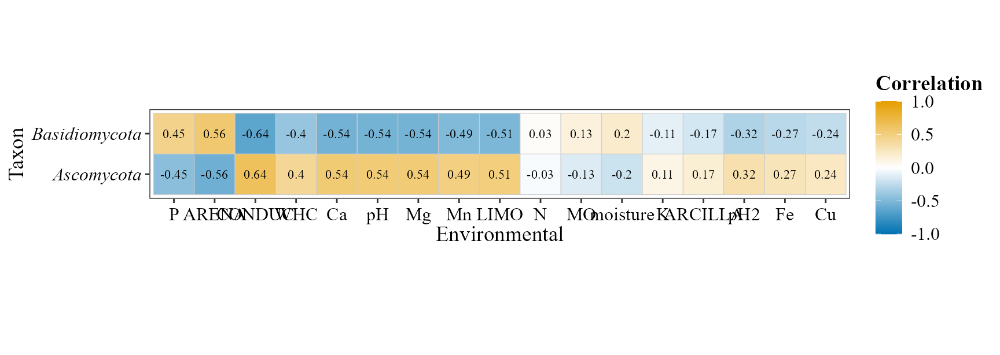

### Constrained ordination (CCA)

``` r

env_table_meta <- env_table_meta[
  match(metadata_meta$SAMPLEID, rownames(env_table_meta)), , drop = FALSE]
```

``` r

cca_rda_biplot(table = table_meta,
               env_data = env_table_meta,
               metadata = metadata_meta,
               env_vars = c("pH", "MO", "N", "P", "K"),
               analysis = "CCA",
               show_all_env_vectors = TRUE,
               group_col = "Polygon",
               scale_arrows = 3)
```

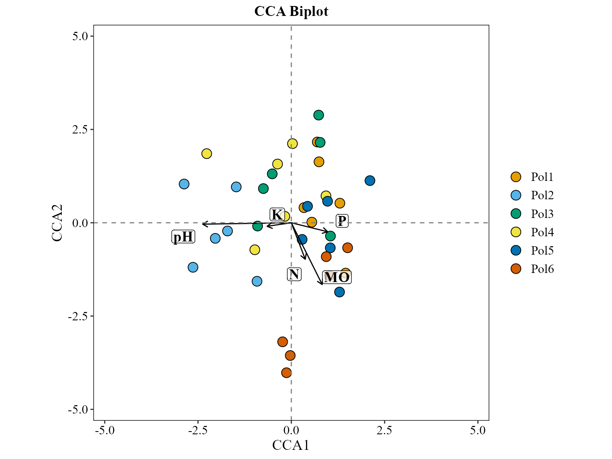

## References

Anderson, Marti J. 2001. “A New Method for Non-Parametric Multivariate
Analysis of Variance.” *Austral Ecology* 26 (1): 32–46.
<https://doi.org/10.1111/j.1442-9993.2001.01070.pp.x>.

Breiman, Leo. 2001. “Random Forests.” *Machine Learning* 45 (1): 5–32.
<https://doi.org/10.1023/A:1010933404324>.

Fernandes, Andrew D., Jennifer N. S. Reid, Jean M. Macklaim, Thomas A.
McMurrough, David R. Edgell, and Gregory B. Gloor. 2014. “Unifying the
Analysis of High-Throughput Sequencing Datasets: Characterizing RNA-Seq,
16S rRNA Gene Sequencing and Selective Growth Experiments by
Compositional Data Analysis.” *Microbiome* 2: 15.
<https://doi.org/10.1186/2049-2618-2-15>.

Lin, Huang, and Shyamal Das Peddada. 2020. “Analysis of Compositions of
Microbiomes with Bias Correction.” *Nature Communications* 11: 3514.
<https://doi.org/10.1038/s41467-020-17041-7>.

Lu, Jennifer, Florian P. Breitwieser, Peter Thielen, and Steven L.
Salzberg. 2017. “Bracken: Estimating Species Abundance in Metagenomics
Data.” *PeerJ Computer Science* 3: e104.
<https://doi.org/10.7717/peerj-cs.104>.

Mantel, Nathan. 1967. “The Detection of Disease Clustering and a
Generalized Regression Approach.” *Cancer Research* 27 (2): 209–20.

Oksanen, Jari, Gavin L. Simpson, F. Guillaume Blanchet, et al. 2024.
*Vegan: Community Ecology Package*.
<https://CRAN.R-project.org/package=vegan>.

Wood, Derrick E., Jennifer Lu, and Ben Langmead. 2019. “Improved
Metagenomic Analysis with Kraken 2.” *Genome Biology* 20: 257.
<https://doi.org/10.1186/s13059-019-1891-0>.

## Session info

``` r

sessionInfo()
```

    ## R version 4.6.1 (2026-06-24 ucrt)
    ## Platform: x86_64-w64-mingw32/x64
    ## Running under: Windows 10 x64 (build 19045)
    ## 
    ## Matrix products: default
    ##   LAPACK version 3.12.1
    ## 
    ## locale:
    ## [1] LC_COLLATE=Spanish_Latin America.utf8 
    ## [2] LC_CTYPE=Spanish_Latin America.utf8   
    ## [3] LC_MONETARY=Spanish_Latin America.utf8
    ## [4] LC_NUMERIC=C                          
    ## [5] LC_TIME=Spanish_Latin America.utf8    
    ## 
    ## time zone: America/Mexico_City
    ## tzcode source: internal
    ## 
    ## attached base packages:
    ## [1] stats     graphics  grDevices utils     datasets  methods   base     
    ## 
    ## other attached packages:
    ##  [1] doRNG_1.8.6.3       rngtools_1.5.2      foreach_1.5.2      
    ##  [4] lubridate_1.9.5     forcats_1.0.1       stringr_1.6.0      
    ##  [7] dplyr_1.2.1         purrr_1.2.2         readr_2.2.0        
    ## [10] tidyr_1.3.2         tibble_3.3.1        ggplot2_4.0.3      
    ## [13] tidyverse_2.0.0     MicroBioMeta_0.99.0
    ## 
    ## loaded via a namespace (and not attached):
    ##   [1] splines_4.6.1               cellranger_1.1.0           
    ##   [3] rpart_4.1.27                lifecycle_1.0.5            
    ##   [5] Rdpack_2.6.6                rstatix_1.1.0              
    ##   [7] doParallel_1.0.17           lattice_0.22-9             
    ##   [9] MASS_7.3-65                 backports_1.5.1            
    ##  [11] hillR_0.5.2                 magrittr_2.0.5             
    ##  [13] Hmisc_5.3-0                 sass_0.4.10                
    ##  [15] rmarkdown_2.32              jquerylib_0.1.4            
    ##  [17] yaml_2.3.12                 otel_0.2.0                 
    ##  [19] ggvenn_0.1.19               gld_2.6.8                  
    ##  [21] minqa_1.2.8                 cowplot_1.2.0              
    ##  [23] RColorBrewer_1.1-3          ade4_1.7-24                
    ##  [25] multcomp_1.4-32             abind_1.4-8                
    ##  [27] Rtsne_0.17                  quadprog_1.5-8             
    ##  [29] expm_1.0-1                  GenomicRanges_1.64.0       
    ##  [31] BiocGenerics_0.58.1         phyloseq_1.56.0            
    ##  [33] TH.data_1.1-5               nnet_7.3-20                
    ##  [35] sandwich_3.1-3              circlize_0.4.18            
    ##  [37] IRanges_2.46.0              S4Vectors_0.50.3           
    ##  [39] ggrepel_0.9.8               vegan_2.7-6                
    ##  [41] microbiome_1.34.0           pkgdown_2.2.1              
    ##  [43] permute_0.9-10              codetools_0.2-20           
    ##  [45] DelayedArray_0.38.2         energy_1.7-12              
    ##  [47] tidyselect_1.2.1            shape_1.4.6.1              
    ##  [49] farver_2.1.2                lme4_2.0-6                 
    ##  [51] viridis_0.6.5               matrixStats_1.5.0          
    ##  [53] stats4_4.6.1                base64enc_0.1-6            
    ##  [55] Seqinfo_1.2.0               ALDEx2_1.44.0              
    ##  [57] jsonlite_2.0.0              GetoptLong_1.1.1           
    ##  [59] multtest_2.68.0             e1071_1.7-17               
    ##  [61] Formula_1.2-6               survival_3.8-6             
    ##  [63] iterators_1.0.14            systemfonts_1.3.2          
    ##  [65] tools_4.6.1                 ragg_1.5.2                 
    ##  [67] DescTools_0.99.60           Rcpp_1.1.2                 
    ##  [69] ggVennDiagram_1.5.7         glue_1.8.1                 
    ##  [71] gridExtra_2.3.1             SparseArray_1.12.2         
    ##  [73] xfun_0.61                   mgcv_1.9-4                 
    ##  [75] MatrixGenerics_1.24.0       numDeriv_2016.8-1.1        
    ##  [77] withr_3.0.3                 fastmap_1.2.0              
    ##  [79] ggh4x_0.3.1                 latticeExtra_0.6-31        
    ##  [81] boot_1.3-32                 digest_0.6.39              
    ##  [83] truncnorm_1.0-9             timechange_0.4.0           
    ##  [85] R6_2.6.1                    textshaping_1.0.5          
    ##  [87] colorspace_2.1-3            Cairo_1.7-0                
    ##  [89] gtools_3.9.5                jpeg_0.1-11                
    ##  [91] dichromat_2.0-1             generics_0.1.4             
    ##  [93] data.table_1.18.6.1         class_7.3-23               
    ##  [95] httr_1.4.9                  htmlwidgets_1.6.4          
    ##  [97] S4Arrays_1.12.0             pkgconfig_2.0.3            
    ##  [99] gtable_0.3.6                Exact_3.3                  
    ## [101] zCompositions_1.6.2         ComplexHeatmap_2.28.0      
    ## [103] S7_0.2.2                    XVector_0.52.0             
    ## [105] htmltools_0.5.9             carData_3.0-6              
    ## [107] biomformat_1.40.0           zigg_0.0.2                 
    ## [109] clue_0.3-68                 scales_1.4.0               
    ## [111] Biobase_2.72.0              lmom_3.3                   
    ## [113] png_0.1-9                   reformulas_0.4.4           
    ## [115] ANCOMBC_2.14.0              knitr_1.52                 
    ## [117] rstudioapi_0.19.0           reshape2_1.4.5             
    ## [119] geosphere_1.6-8             tzdb_0.5.0                 
    ## [121] rjson_0.2.23                nloptr_2.2.1               
    ## [123] checkmate_2.3.4             nlme_3.1-169               
    ## [125] zoo_1.9-1                   proxy_0.4-29               
    ## [127] cachem_1.1.0                GlobalOptions_0.1.4        
    ## [129] rootSolve_1.8.2.4           parallel_4.6.1             
    ## [131] foreign_0.8-91              desc_1.4.3                 
    ## [133] pillar_1.11.1               grid_4.6.1                 
    ## [135] vctrs_0.7.3                 randomForest_4.7-1.2       
    ## [137] ggpubr_1.0.0                car_3.1-5                  
    ## [139] cluster_2.1.8.2             htmlTable_2.5.0            
    ## [141] evaluate_1.0.5              magick_2.9.1               
    ## [143] mvtnorm_1.4-2               cli_3.6.6                  
    ## [145] compiler_4.6.1              rlang_1.3.0                
    ## [147] crayon_1.5.3                ggsignif_0.6.4             
    ## [149] labeling_0.4.3              interp_1.1-6               
    ## [151] plyr_1.8.9                  fs_2.1.0                   
    ## [153] stringi_1.8.9               viridisLite_0.4.3          
    ## [155] deldir_2.0-4                BiocParallel_1.46.0        
    ## [157] Biostrings_2.80.2           lmerTest_3.2-1             
    ## [159] gsl_2.1-9                   Matrix_1.7-5               
    ## [161] hms_1.1.4                   patchwork_1.3.2            
    ## [163] NADA_1.6-1.2                SummarizedExperiment_1.42.0
    ## [165] haven_2.5.5                 rbibutils_2.4.1            
    ## [167] Rfast_2.1.5.2               igraph_2.3.3               
    ## [169] broom_1.0.13                RcppParallel_6.2.1         
    ## [171] bslib_0.12.0                directlabels_2026.8.27     
    ## [173] readxl_1.5.0.1              ape_5.8-1
